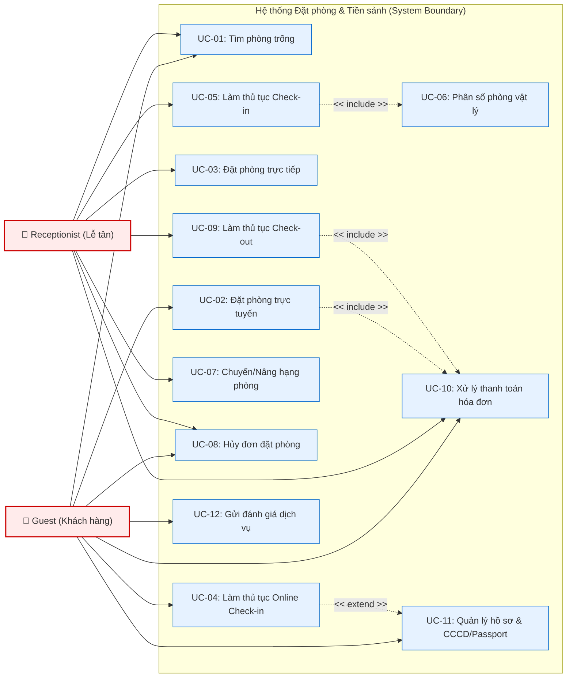
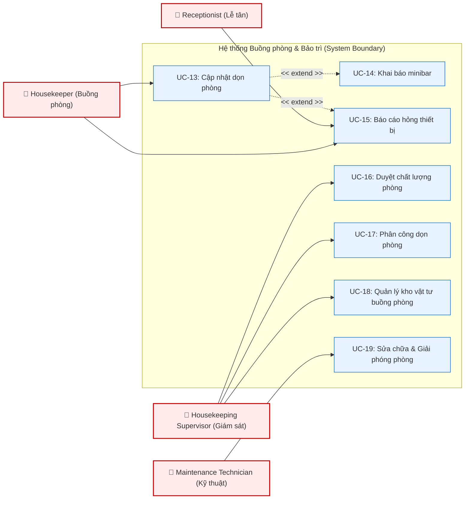
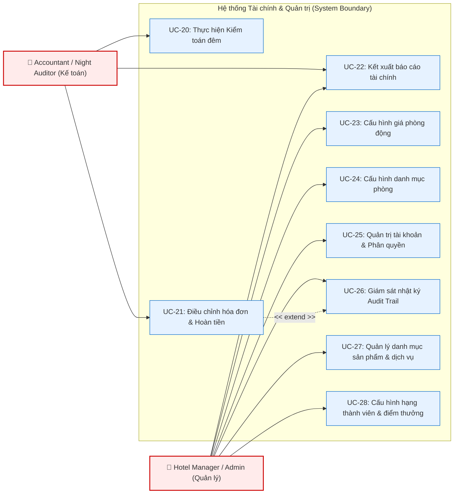
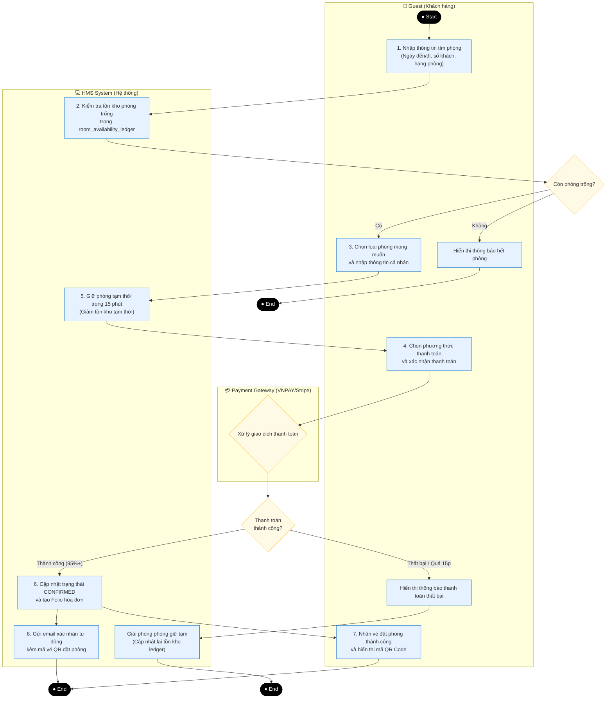
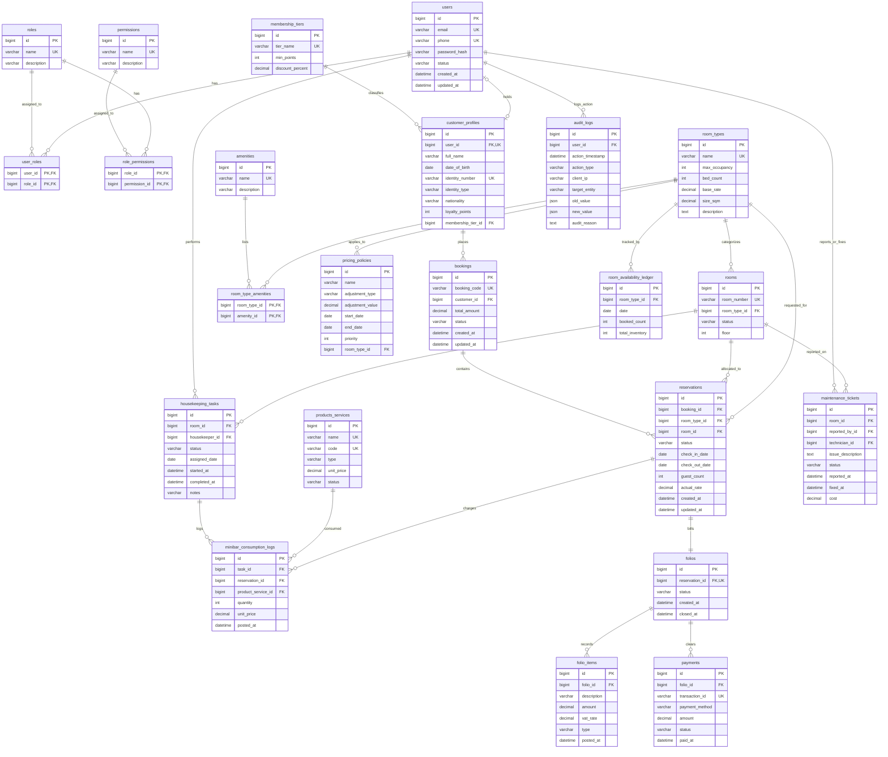

# PHÂN TÍCH NGHIỆP VỤ VÀ ĐỀ XUẤT THIẾT KẾ HỆ THỐNG QUẢN LÝ KHÁCH SẠN (HOTEL MANAGEMENT SYSTEM - HMS)

Tài liệu này được biên soạn bởi **Đội ngũ Kiến trúc sư Hệ thống và Chuyên viên Phân tích Nghiệp vụ Cao cấp**, nhằm phác thảo giải pháp và nền tảng thiết kế cho dự án **Hotel Management System (HMS)**. Hệ thống được định hướng xây dựng trên nền tảng công nghệ hiện đại bao gồm **Spring Boot (Backend), MySQL (Database), và React (Frontend)**, hướng tới mục tiêu tối ưu hóa vận hành, tự động hóa quy trình nghiệp vụ và nâng cao trải nghiệm khách hàng.

---

## 1. MỤC TIÊU HỆ THỐNG (SYSTEM OBJECTIVES)

Hệ thống Quản lý Khách sạn (HMS) được thiết kế nhằm giải quyết các thách thức vận hành thực tế của các khách sạn từ phân khúc trung cấp đến cao cấp (3 đến 5 sao). Dưới đây là các mục tiêu cốt lõi:

### 1.1. Đối với khách hàng (Guests)
*   **Trải nghiệm số hóa toàn diện:** Cung cấp kênh đặt phòng trực tuyến (Online Booking) trực quan, cho phép tìm kiếm, lựa chọn loại phòng, xem thông tin tiện ích và thực hiện thanh toán trực tuyến nhanh chóng, an toàn.
*   **Chủ động quản lý hành trình:** Hỗ trợ tính năng tự phục vụ như tự thực hiện Check-in trực tuyến (Online Check-in) trước khi đến, đăng ký các dịch vụ đi kèm (spa, xe đưa đón, ăn uống tại phòng) và tra cứu lịch sử hóa đơn rõ ràng.

### 1.2. Đối với đội ngũ vận hành khách sạn (Hotel Operations Staff)
*   **Tối ưu hóa quy trình làm việc:** Tự động hóa các tác vụ lặp đi lặp lại như phân buồng phòng, tính toán hóa đơn, cập nhật trạng thái dọn dẹp phòng theo thời gian thực.
*   **Giảm thiểu sai sót thủ công:** Loại bỏ hoàn toàn tình trạng đặt trùng phòng (Overbooking/Double-booking) nhờ cơ chế kiểm soát giao dịch đồng thời (Concurrency Control) ở mức cơ sở dữ liệu.
*   **Giao diện trực quan:** Cung cấp bảng điều khiển (Dashboard) trực quan giúp bộ phận Lễ tân có cái nhìn tổng quan về sơ đồ phòng (Room Grid/Calendar view) tại mọi thời điểm trong ngày.

### 1.3. Đối với ban quản lý (Hotel Management & Administrators)
*   **Báo cáo và ra quyết định dựa trên dữ liệu:** Cung cấp hệ thống báo cáo doanh thu, tỷ lệ lấp đầy phòng (Occupancy Rate), doanh thu trung bình trên mỗi phòng sẵn có (RevPAR - Revenue Per Available Room) theo ngày, tuần, tháng, quý.
*   **Quản trị tài nguyên hiệu quả:** Quản lý tập trung thông tin nhân sự, phân quyền truy cập chặt chẽ theo vai trò (Role-Based Access Control - RBAC), giám sát hiệu suất làm việc của các bộ phận thông qua lịch sử thao tác hệ thống (Audit Trail).

### 1.4. Mục tiêu phi chức năng và kỹ thuật (Technical & Non-functional Objectives)
*   **Khả năng mở rộng (Scalability):** Thiết kế mã nguồn và cơ sở dữ liệu có khả năng chịu tải tốt khi lượng giao dịch tăng cao vào mùa du lịch cao điểm. Cấu trúc hệ thống sẵn sàng chuyển đổi từ cấu trúc nguyên khối (Modular Monolith) sang kiến trúc dịch vụ nhỏ (Microservices) khi quy mô chuỗi khách sạn mở rộng.
*   **Độ tin cậy và tính nhất quán dữ liệu (Reliability & Consistency):** Đảm bảo tính nhất quán ACID tuyệt đối trong các giao dịch đặt phòng và thanh toán tài chính thông qua cơ chế Transaction Management của Spring Boot và MySQL.
*   **Bảo mật thông tin:** Mã hóa mật khẩu người dùng bằng thuật toán bcrypt, bảo mật kết nối API bằng JSON Web Token (JWT) có thời gian hết hạn ngắn kết hợp Refresh Token, mã hóa dữ liệu nhạy cảm truyền tải qua HTTPS.

---

## 2. PHẠM VI HỆ THỐNG (SYSTEM SCOPE)

Hệ thống tập trung vào việc quản lý vòng đời của một giao dịch đặt phòng (Reservation Lifecycle) và quản lý hoạt động nội bộ hàng ngày của một khách sạn đơn lẻ hoặc chuỗi khách sạn quy mô vừa, không bao gồm các hệ thống ERP quản lý chuỗi cung ứng phức tạp hay hệ thống kế toán doanh nghiệp chuyên sâu.

### 2.1. Các nghiệp vụ nằm trong phạm vi (In-Scope)
*   **Quản lý thông tin lưu trú:** Cấu hình phòng, loại phòng, giá phòng theo mùa/ngày lễ, tiện ích đi kèm phòng.
*   **Quản lý đặt phòng trực tuyến & trực tiếp:** Quy trình tìm kiếm phòng trống, giữ phòng tạm thời, xác nhận đặt phòng, hủy đặt phòng, xử lý khách không đến (No-show).
*   **Quy trình Check-in/Check-out:** Kiểm tra thông tin định danh của khách (CMND/CCCD/Passport), gán phòng vật lý phù hợp, tạo thẻ chìa khóa ảo (hoặc cập nhật trạng thái phòng thành Occupied), thực hiện Check-out, tổng hợp hóa đơn chi tiết, áp dụng mã giảm giá và hoàn tất thanh toán.
*   **Quản lý dịch vụ gia tăng (Folio/Add-on Services):** Ghi nhận chi phí các dịch vụ phát sinh trong quá trình lưu trú (như giặt ủi, minibar, ăn uống tại nhà hàng khách sạn, spa) trực tiếp vào hóa đơn của phòng (Room Folio).
*   **Quản lý buồng phòng & bảo trì thiết bị:** Theo dõi quy trình dọn phòng từ lúc bẩn (Dirty) sang sạch (Clean) và kiểm tra sẵn sàng (Inspected). Ghi nhận và phân công sửa chữa các phòng có thiết bị hỏng hóc (Under Maintenance).
*   **Hệ thống phân quyền & Bảo mật tài khoản:** Quản lý hồ sơ nhân sự, phân quyền truy cập chức năng và dữ liệu tương ứng với từng chức danh công việc trong khách sạn.

### 2.2. Các nghiệp vụ nằm ngoài phạm vi (Out-of-Scope)
*   **Quản lý chuỗi cung ứng vật tư lớn:** Không quản lý chi tiết kho hàng nhà cung cấp nguyên vật liệu xây dựng hoặc thực phẩm đầu vào quy mô lớn (chỉ quản lý kho minibar và đồ tiêu hao cơ bản của buồng phòng).
*   **Hệ thống kế toán thuế chuyên sâu:** Không thay thế hoàn toàn các phần mềm kế toán chuyên dụng như MISA hay SAP. Hệ thống HMS chỉ xuất dữ liệu hóa đơn thô và doanh thu định kỳ dưới dạng file Excel/CSV để tích hợp với hệ thống kế toán.
*   **Hệ thống điều khiển phần cứng trực tiếp:** Hệ thống không viết mã nguồn trực tiếp để nạp vào thẻ từ khóa cơ học. Thay vào đó, hệ thống sẽ cung cấp API mở rộng (Open API/Webhook) để kết nối và đẩy lệnh sang phần mềm quản lý khóa từ của bên thứ ba (ví dụ: Adel, Salto).

---

## 3. CÁC ACTORS TRONG HỆ THỐNG (SYSTEM ACTORS)

Hệ thống quản lý khách sạn thực tế yêu cầu sự tham gia và phân vai cực kỳ chặt chẽ của các bộ phận vận hành khác nhau. Để tránh bỏ sót nghiệp vụ cốt lõi, hệ thống HMS xác định rõ ràng 7 nhóm tác nhân (Actors) chính. Việc phân nhóm chi tiết này cung cấp cơ sở để xây dựng cấu trúc phân quyền Role-Based Access Control (RBAC) trên nền tảng Spring Security và phân cấp giao diện người dùng trên React.

```
                                +--------------------------------------------+
                                |                 HMS ACTORS                 |
                                +--------------------------------------------+
                                |  1. GUEST (Khách hàng - B2C Portal)        |
                                |  2. RECEPTIONIST (Lễ tân - Backoffice UI)  |
                                |  3. HOUSEKEEPER (Buồng phòng - Mobile PWA)  |
                                |  4. HOUSEKEEPING SUPERVISOR (Giám sát BP)  |
                                |  5. MAINTENANCE TECHNICIAN (Bảo trì/KT)    |
                                |  6. NIGHT AUDITOR / ACCOUNTANT (Kế toán)   |
                                |  7. HOTEL MANAGER (Quản lý / Admin)        |
                                +--------------------------------------------+
```

### 3.1. Guest (Khách hàng)
*   **Vai trò:** Là người dùng đầu cuối sử dụng cổng thông tin trực tuyến công cộng (Guest Web Portal) để thực hiện các giao dịch đặt phòng tự phục vụ trước, trong và sau thời gian lưu trú tại khách sạn.
*   **Quyền hạn (Permissions & Access Level):**
    *   Quyền truy cập công cộng (Anonymous Access) đối với các tính năng xem danh sách phòng, tìm phòng trống và đọc chính sách.
    *   Quyền đọc và ghi (Read/Write) ở phạm vi cá nhân (Personal Data Scope) sau khi đăng nhập thành công. Không thể truy cập bất kỳ tài nguyên Backoffice nào của khách sạn.
    *   Token xác thực có phạm vi hạn chế (`SCOPE_GUEST`).
*   **Các chức năng được phép sử dụng:**
    *   **Quản lý tài khoản:** Đăng ký tài khoản mới, đăng nhập (xác thực đa nhân tố/OTP hoặc mạng xã hội), cập nhật thông tin hồ sơ cá nhân và giấy tờ định danh (CCCD/Passport/Visa).
    *   **Tìm kiếm & Đặt phòng:** Tra cứu phòng trống theo thời gian thực dựa trên ngày đến/đi và số lượng khách; xem hình ảnh, thông tin mô tả chi tiết, tiện nghi phòng; chọn các dịch vụ đi kèm tùy chọn (đưa đón sân bay, buffet sáng).
    *   **Thanh toán điện tử:** Thực hiện thanh toán đặt cọc hoặc thanh toán trả trước toàn bộ tiền phòng thông qua cổng thanh toán tích hợp (VNPAY/Stripe).
    *   **Check-in trực tuyến (Online Check-in):** Khai báo thông tin lưu trú trước khi đến khách sạn tối đa 24 giờ, chụp ảnh giấy tờ tùy thân tải lên hệ thống để rút ngắn thời gian làm thủ tục tại quầy.
    *   **Quản lý lịch sử:** Tra cứu trạng thái và lịch sử tất cả các đơn đặt phòng (Reservation History); tải hóa đơn điện tử dạng PDF.
    *   **Đánh giá & Phản hồi:** Gửi đánh giá (Rating) từ 1 đến 5 sao kèm nhận xét chi tiết về chất lượng phòng và thái độ dịch vụ sau khi Check-out thành công.

### 3.2. Receptionist (Nhân viên Lễ tân)
*   **Vai trò:** Nhân viên vận hành trực tiếp tại quầy tiền sảnh (Front Desk). Chịu trách nhiệm tiếp đón khách, xử lý các yêu cầu phát sinh trực tiếp và điều phối trạng thái phòng vật lý hàng ngày.
*   **Quyền hạn (Permissions & Access Level):**
    *   Quyền đọc/ghi đối với các tài nguyên nghiệp vụ hàng ngày: `booking:read`, `booking:create`, `booking:update`, `folio:read`, `folio:update`, `room:read`.
    *   Không có quyền xóa (Delete) đặt phòng đã xác nhận (chỉ được chuyển trạng thái sang Cancelled).
    *   Không có quyền cấu hình cấu trúc phòng vật lý hoặc thay đổi bảng giá gốc (Base Rate Table).
*   **Các chức năng được phép sử dụng:**
    *   **Đặt phòng trực tiếp (Walk-in Booking):** Tạo yêu cầu đặt phòng nhanh cho khách vãng lai trực tiếp tại quầy, cập nhật báo giá theo thời gian thực.
    *   **Quản lý sơ đồ phòng (Room Grid Console):** Xem giao diện trực quan trạng thái phòng toàn khách sạn theo thời gian thực (Occupied, Vacant Clean, Vacant Dirty, Under Maintenance).
    *   **Quy trình Check-in:** Xác minh đối chiếu giấy tờ tùy thân của khách với thông tin đặt phòng trên hệ thống; thực hiện thuật toán gán số phòng vật lý cụ thể (Room Assignment); cập nhật trạng thái đặt phòng thành `CHECKED_IN` và trạng thái phòng thành `OCCUPIED`.
    *   **Quản lý Hóa đơn Phòng (Folio Management):** Ghi nhận chi phí phát sinh của khách vào hóa đơn phòng (Folio Item) như phí giặt ủi, nước uống minibar, ăn uống tại nhà hàng, dịch vụ gọi xe.
    *   **Xử lý Đổi phòng (Room Change/Upgrade):** Thực hiện đổi phòng vật lý khác cho khách đang lưu trú trong trường hợp phát sinh sự cố kỹ thuật hoặc yêu cầu nâng hạng phòng (Upgrade), tự động cập nhật lại thông tin chênh lệch giá phòng vào Folio.
    *   **Quy trình Check-out:** Kích hoạt yêu cầu kiểm tra phòng (Room Inspection); đối chiếu danh mục đồ tiêu hao buồng phòng báo về; áp dụng mã giảm giá, phụ thu muộn hoặc chiết khấu; in hóa đơn chi tiết (Folio Invoice); thu tiền mặt/quẹt thẻ vật lý hoặc xác nhận thanh toán thẻ trực tuyến; chuyển đổi trạng thái đặt phòng sang `CHECKED_OUT` và trạng thái phòng sang `VACANT_DIRTY`.

### 3.3. Housekeeper (Nhân viên Buồng phòng)
*   **Vai trò:** Nhân viên thuộc bộ phận buồng phòng (Housekeeping), thực hiện công tác vệ sinh, chuẩn bị phòng và cập nhật tình trạng vật tư tiêu hao thực tế tại mỗi phòng lưu trú.
*   **Quyền hạn (Permissions & Access Level):**
    *   Chỉ truy cập thông qua ứng dụng Web di động tối giản (Mobile PWA).
    *   Quyền hạn giới hạn ở phạm vi phòng được phân công trong ca trực: `housekeeping:read_tasks`, `housekeeping:update_task`, `room:update_status` (chỉ được phép cập nhật trạng thái phòng do mình phụ trách từ `Dirty` sang `Cleaning` và `Clean`).
*   **Các chức năng được phép sử dụng:**
    *   **Xem bảng phân công (Task List):** Tiếp nhận danh sách các số phòng cần dọn dẹp trong ca trực theo thứ tự ưu tiên (phòng khách sắp check-in trước, phòng khách đang ở dọn định kỳ sau).
    *   **Cập nhật quy trình dọn phòng (Real-time Cleaning Status):** Bấm chuyển đổi trạng thái phòng trên thiết bị di động: Bắt đầu dọn phòng (`Dirty` -> `Cleaning`) và Hoàn tất dọn phòng (`Cleaning` -> `Clean`).
    *   **Khai báo Minibar & Vật tư tiêu hao (Minibar Consumption Log):** Nhập số lượng lon nước ngọt, bia, đồ ăn nhẹ hoặc bộ đồ tiêu hao (Guest Amenities) mà khách đã sử dụng trong phòng lên hệ thống để tự động đẩy chi phí vào Room Folio tại quầy Lễ tân.
    *   **Báo cáo sự cố kỹ thuật (Maintenance Report):** Khi phát hiện trang thiết bị hỏng hóc (như bóng đèn cháy, vòi sen rò rỉ, điều hòa không mát), thực hiện báo cáo nhanh kèm mô tả sự cố để hệ thống tự động gán thẻ phòng `UNDER_MAINTENANCE` và gửi yêu cầu cho bộ phận kỹ thuật.

### 3.4. Housekeeping Supervisor (Giám sát Buồng phòng)
*   **Vai trò:** Trưởng bộ phận hoặc giám sát viên buồng phòng. Đảm bảo chất lượng vệ sinh phòng đạt tiêu chuẩn của khách sạn trước khi đưa phòng vào danh sách sẵn sàng đón khách.
*   **Quyền hạn (Permissions & Access Level):**
    *   Quyền đọc/ghi đối với các nghiệp vụ buồng phòng toàn diện: `housekeeping:manage`, `room:inspect`, `room:update_status` (có quyền chuyển đổi trạng thái phòng sang `VACANT_INSPECTED`).
    *   Quyền quản trị kho vật tư tiêu hao nội bộ của bộ phận buồng phòng.
*   **Các chức năng được phép sử dụng:**
    *   **Kiểm tra chất lượng phòng (Room Inspection):** Đến kiểm tra thực tế các phòng nhân viên đã báo dọn xong (`Clean`). Nếu đạt yêu cầu, xác nhận trên hệ thống để chuyển trạng thái phòng sang `VACANT_INSPECTED` (sẵn sàng check-in). Nếu không đạt yêu cầu, từ chối duyệt và chuyển trạng thái phòng trở lại `VACANT_DIRTY` kèm lý do để nhân viên dọn lại.
    *   **Phân công ca trực và Task dọn phòng:** Tạo mới, sửa đổi hoặc phân bổ lại công việc dọn dẹp hàng ngày cho từng nhân viên buồng phòng dựa trên hiệu suất và số lượng phòng thực tế cần xử lý.
    *   **Quản lý Kho vật tư buồng phòng:** Ghi nhận nhập kho, xuất kho các trang thiết bị, vải trải giường, khăn tắm, hóa chất tẩy rửa và đồ tiêu hao minibar cấp cho nhân viên mang đi dọn phòng.

### 3.5. Maintenance Technician (Nhân viên Kỹ thuật / Bảo trì)
*   **Vai trò:** Nhân viên kỹ thuật chịu trách nhiệm khắc phục các sự cố vật lý, sửa chữa và bảo dưỡng trang thiết bị máy móc trong phòng nghỉ và toàn bộ khuôn viên khách sạn.
*   **Quyền hạn (Permissions & Access Level):**
    *   Quyền đọc/ghi đối với các phiếu yêu cầu sửa chữa: `maintenance:read`, `maintenance:update`.
    *   Quyền chuyển đổi trạng thái phòng sang `VACANT_DIRTY` hoặc `VACANT_CLEAN` sau khi hoàn thành sửa chữa thiết bị.
*   **Các chức năng được phép sử dụng:**
    *   **Xem danh sách sự cố (Maintenance Ticket Queue):** Tiếp nhận và quản lý danh sách các yêu cầu sửa chữa được tạo tự động từ hệ thống (khi nhân viên buồng phòng báo hỏng) hoặc được tạo thủ công bởi Lễ tân/Quản lý.
    *   **Cập nhật tiến độ sửa chữa:** Chuyển trạng thái phiếu yêu cầu từ `PENDING` (Đang chờ) sang `IN_PROGRESS` (Đang sửa chữa) kèm ước lượng thời gian hoàn thành và ghi chú linh kiện cần thay thế.
    *   **Xác nhận hoàn thành sửa chữa (Release Maintenance Room):** Sau khi khắc phục xong sự cố, thực hiện cập nhật hoàn tất phiếu yêu cầu sửa chữa, hệ thống sẽ tự động giải phóng trạng thái phòng từ `UNDER_MAINTENANCE` về `VACANT_DIRTY` để yêu cầu bộ phận buồng phòng vào vệ sinh và kiểm tra lại trước khi đưa vào kinh doanh.
    *   **Ghi nhật ký lịch sử bảo trì (Asset Maintenance Log):** Lưu trữ thông tin chi tiết về các thiết bị đã sửa chữa (tên thiết bị, số serial, chi phí thay thế linh kiện nếu có) gắn liền với số phòng vật lý để theo dõi vòng đời tài sản khách sạn.

### 3.6. Night Auditor / Accountant (Nhân viên Kiểm toán đêm / Kế toán)
*   **Vai trò:** Kiểm soát tài chính, đối soát doanh thu, kiểm toán các giao dịch diễn ra trong ngày của tất cả các bộ phận và thực hiện quy trình đóng ngày tài chính (Night Audit).
*   **Quyền hạn (Permissions & Access Level):**
    *   Quyền truy cập cao nhất vào các mô-đun tài chính, hóa đơn và báo cáo doanh thu: `accounting:read`, `accounting:write`, `nightaudit:execute`, `report:export`.
    *   Quyền ghi đè hoặc điều chỉnh các giao dịch hóa đơn (Folio Surcharge/Refund) có gắn kèm lý do giải trình bắt buộc (Audit Reason).
    *   Không có quyền can thiệp vào hoạt động dọn dẹp vật lý của buồng phòng hoặc sửa chữa của kỹ thuật.
*   **Các chức năng được phép sử dụng:**
    *   **Quy trình Kiểm toán đêm (Night Audit):** Thực hiện chạy quy trình chốt ngày tài chính (thường vào lúc 23:59 hàng ngày). Hệ thống sẽ khóa sổ ngày cũ, tự động post tiền phòng đêm tiếp theo của các khách đang lưu trú vào Folio, phát hiện các trường hợp đặt phòng trễ hạn thanh toán để hủy hoặc đánh dấu `NO_SHOW`.
    *   **Đối soát tài chính cổng thanh toán trực tuyến:** Tải dữ liệu đối soát từ VNPAY/Stripe để đối chiếu với các bản ghi giao dịch đặt phòng thành công trên hệ thống, xử lý chênh lệch dòng tiền.
    *   **Điều chỉnh hóa đơn (Folio Adjustment & Refund):** Thực hiện sửa đổi sai sót trong hóa đơn phòng do nhân viên lễ tân nhập nhầm, thực hiện hoàn tiền (Refund) cho khách hàng trong trường hợp hủy đặt phòng được chấp thuận hoàn tiền theo chính sách.
    *   **Kết xuất báo cáo tài chính:** Xem và xuất các file báo cáo doanh thu hàng ngày (Daily Manager Report - DMR), báo cáo thuế GTGT đầu ra, báo cáo công nợ khách đoàn, báo cáo chi tiết dòng tiền ra định dạng Excel/PDF.

### 3.7. Hotel Manager / Administrator (Quản lý khách sạn / Quản trị viên hệ thống)
*   **Vai trò:** Ban giám đốc điều hành khách sạn và quản trị viên kỹ thuật của hệ thống thông tin. Có nhiệm vụ thiết lập chính sách vĩ mô, quản trị nhân sự và giám sát toàn bộ hoạt động kinh doanh.
*   **Quyền hạn (Permissions & Access Level):**
    *   Toàn quyền kiểm soát hệ thống (Super Admin / Full Control) với vai trò `ROLE_ADMIN`.
    *   Quyền cấu hình hệ thống cốt lõi và can thiệp ghi đè dữ liệu ở tất cả các mô-đun trong trường hợp khẩn cấp.
    *   Quyền xem nhật ký hệ thống nâng cao (Audit Trail logs).
*   **Các chức năng được phép sử dụng:**
    *   **Quản lý danh mục phòng khách sạn:** Tạo mới, chỉnh sửa thông tin phòng vật lý, gán phòng vào các khối/tầng, định nghĩa danh mục tiện ích phòng (Amenities) và cấu hình các loại phòng (Room Types).
    *   **Cấu hình giá phòng và khuyến mãi (Dynamic Rate Engine Setup):** Thiết lập biểu giá phòng cơ bản, cấu hình tăng/giảm giá theo mùa cao điểm/thấp điểm hoặc sự kiện lễ Tết, thiết lập phụ thu thêm người, phí check-in sớm/check-out muộn, tạo mã giảm giá (Promotions).
    *   **Quản lý nhân sự và phân quyền (Identity & Access Management):** Tạo tài khoản người dùng cho nhân viên mới, gán vai trò tương ứng (Receptionist, Housekeeper, Maintenance,...), kích hoạt hoặc khóa tài khoản nhân viên.
    *   **Bảng phân tích hiệu suất (Executive Dashboard):** Theo dõi thời gian thực các chỉ số kinh doanh cốt lõi (KPIs): Tỷ lệ lấp đầy phòng (Occupancy Rate), Doanh thu trung bình mỗi phòng sẵn có (RevPAR), Giá phòng trung bình ngày (ADR), Doanh thu lũy kế theo ngày/tháng/năm.
    *   **Giám sát Hệ thống (Audit Trail logs):** Truy cập lịch sử nhật ký hệ thống để kiểm tra xem nhân viên nào đã thực hiện những thao tác nhạy cảm (như sửa hóa đơn, xóa giao dịch thanh toán, đổi phòng của khách) nhằm đảm bảo tính minh bạch phòng chống gian lận nội bộ.

---

## 4. CÁC MODULES CHỨC NĂNG CHÍNH (SYSTEM MODULES)

Hệ thống được thiết kế theo kiến trúc Modular Monolith trên nền tảng Spring Boot (Backend) và React (Frontend), chia tách hệ thống thành các module nghiệp vụ độc lập nhưng giao tiếp chặt chẽ thông qua RESTful APIs hoặc WebSockets. Việc thiết kế chi tiết dưới đây làm rõ mục tiêu, chức năng, cấu trúc dữ liệu vào/ra (Input/Output) và các nghiệp vụ xử lý nghiệp vụ phức tạp của từng module nhằm đáp ứng nhu cầu vận hành thực tế của khách sạn và điều kiện phân quyền của 7 Actors.

```
+-----------------------------------------------------------------------------------------------------------------------------------+
|                                                 HMS SYSTEM ARCHITECTURE (MODULAR)                                                 |
+-----------------------------------------------------------------------------------------------------------------------------------+
|     [Module 1: Room]       |      [Module 2: Booking]     |     [Module 3: Customer]    |   [Module 4: Housekeeping & Maintenance]  |
|  Rooms, Types, Rates,      |    Avail Ledger, Allocation, |     Profiles, Loyalty,      |  Task Assignment, Inspection, Maintenance|
| Dynamic Pricing & Inventory|    Online/Walk-in & Upgrade  |       OCR & Preferences     |          Minibar Consumption             |
+----------------------------+------------------------------+-------------------------+----------------------------------------------+
|                                    [Module 5: Billing, Payment & Night Audit]                                                     |
|                                Room Folio, VNPAY/Stripe, Invoicing & Night Audit Routine                                          |
+-----------------------------------------------------------------------------------------------------------------------------------+
|                                            [Module 6: Security & IAM Module]                                                      |
|                                        Spring Security + JWT, RBAC & Audit Trail Logs                                             |
+-----------------------------------------------------------------------------------------------------------------------------------+
```

---

### 4.1. Module 1: Quản lý Phòng & Giá phòng (Room & Pricing Management)
*   **Mục tiêu:** Định nghĩa cấu hình toàn bộ hệ thống phòng nghỉ vật lý của khách sạn và tự động hóa cơ chế định giá động để tối đa hóa doanh thu trung bình trên mỗi phòng sẵn có (RevPAR).
*   **Chức năng:**
    *   Cấu hình thông tin chi tiết loại phòng (Room Type: diện tích, sức chứa, số giường) và danh mục tiện ích phòng (Amenities).
    *   Quản lý danh sách phòng vật lý cụ thể (Room Number) gắn liền với từng loại phòng và tầng/khu vực.
    *   Thiết lập bảng giá gốc (Base Rate Table) cho từng loại phòng.
    *   Thiết lập chính sách giá động (Dynamic Pricing Engine) tăng/giảm theo mùa, sự kiện nghỉ lễ Tết hoặc các ngày trong tuần (Weekend Surcharge).
    *   Quản lý trạng thái phòng vật lý theo thời gian thực (Room Status Console).
*   **Input:**
    *   Yêu cầu cấu hình phòng/loại phòng từ Admin (Hotel Manager).
    *   Bảng thiết lập quy tắc giá động từ Admin (Thời gian áp dụng, phần trăm tăng giảm hoặc số tiền cố định cộng thêm).
    *   Truy vấn ngày nhận/ngày trả phòng từ khách hàng hoặc lễ tân để tính giá.
*   **Output:**
    *   Cấu trúc dữ liệu phòng nghỉ và loại phòng được lưu trữ thành công trong MySQL.
    *   Giá phòng chính xác của từng loại phòng áp dụng cho các ngày cụ thể được tính toán thời gian thực (Price Matrix).
    *   Màn hình sơ đồ phòng cập nhật trạng thái phòng vật lý.
*   **Các nghiệp vụ xử lý (Business Processing Logic):**
    *   **Thuật toán Công cụ tính Giá động (Dynamic Price Calculation Algorithm):** Khi có truy vấn tính giá phòng từ ngày $D_{start}$ đến $D_{end}$, hệ thống thực hiện vòng lặp qua từng ngày $D_i$ trong khoảng thời gian đó. Đối với mỗi ngày $D_i$, hệ thống sẽ lấy giá gốc (Base Rate), sau đó quét qua các quy tắc giá đang kích hoạt. Thuật toán ưu tiên áp dụng theo thứ tự: *Khuyến mãi định kỳ (Promotion) $\rightarrow$ Phụ thu cuối tuần (Weekend Surcharge) $\rightarrow$ Giá ngày lễ đặc biệt (Holiday Rate - ghi đè các giá khác)*.
    *   **Quản lý sổ quỹ tồn kho phòng trống (Date-wise Room Availability Ledger):** Để tránh việc đếm phòng thủ công gây sai lệch, hệ thống duy trì một bảng `room_availability_ledger` ghi nhận: `[Room_Type_ID, Date, Booked_Count, Total_Inventory]`. Khi có đặt phòng mới, số lượng `Booked_Count` của các ngày liên quan sẽ tăng lên. Hệ thống chỉ cho phép đặt phòng nếu tại tất cả các ngày trong khoảng lưu trú, hiệu số `Total_Inventory - Booked_Count > 0`.

---

### 4.2. Module 2: Quản lý Đặt phòng (Booking & Reservation Management)
*   **Mục tiêu:** Quản lý toàn bộ vòng đời của giao dịch đặt phòng nghỉ (Reservation Lifecycle), giải quyết triệt để vấn đề Overbooking và tối ưu hóa quy trình điều phối đón tiếp khách tại quầy lễ tân.
*   **Chức năng:**
    *   Tìm kiếm và lọc phòng trống thời gian thực theo các tiêu chí (ngày lưu trú, số lượng người, loại phòng mong muốn).
    *   Tạo đơn đặt phòng trực tuyến (Online Booking) cho khách hàng hoặc trực tiếp (Walk-in Booking) cho Lễ tân.
    *   Cơ chế giữ phòng tạm thời (Room Holding Lock) trong lúc khách hàng thực hiện thanh toán trực tuyến.
    *   Tự động phân bổ số phòng vật lý cụ thể (Auto Room Allocation) khi Check-in.
    *   Quy trình xử lý Check-in và Check-out trên hệ thống.
    *   Xử lý yêu cầu đổi phòng đang ở hoặc nâng hạng phòng (Room Change/Upgrade).
*   **Input:**
    *   Dữ liệu đặt phòng: Ngày Check-in, Ngày Check-out, Loại phòng, Số lượng khách, Thông tin khách hàng đặt phòng.
    *   Yêu cầu Check-in/Check-out của Lễ tân trên giao diện Web.
    *   Yêu cầu đổi phòng: ID lượt đặt phòng hiện tại, Số phòng mới mong muốn chuyển đến.
*   **Output:**
    *   Bản ghi đơn đặt phòng (`Reservation`) được lưu trữ với ID và mã QR Code định danh duy nhất.
    *   Cập nhật trạng thái Booking (`PENDING`, `CONFIRMED`, `CHECKED_IN`, `CHECKED_OUT`, `CANCELLED`).
    *   Trạng thái phòng vật lý chuyển sang `OCCUPIED_CLEAN` hoặc `VACANT_DIRTY`.
*   **Các nghiệp vụ xử lý (Business Processing Logic):**
    *   **Cơ chế khóa đồng thời ngăn chặn trùng phòng (Overbooking Concurrency Control):** Khi hai khách hàng cùng chọn đặt phòng cuối cùng của loại phòng Deluxe trong cùng một khoảng ngày, backend Spring Boot áp dụng cơ chế **Pessimistic Locking (`SELECT ... FOR UPDATE` trong JPA)** trên các dòng dữ liệu ngày tương ứng trong bảng `room_availability_ledger`. Giao dịch của khách hàng thứ nhất sẽ khóa bảng này lại, giao dịch của khách hàng thứ hai phải đợi. Sau khi giao dịch thứ nhất hoàn tất (hoặc quá thời gian giữ phòng tạm thời 15 phút), khóa được giải phóng. Nếu tồn kho đã hết, giao dịch thứ hai sẽ nhận thông báo lỗi "Phòng đã được đặt hết" một cách an toàn và nhất quán.
    *   **Thuật toán Phân phòng tự động (Room Allocation Engine):** Khi làm thủ tục Check-in, Lễ tân kích hoạt tính năng tự phân phòng. Thuật toán quét các phòng vật lý thuộc loại phòng đã đặt có trạng thái là `VACANT_INSPECTED` (Trống và đã kiểm duyệt chất lượng). Hệ thống ưu tiên chọn phòng theo các tiêu chuẩn: *1. Phòng nằm cùng tầng với các phòng khác trong cùng đơn đặt phòng (nếu là khách đoàn) $\rightarrow$ 2. Phòng có thời gian trống (Vacant duration) dài nhất để tối ưu hóa việc phân đều hao mòn thiết bị giữa các phòng $\rightarrow$ 3. Tránh để lại các khoảng trống lẻ 1 đêm giữa các booking (Room GAP minimization)*.

---

### 4.3. Module 3: Quản lý Khách hàng & Loyalty (Customer & Loyalty Management)
*   **Mục tiêu:** Xây dựng cơ sở dữ liệu khách hàng tập trung (Single Customer View), quản lý thông tin định danh và sở thích cá nhân của khách nhằm cá nhân hóa dịch vụ chăm sóc khách hàng và gia tăng tỷ lệ khách hàng quay lại.
*   **Chức năng:**
    *   Tạo mới, cập nhật hồ sơ khách hàng (Guest Profile) bao gồm thông tin liên hệ, lịch sử lưu trú, sở thích đặc biệt (ví dụ: phòng không hút thuốc, phòng tầng cao, gối cao su non).
    *   Tải lên hình ảnh và lưu trữ giấy tờ tùy thân của khách (CCCD/Passport/Visa).
    *   Tự động phân hạng thành viên khách hàng thân thiết (Loyalty Program) dựa trên điểm tích lũy lưu trú.
    *   Cung cấp tính năng áp dụng mã giảm giá thành viên khi đặt phòng trực tuyến.
*   **Input:**
    *   Thông tin đăng ký tài khoản của khách hàng từ B2C Web Portal hoặc thông tin nhập tay của Lễ tân.
    *   Ảnh chụp/quét giấy tờ tùy thân tải lên hệ thống.
    *   Sự kiện hoàn tất Check-out (để tích điểm cho lượt lưu trú vừa kết thúc).
*   **Output:**
    *   Hồ sơ định danh khách hàng duy nhất trên hệ thống.
    *   Bảng theo dõi điểm tích lũy (Loyalty Points) và hạng thành viên (`Classic`, `Silver`, `Gold`, `Platinum`).
    *   Danh sách gợi ý sở thích cá nhân khi khách hàng thực hiện các lượt đặt phòng tiếp theo.
*   **Các nghiệp vụ xử lý (Business Processing Logic):**
    *   **Nghiệp vụ Chuẩn hóa và Khử trùng lặp Hồ sơ (Guest De-duplication Engine):** Khi tạo mới hồ sơ khách hàng tại quầy Lễ tân hoặc từ đơn đặt phòng trực tuyến, hệ thống thực hiện đối chiếu tự động dựa trên 3 trường thông tin cốt lõi: *Số CCCD/Passport (Trọng số 100%) $\rightarrow$ Email (Trọng số 80%) $\rightarrow$ Số điện thoại di động (Trọng số 80%)*. Nếu phát hiện trùng khớp thông tin CCCD/Passport, hệ thống sẽ tự động gộp đơn đặt phòng mới vào hồ sơ khách hàng cũ thay vì tạo hồ sơ mới, giúp lưu trữ lịch sử lưu trú liên tục của khách chính xác.
    *   **Cơ chế Tính điểm Thân thiết & Nâng hạng:** Sau khi trạng thái đặt phòng chuyển sang `CHECKED_OUT` và hóa đơn thanh toán được xác nhận hoàn tất, hệ thống kích hoạt Async Task: *Tính điểm tích lũy = Tổng số tiền thanh toán phòng thực tế (trừ VAT và phí dịch vụ ngoài) $\times$ Hệ số hạng thành viên hiện tại*. Nếu điểm tích lũy đạt ngưỡng quy định trong vòng 12 tháng liên tục, hệ thống sẽ tự động gửi email chúc mừng và nâng hạng thành viên của khách lên cấp độ mới trong database.

---

### 4.4. Module 4: Quản lý Buồng phòng & Bảo trì (Housekeeping & Room Maintenance)
*   **Mục tiêu:** Tự động hóa quy trình phân công dọn phòng cho bộ phận buồng phòng, đảm bảo kiểm soát chất lượng vệ sinh nghiêm ngặt và số hóa việc xử lý sự cố thiết bị nhằm giảm thiểu thời gian phòng bị dừng kinh doanh.
*   **Chức năng:**
    *   Tự động tạo tác vụ dọn dẹp phòng (Housekeeping Tasks) dựa trên các sự kiện đặt phòng hoặc lịch dọn định kỳ hàng ngày.
    *   Phân chia công việc dọn dẹp thông minh cho danh sách nhân viên buồng phòng trực ca.
    *   Nhân viên buồng phòng cập nhật quy trình làm việc thời gian thực qua điện thoại (Mobile UI).
    *   Quy trình kiểm duyệt chất lượng phòng dọn dẹp dành cho Giám sát buồng phòng (Inspection Process).
    *   Khai báo và ghi nhận số lượng đồ uống minibar và đồ tiêu hao đã sử dụng trong phòng.
    *   Tạo phiếu báo hỏng thiết bị và quản lý toàn bộ quy trình sửa chữa của bộ phận Kỹ thuật (Maintenance Tickets).
*   **Input:**
    *   Tín hiệu Check-out thành công từ Module Đặt phòng (Tự động kích hoạt phòng sang trạng thái `VACANT_DIRTY`).
    *   Thao tác bấm nút trạng thái của Nhân viên buồng phòng (`Dirty` -> `Cleaning` -> `Clean`).
    *   Thao tác phê duyệt/từ chối chất lượng của Giám sát buồng phòng (`Clean` -> `VACANT_INSPECTED` hoặc quay lại `VACANT_DIRTY`).
    *   Phiếu mô tả sự cố trang thiết bị (do nhân viên buồng phòng hoặc lễ tân phát hiện).
*   **Output:**
    *   Nhiệm vụ dọn phòng và phiếu sửa chữa thiết bị lưu trong cơ sở dữ liệu.
    *   Thông báo đẩy (Push Notification) qua WebSocket tới di động của nhân viên được phân công.
    *   Trạng thái phòng vật lý cập nhật liên tục trên Sơ đồ phòng của Lễ tân.
*   **Các nghiệp vụ xử lý (Business Processing Logic):**
    *   **Thuật toán Phân chia Công việc Dọn phòng Công bằng (Fair Housekeeping Assignment Algorithm):** Vào đầu ca trực (ví dụ: 08:00 sáng), hệ thống quét toàn bộ các phòng có trạng thái bẩn cần dọn dẹp. Thuật toán gom cụm các phòng cần dọn theo từng tầng/khu vực vật lý gần nhau, sau đó chia đều số lượng phòng dọn cho danh sách nhân viên buồng phòng đã check-in ca trực sáng. Nhân viên buồng phòng nhận được danh sách tối ưu hóa đường đi dọn dẹp trên giao diện di động của mình.
    *   **Quy trình Khóa tồn kho phòng khi Bảo trì (Asset Maintenance Block):** Khi có phiếu báo lỗi thiết bị nghiêm trọng (ví dụ: hỏng điều hòa, rò rỉ nước nhà vệ sinh) chuyển phòng sang trạng thái `UNDER_MAINTENANCE`, hệ thống sẽ kích hoạt một Trigger tự động: *Khóa phòng vật lý này trên bảng `room_availability_ledger` cho tất cả các ngày từ ngày hiện tại cho đến ngày dự kiến hoàn thành sửa chữa*. Phòng này sẽ tự động biến mất khỏi danh sách phòng trống trên cổng đặt phòng trực tuyến của khách và danh sách phân phòng của lễ tân, loại bỏ hoàn toàn rủi ro bán nhầm phòng đang hỏng.

---

### 4.5. Module 5: Quản lý Hóa đơn, Thanh toán & Kiểm toán đêm (Billing, Payment & Night Audit)
*   **Mục tiêu:** Quản lý tuyệt đối chính xác tài chính của khách sạn, tích hợp thanh toán không tiền mặt bảo mật và tự động hóa công tác đối soát doanh thu cuối ngày.
*   **Chức năng:**
    *   Quản lý Hồ sơ tài chính của lượt đặt phòng (Room Folio) ghi nhận tiền phòng gốc và mọi khoản chi phí phát sinh.
    *   Tích hợp thanh toán trực tuyến qua VNPAY (QR Code, thẻ ATM nội địa) và Stripe (thẻ Visa, Mastercard quốc tế).
    *   Điều chỉnh hóa đơn (Folio Adjustment) khi có sai sót và thực hiện hoàn tiền (Refund).
    *   Thực hiện quy trình Kiểm toán đêm (Night Audit Routine) chốt ngày tài chính.
    *   Xuất hóa đơn dịch vụ (Invoicing) và kết xuất báo cáo doanh thu, thuế suất.
*   **Input:**
    *   Tín hiệu gọi dịch vụ gia tăng từ nhà hàng, spa (qua API) hoặc minibar (từ nhân viên buồng phòng).
    *   Yêu cầu thanh toán trực tuyến từ khách hàng hoặc yêu cầu thanh toán trực tiếp từ lễ tân.
    *   Lệnh kích hoạt chạy kiểm toán đêm (tự động chạy lúc 23:59 hoặc chạy thủ công bởi Kiểm toán viên).
*   **Output:**
    *   Hóa đơn tổng hợp chi tiết đã thanh toán được lưu trữ và xuất dạng PDF.
    *   Mã giao dịch tài chính (Transaction ID) từ cổng thanh toán đối chiếu thành công.
    *   Báo cáo Kiểm toán đêm hoàn thành, ngày tài chính của khách sạn chuyển sang ngày tiếp theo trong cơ sở dữ liệu.
*   **Các nghiệp vụ xử lý (Business Processing Logic):**
    *   **Quy trình Kiểm toán đêm tự động (Night Audit Engine):** Đây là nghiệp vụ tài chính bắt buộc của một khách sạn. Đúng 23:59 hàng ngày, hệ thống chạy một job nền (Spring Scheduled Task) để thực hiện các bước:
        1.  *Khóa sổ ngày tài chính hiện tại ($D_{current}$)*: Ngăn chặn nhân viên lễ tân sửa đổi bất kỳ hóa đơn nào đã hoàn tất trong ngày $D_{current}$.
        2.  *Tự động ghi nhận tiền phòng (Post Room Charge)*: Quét tất cả các lượt đặt phòng có trạng thái `CHECKED_IN`, tự động cộng chi phí tiền phòng của đêm đó vào Folio của khách.
        3.  *Xử lý đặt phòng trễ hạn (Late Reservation Cleanup)*: Quét các đơn đặt phòng trạng thái `PENDING` quá hạn đặt cọc hoặc đơn `CONFIRMED` nhưng khách không đến check-in trước 20:00 (hoặc giờ cấu hình), tự động chuyển trạng thái đơn đặt phòng sang `CANCELLED` hoặc `NO_SHOW` để giải phóng phòng trống cho ngày hôm sau trong Ledger.
        4.  *Kết xuất báo cáo tài chính ngày (Daily Manager Report - DMR)* và chuyển ngày hệ thống sang ngày mới $D_{current} + 1$.
    *   **Đảm bảo an toàn thanh toán trực tuyến (Secure Hash Re-verification):** Khi nhận phản hồi thanh toán qua IPN từ cổng VNPAY/Stripe, backend Spring Boot sẽ thực hiện tính toán lại chữ ký số (Secure Hash) dựa trên thuật toán SHA256 kết hợp mã bí mật (Hash Secret Key) được cấu hình bảo mật ở máy chủ, so sánh với chữ ký gửi kèm trong phản hồi IPN. Hệ thống chỉ cập nhật trạng thái hóa đơn thành công nếu chữ ký trùng khớp hoàn toàn, ngăn chặn tuyệt đối các cuộc tấn công thay đổi tham số giá trị tiền thanh toán từ client.

---

### 4.6. Module 6: Quản lý Định danh & Phân quyền (Identity & Access Management - IAM)
*   **Mục tiêu:** Cung cấp giải pháp bảo mật tập trung cho toàn hệ thống, xác thực người dùng và kiểm soát phân quyền truy cập chức năng chi tiết cho 7 Actors.
*   **Chức năng:**
    *   Đăng ký tài khoản khách hàng, tạo mới tài khoản nhân viên khách sạn.
    *   Xác thực đăng nhập người dùng thông qua cơ chế Token JWT (JSON Web Token).
    *   Phân quyền chi tiết (Granular Permission Mapping) tương ứng với từng chức danh công việc của nhân viên (Role-Based Access Control - RBAC).
    *   Quản lý phiên làm việc (Session Management) và thu hồi quyền truy cập (Token Revocation).
    *   Nhật ký thao tác hệ thống nâng cao (System Audit Trail Logs).
*   **Input:**
    *   Thông tin đăng nhập (Tên đăng nhập/Email/Số điện thoại và Mật khẩu).
    *   Token JWT được gửi kèm theo Header của mỗi request API.
    *   Bảng gán quyền chi tiết (Permissions) cho từng vai trò (Roles) từ Admin.
*   **Output:**
    *   Cặp Access Token (thời hạn ngắn) và Refresh Token (thời hạn dài) khi đăng nhập thành công.
    *   Quyền truy cập hợp lệ (Authorized Access) vào dữ liệu API hoặc thông báo lỗi truy cập trái phép (`403 Forbidden`).
    *   Bản ghi nhật ký thao tác chi tiết lưu trong MySQL.
*   **Các nghiệp vụ xử lý (Business Processing Logic):**
    *   **Bảo mật Token JWT hai lớp kết hợp Cookie an toàn:** Hệ thống cấp phát Access Token có thời gian sống ngắn (15 phút) lưu trong bộ nhớ RAM của ứng dụng React để phục vụ các request API tốc độ cao. Refresh Token có thời hạn sống dài hơn (7 ngày) được lưu trữ tại trình duyệt của người dùng dưới dạng **HTTP-Only, Secure, SameSite=Strict Cookie**. Cơ chế này đảm bảo mã nguồn Javascript phía client không thể đọc được Refresh Token, ngăn chặn hiệu quả các cuộc tấn công XSS (Cross-Site Scripting) và CSRF (Cross-Site Request Forgery).
    *   **Nhật ký thao tác chống gian lận tài chính (Financial Audit Trail System):** Mọi hành động ghi đè dữ liệu hoặc sửa đổi tài chính nhạy cảm như: *đổi phòng miễn phí, thay đổi giá phòng bằng tay của Lễ tân, điều chỉnh giảm tiền hóa đơn Folio, xóa giao dịch phát sinh* đều phải đi qua một Spring Aspect (`AOP - Aspect Oriented Programming`) để ghi nhật ký bắt buộc. Nhật ký Audit Trail ghi nhận chi tiết: `[User_ID, IP_Address, Action_Timestamp, Action_Type, Target_Entity_ID, Old_Value, New_Value, Audit_Reason]`. Dữ liệu nhật ký này được cấu hình quyền chỉ ghi (Append-only) trong MySQL, ngay cả Lễ tân hay Kế toán cũng không có quyền sửa đổi hay xóa, giúp Admin dễ dàng đối soát khi có thất thoát doanh thu.

---


## 5. LUỒNG NGHIỆP VỤ TỔNG QUAN (OVERALL BUSINESS FLOW)

Quy trình nghiệp vụ của hệ thống HMS xoay quanh hai luồng nghiệp vụ xương sống: **Luồng Đặt phòng Trực tuyến dành cho Khách hàng** và **Luồng Vận hành Nội bộ tại Khách sạn (Lễ tân - Buồng phòng)**.

### 5.1. Luồng 1: Đặt phòng trực tuyến và Thanh toán (Guest Online Booking Flow)

Luồng này mô tả hành trình trải nghiệm số của khách hàng từ lúc tìm phòng đến khi hoàn tất đặt phòng trực tuyến.

```mermaid
sequenceDiagram
    autonumber
    actor Customer as Customer (Khách hàng)
    participant Frontend as Frontend (React App)
    participant API as Booking API (Spring Boot)
    database DB as Database (MySQL + Cache)
    participant Gateway as Payment Gateway (VNPAY/Stripe)
    participant Notif as Notification Service (Mail/SMS)

    %% Step 1: Search Rooms
    Customer->>Frontend: 1. Nhập thông tin tìm phòng trống (Ngày đến/đi, số khách)
    Frontend->>API: 2. GET /api/v1/rooms/search?checkIn=...&checkOut=...&guests=...
    API->>DB: 3. Query room_availability_ledger (check availability & get base rates)
    DB-->>API: 4. Trả về dữ liệu tồn kho phòng & giá gốc
    API->>API: 5. Tính toán giá phòng động (Dynamic Pricing Engine)
    API-->>Frontend: 6. Trả về danh sách loại phòng trống kèm giá động chính xác
    Frontend-->>Customer: 7. Hiển thị danh sách loại phòng trực quan trên giao diện B2C

    %% Step 2: Select Room & Initiate Booking
    Customer->>Frontend: 8. Chọn loại phòng mong muốn, nhập thông tin cá nhân & CCCD/Passport
    Frontend->>API: 9. POST /api/v1/bookings/create (Payload: Customer info, Room type, Dates)
    
    activate API
    Note over API, DB: Mở Spring Transaction (@Transactional)
    API->>DB: 10. SELECT FOR UPDATE trên room_availability_ledger (Pessimistic Lock)
    DB-->>API: 11. Xác nhận số lượng phòng còn trống hợp lệ
    
    API->>DB: 12. Lưu thông tin Booking & Reservations (Status: PENDING_PAYMENT)
    API->>DB: 13. Tăng booked_count trong room_availability_ledger (Giữ phòng tạm thời)
    DB-->>API: 14. Trả về bản ghi booking_id & booking_code thành công
    deactivate API

    %% Step 3: Payment Process Initiation
    API->>Gateway: 15. Gửi yêu cầu tạo giao dịch thanh toán đặt cọc (Amount, TxRef)
    Gateway-->>API: 16. Trả về Payment Redirect URL
    API-->>Frontend: 17. Trả về chi tiết Booking và Payment Redirect URL
    Frontend-->>Customer: 18. Tự động chuyển hướng trình duyệt sang Cổng thanh toán

    %% Step 4: Customer performs payment
    Customer->>Gateway: 19. Thực hiện xác thực thanh toán (Nhập OTP / thông tin thẻ)
    Gateway->>Gateway: 20. Xử lý trừ tiền tài khoản của khách hàng

    %% Step 5: Asynchronous Callback Processing (IPN)
    Note over Gateway, API: Gọi IPN/Webhook URL bất đồng bộ (Server-to-Server)
    Gateway->>API: 21. POST /api/v1/payments/ipn-callback (Transaction status, Signature)
    
    activate API
    API->>API: 22. Kiểm tra tính toàn vẹn và xác thực chữ ký (Secure Hash)
    
    alt Thanh toán thành công (VNPAY Code 00 / Stripe Success)
        Note over API, DB: Mở Spring Transaction (@Transactional)
        API->>DB: 23. Cập nhật trạng thái Booking & Reservations sang 'CONFIRMED'
        API->>DB: 24. Tạo hồ sơ hóa đơn Folio mới cho lượt đặt phòng (Status: OPEN)
        API->>DB: 25. Lưu thông tin thanh toán vào bảng payments (Status: SUCCESS)
        DB-->>API: 26. Xác nhận cập nhật thành công
        API-->>Gateway: 27. Phản hồi IPN: {"RspCode": "00", "Message": "Confirm Success"}
        
        %% Notification Service trigger
        API->>Notif: 28. Kích hoạt Event gửi Email xác nhận (Asynchronous Event)
        activate Notif
        Notif->>Notif: 29. Tự động sinh tệp tin hóa đơn PDF & mã QR vé điện tử
        Notif-->>Customer: 30. Gửi Email thông báo đặt phòng thành công kèm PDF & QR Code
        deactivate Notif
    else Thanh toán thất bại hoặc quá hạn 15 phút (Timeout)
        Note over API, DB: Mở Spring Transaction (@Transactional)
        API->>DB: 31. Cập nhật trạng thái Booking & Reservations sang 'CANCELLED'
        API->>DB: 32. Giảm booked_count trong room_availability_ledger (Giải phóng tồn kho)
        API->>DB: 33. Cập nhật trạng thái thanh toán payments (Status: FAILED)
        DB-->>API: 34. Xác nhận cập nhật thành công
        API-->>Gateway: 35. Phản hồi IPN: {"RspCode": "01", "Message": "Booking Cancelled"}
    end
    deactivate API

    %% Step 6: Redirect & Poll Status
    Gateway-->>Frontend: 36. Chuyển hướng Customer quay trở lại trang web (Redirect URL)
    Frontend->>API: 37. GET /api/v1/bookings/{bookingId}/status (Poll/WebSocket)
    API->>DB: 38. Truy vấn trạng thái booking hiện tại
    DB-->>API: 39. Trả về trạng thái booking (CONFIRMED hoặc CANCELLED)
    API-->>Frontend: 40. Trả về trạng thái thanh toán và thông tin đặt phòng mới nhất
    
    alt Nếu Đặt phòng Thành công
        Frontend-->>Customer: 41a. Hiển thị màn hình đặt phòng thành công kèm mã QR Code vé
    else Nếu Đặt phòng Thất bại
        Frontend-->>Customer: 41b. Hiển thị màn hình báo lỗi thanh toán & hướng dẫn thử lại
    end
end
```


#### Mô tả chi tiết các bước trong luồng:
1.  **Tìm kiếm:** Khách hàng nhập các tiêu chí tìm phòng lưu trú. Hệ thống tính toán dựa trên ngày nhận/trả phòng để xác định các loại phòng còn đủ số lượng trống thực tế trong khoảng thời gian đó.
2.  **Khóa giữ phòng tạm thời (Room Holding):** Khi khách bấm nút tiến hành đặt phòng, hệ thống sẽ thực hiện khóa tạm thời phòng đó trong khoảng 15 phút. Điều này ngăn chặn việc khách hàng khác đặt trùng đúng phòng đó trong lúc khách hiện tại đang thao tác nhập thông tin thanh toán.
3.  **Xử lý thanh toán:** Sau khi cổng thanh toán (VNPAY/Stripe) xử lý thành công giao dịch trừ tiền, hệ thống sẽ nhận được một tín hiệu gọi là IPN (Instant Payment Notification) từ máy chủ cổng thanh toán gửi trực tiếp đến backend Spring Boot. Quy trình này hoạt động độc lập với trình duyệt của khách hàng, đảm bảo tính an toàn dữ liệu ngay cả khi khách hàng lỡ đóng trình duyệt giữa chừng.
4.  **Hoàn tất và Xác nhận:** Hệ thống tự động chuyển trạng thái đặt phòng thành `CONFIRMED` và gửi email chứa mã QR định danh duy nhất cho khách hàng. Mã QR này sẽ được dùng để check-in nhanh tại quầy lễ tân.

---

### 5.2. Luồng 2: Quy trình Lưu trú tại Khách sạn (Check-in -> Lưu trú -> Check-out)

Luồng nghiệp vụ này mô tả chuỗi hành động phối hợp nghiệp vụ nhịp nhàng giữa Lễ tân, Khách hàng, bộ phận Buồng phòng (Nhân viên và Giám sát), và bộ phận Kỹ thuật bảo trì tại khách sạn.

```mermaid
flowchart TD
    %% Định nghĩa các lớp màu sắc để tăng tính thẩm mỹ
    classDef startEnd fill:#f9f,stroke:#333,stroke-width:2px;
    classDef step fill:#bbf,stroke:#333,stroke-width:1px;
    classDef decision fill:#ff9,stroke:#333,stroke-width:1px;
    classDef actorStep fill:#bfb,stroke:#333,stroke-width:1px;

    Start([Khách hàng đến khách sạn]) --> Step1[Lễ tân quét mã QR hoặc tìm thông tin Đặt phòng]
    Step1 --> Step2[Lễ tân kiểm tra giấy tờ định danh & cập nhật thông tin Guest Profile]
    Step2 --> Step3[Hệ thống quét & đề xuất các phòng vật lý có trạng thái VACANT_INSPECTED]
    Step3 --> Step4[Lễ tân thực hiện gán số phòng vật lý cụ thể & bấm Check-in trên React]
    
    %% Thay đổi trạng thái phòng vật lý sang Occupied
    Step4 --> State1[Trạng thái phòng chuyển sang: OCCUPIED_CLEAN]
    
    %% Quá trình lưu trú
    State1 --> Step5[Khách nhận phòng lưu trú & sử dụng các dịch vụ của khách sạn]
    Step5 --> Step6[Nhân viên Lễ tân ghi nhận phí dịch vụ minibar, giặt ủi vào Room Folio]
    
    %% Bắt đầu quy trình Check-out
    Step6 --> Step7[Đến ngày trả phòng: Khách xuống quầy làm thủ tục Check-out]
    Step7 --> Step8[Lễ tân bấm yêu cầu kiểm tra phòng trên màn hình Frontdesk]
    
    %% Đồng bộ buồng phòng kiểm tra khi check-out
    Step8 -- WebSocket thông báo đến di động --> Step9[Nhân viên Buồng phòng kiểm tra thực tế phòng]
    Step9 --> Step10{Có hỏng hóc hoặc minibar phát sinh?}
    
    Step10 -- Có hỏng hóc thiết bị --> Step10a[Khai báo lỗi kỹ thuật trên di động]
    Step10a --> StateM1[Hệ thống chuyển trạng thái phòng sang: UNDER_MAINTENANCE & Tạo phiếu sửa chữa]
    StateM1 --> Step10b[Nhân viên kỹ thuật tiếp nhận & tiến hành sửa chữa]
    Step10b --> Step10c[Sửa xong: Xác nhận hoàn thành phiếu bảo trì]
    Step10c --> StateM2[Phòng tự động chuyển sang trạng thái: VACANT_DIRTY]
    
    Step10 -- Chỉ sử dụng minibar/Không hỏng --> Step10d[Khai báo số lượng tiêu hao minibar trên di động]
    
    StateM2 & Step10d -- WebSocket đồng bộ ngược lại --> Step11[Lễ tân nhận thông tin chi phí bổ sung tức thời]
    
    Step11 --> Step12[Hệ thống xuất hóa đơn tổng hợp Folio chi tiết]
    Step12 --> Step13{Thanh toán hóa đơn}
    
    Step13 -- Đã thanh toán --> Step14[In hóa đơn, trả giấy tờ tùy thân & Khách rời đi]
    Step14 --> State2[Phòng tự động chuyển sang trạng thái: VACANT_DIRTY]
    
    %% Chu trình làm sạch phòng và Giám sát duyệt phòng
    State2 --> Step15[Nhân viên Buồng phòng nhận phân công dọn phòng]
    Step15 --> Step15a[Cập nhật trạng thái: Cleaning -> Clean trên điện thoại]
    Step15a --> Step16[Giám sát Buồng phòng đến kiểm tra phòng thực tế]
    Step16 --> Step17{Phòng đạt chất lượng?}
    
    Step17 -- Không đạt --> Step17a[Từ chối duyệt và ghi lý do bắt dọn lại]
    Step17a --> State2
    
    Step17 -- Đạt tiêu chuẩn --> Step18[Bấm duyệt kiểm tra phòng trên hệ thống]
    Step18 --> State3([Phòng tự động chuyển sang trạng thái: VACANT_INSPECTED và sẵn sàng đón khách mới])

    class Start,State3 startEnd;
    class Step1,Step2,Step3,Step5,Step6,Step7,Step8,Step11,Step12,Step14 step;
    class Step4,Step9,Step10a,Step10b,Step10c,Step10d,Step15,Step15a,Step16,Step18 actorStep;
    class Step10,Step13,Step17 decision;
```



#### Mô tả chi tiết các bước trong luồng lưu trú:
1.  **Tiếp đón & Đối chiếu:** Khi khách đến, Lễ tân thực hiện tìm kiếm nhanh đặt phòng bằng mã QR gửi qua email hoặc tìm theo Tên khách/Số điện thoại.
2.  **Phân bổ phòng vật lý (Assign Room):** Hệ thống sẽ chỉ hiển thị các phòng vật lý đang có trạng thái `VACANT_INSPECTED` (Trống và Đã kiểm tra phê duyệt) thuộc loại phòng tương ứng để Lễ tân chọn gán cho khách. Đây là bước kiểm soát quan trọng, đảm bảo khách không bao giờ bị gán nhầm vào phòng chưa dọn sạch (`VACANT_DIRTY`) hoặc phòng đang chờ giám sát duyệt.
3.  **Lưu trú & Phát sinh dịch vụ (Folio Billing):** Trong suốt quá trình lưu trú, mọi dịch vụ khách dùng (minibar, nhà hàng, spa) được tính lũy kế vào một hóa đơn chung gọi là Room Folio. Lễ tân ghi nhận trực tiếp trên giao diện lễ tân hoặc hệ thống tự động cộng dồn thông qua tích hợp API từ nhà hàng/spa.
4.  **Kiểm tra phòng khi trả phòng (Room Inspection on Check-out):** Khi khách yêu cầu check-out, Lễ tân kích hoạt tín hiệu kiểm tra phòng. Hệ thống gửi thông báo đẩy (Push Notification) qua WebSocket tới ứng dụng di động của nhân viên buồng phòng phụ trách. Nhân viên buồng phòng kiểm tra thực tế:
    *   Nếu phát hiện thiết bị hỏng hóc: Khai báo lỗi, hệ thống chuyển trạng thái phòng sang `UNDER_MAINTENANCE` và tự động tạo ticket sửa chữa chuyển cho bộ phận kỹ thuật.
    *   Nếu phát hiện đồ tiêu hao minibar: Khai báo số lượng trên di động, hệ thống tự động cập nhật ngay lập tức vào hóa đơn phòng tại quầy lễ tân nhờ kết nối WebSocket thời gian thực.
5.  **Thanh toán & Giải phóng phòng:** Khách hàng thanh toán hóa đơn tổng hợp. Sau khi xác nhận thanh toán thành công, Lễ tân hoàn tất thủ tục trên hệ thống. Phòng ngay lập tức chuyển trạng thái sang `VACANT_DIRTY` (Bẩn), đồng thời hệ thống tự động đưa phòng này vào danh sách phân công dọn dẹp cho nhân viên buồng phòng.
6.  **Quy trình dọn phòng và Giám sát phê duyệt (Cleaning & Quality Inspection):** 
    *   Nhên viên buồng phòng tiến hành dọn phòng vật lý và cập nhật tiến độ trên điện thoại (`Dirty` -> `Cleaning` -> `Clean`).
    *   Khi phòng chuyển sang trạng thái `Clean`, Giám sát buồng phòng sẽ tiến hành đi kiểm tra chất lượng thực tế.
    *   Nếu chất lượng đạt yêu cầu, Giám sát bấm duyệt trên hệ thống, phòng được chuyển sang trạng thái `VACANT_INSPECTED` và ngay lập tức xuất hiện trở lại trên danh sách phòng sẵn sàng gán cho khách mới của Lễ tân. Nếu chất lượng chưa đạt, Giám sát từ chối và phòng quay lại trạng thái `VACANT_DIRTY` để dọn lại.

---

## 6. KHẢ NĂNG MỞ RỘNG VÀ ĐỊNH HƯỚNG PHÁT TRIỂN KỸ THUẬT (SCALABILITY)

Hệ thống được thiết kế kiến trúc chuẩn hóa để sẵn sàng nâng cấp hiệu năng và mở rộng quy mô khi khách sạn phát triển thành chuỗi nhiều chi nhánh:

1.  **Cơ sở dữ liệu MySQL tối ưu:**
    *   Sử dụng cơ chế đánh chỉ mục (Index) trên các trường dữ liệu tìm kiếm thường xuyên như `check_in_date`, `check_out_date`, `room_type_id`, `reservation_status`.
    *   Tách biệt bảng ghi log lịch sử (`audit_logs`, `maintenance_logs`) ra khỏi các bảng giao dịch chính để đảm bảo kích thước các bảng cốt lõi như `reservations` không bị phình to quá nhanh làm chậm truy vấn.
2.  **Ứng dụng bộ đệm Caching (Redis):**
    *   Tích hợp Redis làm tầng đệm lưu trữ thông tin cấu hình phòng, sơ đồ phòng và đặc biệt là kết quả tìm kiếm phòng trống.
    *   Khi khách hàng tìm kiếm phòng, hệ thống sẽ ưu tiên đọc dữ liệu phòng trống từ Redis Cache. Bộ nhớ đệm chỉ bị xóa hoặc cập nhật khi có giao dịch đặt phòng thành công hoặc thay đổi trạng thái phòng vật lý, giúp giảm tải tới 80% truy vấn trực tiếp xuống MySQL Database.
3.  **Xử lý tác vụ bất đồng bộ & Hàng đợi tin nhắn (RabbitMQ/Kafka):**
    *   Sử dụng Spring Event kết hợp `@Async` để xử lý các tác vụ tốn thời gian ngoài luồng giao dịch chính như: gửi email xác nhận đặt phòng, đồng bộ dữ liệu hóa đơn điện tử với cơ quan thuế, đồng bộ thông tin phòng trống lên các kênh OTA (Online Travel Agency như Booking.com, Agoda) qua Channel Manager.
4.  **Kiến trúc Backend dạng Modular Monolith:**
    *   Mặc dù triển khai dưới dạng một ứng dụng Spring Boot chạy trên một máy chủ duy nhất để tiết kiệm chi phí vận hành ban đầu, mã nguồn được chia tách rõ ràng theo các packages tương ứng với từng module chức năng (`com.hotel.hms.iam`, `com.hotel.hms.room`, `com.hotel.hms.booking`, `com.hotel.hms.billing`, `com.hotel.hms.housekeeping`).
    *   Các module giao tiếp với nhau qua các Service Interface được định nghĩa rõ ràng, không truy vấn chéo trực tiếp database của module khác. Định hướng thiết kế này giúp việc tách hệ thống thành các Microservices độc lập trong tương lai trở nên cực kỳ dễ dàng mà không phải viết lại mã nguồn từ đầu.

---

## 7. YÊU CẦU CHỨC NĂNG CHI TIẾT (FUNCTIONAL REQUIREMENTS - FR)

Mục này trình bày chi tiết các yêu cầu chức năng (Functional Requirements - FR) của hệ thống HMS theo tiêu chuẩn IEEE. Mỗi chức năng được chuẩn hóa với ID riêng biệt, mô tả nghiệp vụ, tác nhân tương tác, điều kiện tiên quyết, luồng xử lý chi tiết (phối hợp giữa React client và Spring Boot backend) cùng trạng thái hệ thống sau khi hoàn thành.

### 7.1. Nhóm Chức năng 1: Module Quản lý Định danh & Bảo mật (IAM & Security)

#### FR-001: Đăng ký tài khoản khách hàng trực tuyến (Guest Registration)
*   **ID:** FR-001
*   **Tên chức năng:** Đăng ký tài khoản khách hàng trực tuyến.
*   **Mô tả:** Cho phép khách hàng tự đăng ký tài khoản lưu trú mới trên cổng thông tin Guest Web Portal để sử dụng cho các dịch vụ đặt phòng trực tuyến.
*   **Actor:** Guest.
*   **Điều kiện trước:** Khách hàng chưa đăng ký tài khoản với email dự định đăng ký trên hệ thống; thiết bị có kết nối Internet để kết nối API.
*   **Luồng xử lý:**
    1.  Khách hàng truy cập trang đăng ký trên React Frontend, nhập các thông tin bắt buộc: Họ và tên, Email, Số điện thoại, Mật khẩu, Xác nhận mật khẩu.
    2.  React Frontend kiểm tra tính hợp lệ của dữ liệu (Validate email đúng định dạng, mật khẩu tối thiểu 8 ký tự, khớp mật khẩu xác nhận).
    3.  Client gửi request POST tới endpoint `/api/v1/auth/register` của Spring Boot Backend.
    4.  Backend nhận dữ liệu, thực hiện kiểm tra kiểm trùng email trong bảng `users` của MySQL.
    5.  Nếu email đã tồn tại, Backend trả về mã lỗi `400 Bad Request` kèm thông báo trùng lặp.
    6.  Nếu hợp lệ, Backend sử dụng thư viện `BCryptPasswordEncoder` để mã hóa mật khẩu, tạo thực thể `User` với vai trò mặc định `ROLE_GUEST`, trạng thái `PENDING_ACTIVATION`.
    7.  Backend lưu thông tin người dùng vào database và sinh token kích hoạt tài khoản gửi qua email của khách thông qua Spring Boot Starter Mail (`@Async`).
    8.  Client nhận phản hồi `201 Created` và chuyển hướng khách hàng sang trang thông báo kiểm tra email kích hoạt.
    9.  Khách hàng nhấp vào link trong email, hệ thống xác thực token kích hoạt và đổi trạng thái tài khoản thành `ACTIVE`.
*   **Điều kiện sau:** Tài khoản được lưu trữ an toàn trong MySQL, mật khẩu được mã hóa, khách hàng có thể dùng email đăng nhập.

#### FR-002: Đăng nhập & Cấp phát Token xác thực (User Authentication)
*   **ID:** FR-002
*   **Tên chức năng:** Đăng nhập hệ thống và cấp phát Token xác thực.
*   **Mô tả:** Đăng nhập và xác thực thông tin tài khoản của khách hàng hoặc nhân viên khách sạn, cấp phát JWT để truy cập tài nguyên.
*   **Actor:** Tất cả các Actors (Guest, Receptionist, Housekeeper, Housekeeping Supervisor, Maintenance Technician, Night Auditor / Accountant, Hotel Manager).
*   **Điều kiện trước:** Tài khoản của người dùng đã tồn tại trong MySQL và ở trạng thái hoạt động (`ACTIVE`).
*   **Luồng xử lý:**
    1.  Người dùng nhập Email/Tên đăng nhập và Mật khẩu tại giao diện đăng nhập (React Portal hoặc Backoffice Console).
    2.  Client gửi request POST chứa thông tin đăng nhập đã mã hóa TLS lên backend Spring Boot endpoint `/api/v1/auth/login`.
    3.  Backend sử dụng `AuthenticationManager` của Spring Security để kiểm tra mật khẩu thô đối chiếu với mật khẩu băm BCrypt trong database.
    4.  Nếu thông tin sai, backend ghi nhận số lần đăng nhập sai và trả về mã lỗi `401 Unauthorized` (Nếu sai quá 5 lần liên tiếp, khóa tài khoản tạm thời 15 phút).
    5.  Nếu thông tin đúng, backend sinh ra cặp Token: Access Token (thời hạn 15 phút, chứa danh sách quyền/roles) và Refresh Token (thời hạn 7 ngày).
    6.  Backend ghi Refresh Token vào HTTP-Only Cookie (có các thuộc tính `Secure`, `SameSite=Strict`), và trả Access Token trong Response Body cùng thông tin User Profile cơ bản về React.
    7.  React Client lưu Access Token trong bộ nhớ RAM (State management) và chuyển hướng người dùng đến giao diện tương ứng với Role của họ.
*   **Điều kiện sau:** Người dùng đăng nhập thành công, phiên làm việc được xác lập, trình duyệt lưu trữ token an toàn để gọi các API tiếp theo.

#### FR-003: Phân quyền vai trò người dùng (Role-Based Access Control - RBAC)
*   **ID:** FR-003
*   **Tên chức năng:** Quản lý phân quyền dựa trên vai trò (RBAC).
*   **Mô tả:** Thiết lập và gán các quyền chi tiết (Permissions) cho từng vai trò người dùng (Roles) trong khách sạn.
*   **Actor:** Hotel Manager.
*   **Điều kiện trước:** Tài khoản Admin có quyền quản trị tối cao đang đăng nhập hệ thống.
*   **Luồng xử lý:**
    1.  Admin truy cập phân hệ Quản trị nhân sự trên Admin Console (React).
    2.  Admin chọn vai trò cần cấu hình (ví dụ: `RECEPTIONIST`) hoặc chọn tài khoản nhân viên cụ thể.
    3.  Admin tích chọn các quyền chi tiết từ danh sách quyền hệ thống (ví dụ: `booking.create`, `folio.refund`, `room.update`).
    4.  Admin bấm lưu, React gửi request PUT tới endpoint `/api/v1/admin/roles/{roleId}/permissions` kèm mảng các Permission IDs.
    5.  Spring Boot Backend kiểm tra quyền Admin hiện tại qua Spring Security `@PreAuthorize("hasRole('ADMIN')")`.
    6.  Backend thực hiện cập nhật mối quan hệ Role-Permission trong bảng trung gian `role_permissions` của MySQL trong một Transaction.
    7.  Hệ thống xóa cache phân quyền của các session đang hoạt động thuộc Role này để bắt buộc nạp lại quyền mới vào Context trong request tiếp theo.
*   **Điều kiện sau:** Phân quyền của Role hoặc User được cập nhật thành công trong MySQL, có hiệu lực ngay lập tức đối với tất cả các request API sau đó.

#### FR-004: Ghi nhật ký thao tác hệ thống (Audit Trail Logging)
*   **ID:** FR-004
*   **Tên chức năng:** Ghi nhật ký thao tác hệ thống chống gian lận.
*   **Mô tả:** Tự động ghi lại các hành động nhạy cảm của nhân viên liên quan đến tài chính, đặt phòng và cấu hình giá phòng nhằm phục vụ công tác thanh tra độc lập.
*   **Actor:** System (Tự động thực hiện).
*   **Điều kiện trước:** Một tác nhân hệ thống thực hiện thao tác gọi API ghi đè hoặc chỉnh sửa dữ liệu nhạy cảm được cấu hình giám sát.
*   **Luồng xử lý:**
    1.  Nhân viên (ví dụ: Lễ tân) thực hiện thao tác sửa hóa đơn hoặc đổi phòng miễn phí trên giao diện Frontdesk React.
    2.  Request được gửi đến backend Spring Boot.
    3.  Spring Boot sử dụng AOP (Aspect-Oriented Programming) chặn trước khi phương thức Service thực thi.
    4.  Aspect đọc thông tin người dùng trong `SecurityContextHolder`, địa chỉ IP từ HttpServletRequest, thông tin dữ liệu cũ (Old Value) và tham số truyền vào (New Value).
    5.  Hệ thống thực thi nghiệp vụ chính của Service.
    6.  Sau khi Service lưu thành công vào MySQL, Aspect bất đồng bộ (`@Async`) thực hiện chèn một bản ghi mới vào bảng `audit_logs` bao gồm: ID nhân viên, IP, thời gian, loại hành động, dữ liệu cũ, dữ liệu mới và lý do sửa đổi bắt buộc.
*   **Điều kiện sau:** Nhật ký thao tác được lưu trữ vĩnh viễn trong database MySQL, không cho phép sửa đổi hoặc xóa bởi bất kỳ ai kể cả Admin.

---

### 7.2. Nhóm Chức năng 2: Module Quản lý Phòng & Giá (Room & Pricing Management)

#### FR-005: Khởi tạo và cập nhật danh mục phòng (Room Configuration)
*   **ID:** FR-005
*   **Tên chức năng:** Khởi tạo và cấu hình phòng/loại phòng nghỉ.
*   **Mô tả:** Cho phép tạo lập cấu trúc vật lý của khách sạn gồm các loại phòng, các phòng cụ thể và tiện nghi tương ứng.
*   **Actor:** Hotel Manager.
*   **Điều kiện trước:** Trình duyệt có kết nối API hợp lệ và tài khoản Admin đang hoạt động.
*   **Luồng xử lý:**
    1.  Admin vào trang Cấu hình phòng, chọn "Thêm loại phòng mới", nhập các thông tin: Tên loại phòng (ví dụ: Deluxe Ocean View), Giá cơ bản (Base Rate), Sức chứa tối đa, Mô tả và chọn danh sách Tiện ích đi kèm.
    2.  Bấm lưu, React gửi request POST tới `/api/v1/rooms/types`.
    3.  Backend Spring Boot kiểm tra tính hợp lệ dữ liệu, thực hiện chèn bản ghi vào bảng `room_types` và lưu liên kết tiện ích vào bảng trung gian `room_type_amenities`.
    4.  Admin tiếp tục cấu hình các phòng cụ thể (ví dụ: phòng 101, 102), chọn gán vào loại phòng Deluxe Ocean View vừa tạo và bấm lưu.
    5.  Backend lưu các phòng vật lý vào bảng `rooms` với trạng thái mặc định `VACANT_INSPECTED` và cập nhật tăng tổng số phòng vật lý trong Ledger tồn kho của loại phòng đó.
*   **Điều kiện sau:** Loại phòng và các phòng vật lý tương ứng được ghi nhận thành công trong cơ sở dữ liệu MySQL, sẵn sàng mở bán.

#### FR-006: Thiết lập chính sách giá phòng động (Dynamic Pricing Configuration)
*   **ID:** FR-006
*   **Tên chức năng:** Cấu hình biểu giá động theo thời gian.
*   **Mô tả:** Cho phép thiết lập các quy tắc điều chỉnh giá tự động dựa trên ngày lễ Tết, cuối tuần hoặc các chương trình khuyến mãi.
*   **Actor:** Hotel Manager.
*   **Điều kiện trước:** Tài khoản Admin đang hoạt động và loại phòng tương ứng đã được cấu hình trên hệ thống.
*   **Luồng xử lý:**
    1.  Admin truy cập phân hệ Quản lý giá phòng, chọn "Tạo quy tắc giá mới".
    2.  Admin chọn loại phòng áp dụng, khoảng ngày hiệu lực (ví dụ: từ 01/09 đến 05/09), loại điều chỉnh (tăng/giảm theo % hoặc số tiền cố định), giá trị điều chỉnh (ví dụ: tăng 30% cho ngày Quốc khánh) và thứ tự ưu tiên áp dụng.
    3.  Bấm lưu, React gửi request POST tới `/api/v1/pricing/policies`.
    4.  Backend nhận request, kiểm tra các chính sách giá có bị trùng lặp khoảng thời gian hay không. Nếu trùng lặp cùng cấp độ ưu tiên, hệ thống cảnh báo Admin điều chỉnh.
    5.  Backend lưu quy tắc vào bảng `pricing_policies` trong MySQL.
*   **Điều kiện sau:** Chính sách giá động được ghi nhận thành công. Khi khách hàng tìm kiếm phòng rơi vào khoảng thời gian này, giá hiển thị sẽ tự động áp dụng quy tắc.

#### FR-007: Tra cứu sơ đồ phòng thời gian thực (Room Status Grid Search)
*   **ID:** FR-007
*   **Tên chức năng:** Tra cứu sơ đồ trạng thái phòng thời gian thực.
*   **Mô tả:** Hiển thị trực quan trạng thái của tất cả phòng vật lý trong khách sạn để Lễ tân điều phối nhận/trả phòng.
*   **Actor:** Receptionist, Housekeeping Supervisor, Hotel Manager.
*   **Điều kiện trước:** Nhân viên đang đăng nhập và có quyền truy cập vào chức năng sơ đồ phòng (`room.view`).
*   **Luồng xử lý:**
    1.  Lễ tân mở trang "Sơ đồ phòng" trên Backoffice Console.
    2.  React Frontend gửi request GET tới endpoint `/api/v1/rooms/status-grid` kèm bộ lọc theo tầng, loại phòng hoặc trạng thái.
    3.  Backend Spring Boot truy vấn dữ liệu trạng thái hiện tại của tất cả các phòng vật lý từ bảng `rooms`, kết hợp thông tin khách đang ở (nếu có) từ bảng `reservations`.
    4.  Backend trả về danh sách đối tượng phòng kèm trạng thái (`OCCUPIED_CLEAN`, `VACANT_DIRTY`, `VACANT_INSPECTED`, `UNDER_MAINTENANCE`).
    5.  React vẽ sơ đồ phòng dạng lưới (Grid), tô màu khác nhau cho từng trạng thái và mở kết nối WebSocket lắng nghe sự thay đổi.
*   **Điều kiện sau:** Lễ tân quan sát được sơ đồ phòng toàn khách sạn, sơ đồ tự động đổi màu khi có nhân viên dọn phòng hoặc lễ tân check-out phòng khác.

---

### 7.3. Nhóm Chức năng 3: Module Quản lý Đặt phòng (Booking & Reservation)

#### FR-008: Tìm kiếm phòng trống theo thời gian thực (Room Availability Search)
*   **ID:** FR-008
*   **Tên chức năng:** Tìm kiếm phòng trống theo thời gian thực.
*   **Mô tả:** Cho phép khách hàng hoặc lễ tân tìm kiếm các loại phòng còn phòng trống thực tế trong một khoảng thời gian lưu trú cụ thể.
*   **Actor:** Guest, Receptionist.
*   **Điều kiện trước:** Khoảng thời gian tìm kiếm hợp lệ (Ngày nhận phòng $\ge$ ngày hiện tại, Ngày trả phòng $>$ Ngày nhận phòng).
*   **Luồng xử lý:**
    1.  Người dùng nhập: Ngày Check-in, Ngày Check-out, Số lượng khách (người lớn/trẻ em) tại thanh tìm kiếm.
    2.  React gửi request GET tới endpoint `/api/v1/bookings/availability` kèm các tham số trên.
    3.  Backend Spring Boot kiểm tra Redis Cache trước tiên để giảm tải database.
    4.  Nếu cache miss, backend thực hiện câu lệnh truy vấn xuống bảng `room_availability_ledger` để đếm tổng số lượng phòng trống của từng loại phòng trong khoảng ngày tìm kiếm (đảm bảo tồn kho tại từng ngày trong khoảng đều lớn hơn 0).
    5.  Hệ thống gọi module định giá động để tính toán mức giá chính xác cho từng ngày của đợt lưu trú.
    6.  Backend lưu kết quả vào Redis Cache với TTL ngắn (ví dụ: 1 phút) và trả về danh sách loại phòng còn trống kèm đơn giá chi tiết cho Client hiển thị.
*   **Điều kiện sau:** Kết quả phòng trống được hiển thị trực quan lên màn hình tìm kiếm của người dùng kèm chi phí tạm tính.

#### FR-009: Đặt phòng trực tuyến (Online Booking)
*   **ID:** FR-009
*   **Tên chức năng:** Đặt phòng trực tuyến qua Guest Web Portal.
*   **Mô tả:** Khách hàng tự thực hiện quy trình đặt phòng và thanh toán đặt cọc/thanh toán trước qua cổng trực tuyến.
*   **Actor:** Guest.
*   **Điều kiện trước:** Khách hàng đã chọn được loại phòng trống hợp lệ và đăng nhập tài khoản khách hàng.
*   **Luồng xử lý:**
    1.  Khách hàng bấm chọn đặt phòng, nhập thông tin liên hệ và yêu cầu đặc biệt tại trang đặt phòng.
    2.  React gửi yêu cầu tạo booking POST tới `/api/v1/bookings/online` chứa thông tin đặt phòng.
    3.  Backend mở một `@Transactional` transaction, thực hiện Pessimistic Lock trên các ngày đặt của loại phòng đó trong `room_availability_ledger` để giữ phòng tạm thời trong 15 phút.
    4.  Backend tạo bản ghi `Reservation` mới có trạng thái `PENDING_PAYMENT`, đồng thời tạo một bản ghi `Folio` trống gắn kèm.
    5.  Backend gọi API của cổng thanh toán (VNPAY/Stripe) để sinh URL thanh toán (Payment URL) tương ứng với số tiền cần cọc.
    6.  Backend trả về thông tin Reservation ID và Payment URL cho client.
    7.  React chuyển hướng khách hàng sang cổng thanh toán trực tuyến.
*   **Điều kiện sau:** Đơn đặt phòng tạm thời được lưu trữ, phòng bị khóa giữ chỗ trong 15 phút chờ khách hàng thanh toán.

#### FR-010: Đặt phòng trực tiếp tại quầy (Walk-in Booking)
*   **ID:** FR-010
*   **Tên chức năng:** Đặt phòng trực tiếp tại quầy lễ tân.
*   **Mô tả:** Nhân viên lễ tân tạo đơn đặt phòng trực tiếp cho khách vãng lai đến quầy đón tiếp mà không đặt trước trực tuyến.
*   **Actor:** Receptionist.
*   **Điều kiện trước:** Lễ tân đang trực ca, loại phòng khách yêu cầu còn phòng trống thực tế tại quầy.
*   **Luồng xử lý:**
    1.  Lễ tân nhập thông tin khách hàng (Họ tên, số điện thoại, CCCD/Passport), ngày nhận/trả phòng và loại phòng khách chọn trên Frontdesk Console.
    2.  Lễ tân bấm nút tạo đặt phòng, React gửi request POST tới `/api/v1/bookings/walk-in`.
    3.  Backend kiểm tra tồn kho phòng trống trong Ledger. Nếu còn trống, thực hiện trừ tồn kho ngay lập tức.
    4.  Backend tạo bản ghi `Reservation` với trạng thái `CONFIRMED` (hoặc `CHECKED_IN` trực tiếp nếu khách nhận phòng ngay).
    5.  Hệ thống tạo hóa đơn phòng `Folio` chứa tiền phòng cơ bản và in phiếu xác nhận đặt phòng cho khách hàng ký nhận.
*   **Điều kiện sau:** Đơn đặt phòng trực tiếp được xác nhận thành công, phòng vật lý được khóa giữ chỗ chính thức trên hệ thống.

#### FR-011: Hủy đặt phòng tự động/thủ công (Reservation Cancellation)
*   **ID:** FR-011
*   **Tên chức năng:** Hủy đơn đặt phòng và giải phóng tồn kho.
*   **Mô tả:** Cho phép hủy đơn đặt phòng quá hạn thanh toán đặt cọc hoặc hủy thủ công theo yêu cầu của khách hàng/lễ tân.
*   **Actor:** System (Tự động), Guest, Receptionist.
*   **Điều kiện trước:** Đơn đặt phòng đang ở trạng thái `PENDING_PAYMENT` (quá hạn 15 phút) hoặc `CONFIRMED` (yêu cầu hủy trước giờ check-in).
*   **Luồng xử lý:**
    1.  **Hủy tự động:** Một Scheduler trong Spring Boot chạy định kỳ mỗi 5 phút quét qua các đơn `PENDING_PAYMENT` có thời gian tạo quá 15 phút mà chưa nhận được IPN thanh toán thành công.
    2.  **Hủy thủ công:** Khách hàng bấm "Hủy đặt phòng" trên Web hoặc Lễ tân thao tác hủy trên Admin Console.
    3.  Backend cập nhật trạng thái đơn đặt phòng thành `CANCELLED`.
    4.  Backend mở transaction giải phóng tồn kho trong bảng `room_availability_ledger` (cộng ngược lại số lượng phòng trống của loại phòng đó vào các ngày liên quan).
    5.  Backend kích hoạt gửi email thông báo hủy đặt phòng cho khách hàng.
*   **Điều kiện sau:** Trạng thái đặt phòng cập nhật thành `CANCELLED`, số lượng tồn kho phòng trống được hoàn trả đầy đủ để mở bán lại.

#### FR-012: Nhận phòng và gán số phòng vật lý (Check-in & Room Assignment)
*   **ID:** FR-012
*   **Tên chức năng:** Làm thủ tục Check-in và gán số phòng vật lý cụ thể.
*   **Mô tả:** Lễ tân thực hiện xác minh thông tin khách hàng khi đến và gán cho khách một số phòng vật lý trống sạch cụ thể thuộc loại phòng khách đã đặt.
*   **Actor:** Receptionist.
*   **Điều kiện trước:** Khách hàng có đơn đặt phòng trạng thái `CONFIRMED` có ngày nhận phòng trùng với ngày hiện tại của hệ thống.
*   **Luồng xử lý:**
    1.  Lễ tân quét mã QR đặt phòng của khách hoặc tìm kiếm đơn đặt phòng theo tên trên Frontdesk Console.
    2.  Lễ tân xác minh đối chiếu giấy tờ tùy thân thực tế của khách, bổ sung cập nhật thông tin định danh vào hệ thống (nếu khách chưa cập nhật khi online check-in).
    3.  Lễ tân bấm nút "Chọn phòng vật lý". React gửi request GET tới `/api/v1/rooms/available-to-assign` kèm loại phòng đặt.
    4.  Backend trả về danh sách các phòng vật lý đang có trạng thái `VACANT_INSPECTED` thuộc loại phòng đó.
    5.  Lễ tân chọn số phòng cụ thể (ví dụ: phòng 302) và bấm "Hoàn tất Check-in".
    6.  React gửi request POST tới `/api/v1/bookings/{reservationId}/check-in` chứa mã phòng vật lý được chọn.
    7.  Backend cập nhật trạng thái đơn đặt phòng thành `CHECKED_IN`, gán số phòng vào đơn đặt phòng, cập nhật trạng thái phòng 302 thành `OCCUPIED_CLEAN` trong bảng `rooms`.
    8.  Hệ thống bắn thông báo WebSocket đồng bộ sơ đồ phòng lễ tân và gửi lệnh kích hoạt thẻ khóa phòng (nếu tích hợp phần cứng).
*   **Điều kiện sau:** Đơn đặt phòng chuyển trạng thái `CHECKED_IN`, phòng vật lý chuyển trạng thái `OCCUPIED_CLEAN`, khách chính thức nhận phòng lưu trú.

#### FR-013: Thay đổi số phòng vật lý / Nâng hạng phòng (Room Change & Upgrade)
*   **ID:** FR-013
*   **Tên chức năng:** Thay đổi phòng lưu trú hoặc nâng hạng phòng cho khách.
*   **Mô tả:** Lễ tân thực hiện chuyển khách hàng từ phòng vật lý hiện tại sang một phòng vật lý khác cùng hạng hoặc nâng hạng phòng cao hơn do sự cố hoặc yêu cầu cá nhân.
*   **Actor:** Receptionist.
*   **Điều kiện trước:** Đơn đặt phòng của khách đang ở trạng thái `CHECKED_IN` (Khách đang lưu trú tại phòng cũ).
*   **Luồng xử lý:**
    1.  Lễ tân chọn đơn đặt phòng của khách trên Sơ đồ phòng, chọn chức năng "Chuyển phòng".
    2.  Lễ tân chọn phòng vật lý trống mới (phải là phòng `VACANT_INSPECTED` thuộc cùng hạng hoặc hạng cao hơn).
    3.  Lễ tân nhập lý do chuyển phòng (bắt buộc để ghi nhật ký Audit Trail).
    4.  React gửi request PUT tới `/api/v1/bookings/{reservationId}/room-change` kèm mã phòng mới và lý do.
    5.  Backend mở transaction thực hiện:
        *   Cập nhật trạng thái phòng cũ từ `OCCUPIED` thành `VACANT_DIRTY` (để nhân viên buồng phòng dọn dẹp lại).
        *   Cập nhật trạng thái phòng mới thành `OCCUPIED_CLEAN`.
        *   Cập nhật số phòng mới vào bản ghi `Reservation`.
        *   Nếu là nâng hạng phòng có tính thêm phí, backend tự động tính toán chênh lệch giá phòng và ghi nhận một dòng phụ thu mới vào Folio hóa đơn của khách. Nếu miễn phí nâng hạng, backend ghi nhận giảm giá tương đương để triệt tiêu tiền chênh lệch.
        *   Ghi nhật ký Audit Trail chi tiết về sự thay đổi này.
    6.  Đồng bộ sơ đồ phòng của Lễ tân tức thời qua WebSocket.
*   **Điều kiện sau:** Khách chuyển sang phòng mới thành công, phòng cũ chuyển bẩn cần dọn dẹp, hóa đơn Folio cập nhật số liệu chính xác.

---

### 7.4. Nhóm Chức năng 4: Module Quản lý Khách hàng & Loyalty (Customer & Loyalty)

#### FR-014: Quản lý hồ sơ định danh và giấy tờ tùy thân (Customer Profile & Identity Document Management)
*   **ID:** FR-014
*   **Tên chức năng:** Quản lý hồ sơ định danh khách hàng và lưu trữ giấy tờ tùy thân.
*   **Mô tả:** Tạo lập, lưu trữ hồ sơ thông tin cá nhân khách hàng, hỗ trợ tải lên và trích xuất thông tin giấy tờ định danh (CCCD/Passport).
*   **Actor:** Guest, Receptionist.
*   **Điều kiện trước:** Người dùng có quyền truy cập hợp lệ để thao tác hồ sơ khách hàng.
*   **Luồng xử lý:**
    1.  Lễ tân chụp ảnh CCCD/Passport của khách tại quầy hoặc Khách tự tải ảnh lên ứng dụng di động khi làm thủ tục Online Check-in.
    2.  React gửi file ảnh kèm request POST lên backend endpoint `/api/v1/customers/{customerId}/documents`.
    3.  Backend lưu trữ file ảnh an toàn vào thư mục lưu trữ cục bộ (hoặc Cloud Storage) và mã hóa đường dẫn lưu vào DB.
    4.  Hệ thống kích hoạt Service tích hợp thư viện OCR (hoặc gọi dịch vụ AI OCR bên thứ ba) để tự động nhận dạng và trích xuất các trường thông tin: Họ tên, Số định danh, Ngày sinh, Quốc tịch, Ngày hết hạn.
    5.  Backend trả về dữ liệu trích xuất dạng JSON cho Client.
    6.  Nhân viên hoặc Khách hàng đối chiếu dữ liệu OCR, xác nhận lưu thông tin vào bảng `customer_profiles` của MySQL.
*   **Điều kiện sau:** Hồ sơ khách hàng được cập nhật đầy đủ thông tin định danh chính xác, có hình ảnh đính kèm lưu trữ an toàn.

#### FR-015: Tích lũy điểm thưởng và cập nhật phân hạng thành viên (Loyalty & Membership Management)
*   **ID:** FR-015
*   **Tên chức năng:** Tích lũy điểm thưởng và tự động phân hạng thành viên.
*   **Mô tả:** Tự động tính điểm thưởng cho khách hàng sau mỗi lượt lưu trú hoàn thành và cập nhật hạng thẻ thành viên để áp dụng ưu đãi giảm giá tự động.
*   **Actor:** System (Tự động thực hiện).
*   **Điều kiện trước:** Một đơn đặt phòng chuyển sang trạng thái `CHECKED_OUT` và hóa đơn Folio tương ứng được xác nhận thanh toán đủ 100%.
*   **Luồng xử lý:**
    1.  Khi Lễ tân hoàn tất Check-out trên hệ thống, một Event `ReservationCheckedOutEvent` được phát ra.
    2.  Bộ lắng nghe sự kiện (Event Listener) bắt sự kiện bất đồng bộ.
    3.  Hệ thống truy vấn tổng số tiền thực tế mà khách đã chi trả cho tiền phòng (không tính tiền dịch vụ phát sinh và thuế GTGT).
    4.  Tính toán số điểm thưởng mới nhận được: $Points_{new} = Price_{room} \times Ratio_{tier}$ (trong đó hệ số hạng thẻ hiện tại của khách được dùng để nhân điểm).
    5.  Hệ thống cập nhật cộng thêm điểm vào bảng `loyalty_accounts` của khách hàng.
    6.  Hệ thống kiểm tra tổng điểm tích lũy trong vòng 12 tháng qua. Nếu vượt quá các cột mốc quy định (ví dụ: Gold đạt 5,000 điểm, Platinum đạt 10,000 điểm), hệ thống cập nhật trường `membership_tier_id` trong MySQL và kích hoạt gửi email thông báo chúc mừng nâng hạng thành viên cho khách hàng.
*   **Điều kiện sau:** Tài khoản Loyalty của khách hàng được cộng điểm thưởng chính xác, hạng thành viên được cập nhật tự động.

---

### 7.5. Nhóm Chức năng 5: Module Quản lý Buồng phòng & Bảo trì (Housekeeping & Maintenance)

#### FR-016: Cập nhật tiến độ dọn dẹp phòng (Housekeeping Task Execution)
*   **ID:** FR-016
*   **Tên chức năng:** Cập nhật tiến độ và trạng thái dọn dẹp phòng nghỉ.
*   **Mô tả:** Nhân viên buồng phòng sử dụng ứng dụng di động để tiếp nhận công việc dọn dẹp được phân công và cập nhật trạng thái làm việc thời gian thực.
*   **Actor:** Housekeeper.
*   **Điều kiện trước:** Nhân viên buồng phòng đã đăng nhập vào Mobile PWA và được phân công các phòng cần dọn dẹp.
*   **Luồng xử lý:**
    1.  Nhân viên buồng phòng xem danh sách phòng cần dọn trên điện thoại.
    2.  Khi bắt đầu dọn phòng vật lý (ví dụ: phòng 204 đang ở trạng thái `VACANT_DIRTY`), nhân viên bấm nút "Bắt đầu dọn phòng".
    3.  React gửi request PUT tới endpoint `/api/v1/housekeeping/tasks/{taskId}/start`.
    4.  Backend cập nhật trạng thái phòng vật lý 204 sang trạng thái trung gian `VACANT_CLEANING` và cập nhật thông tin thời gian bắt đầu dọn phòng vào bảng `housekeeping_tasks`.
    5.  Đồng bộ sơ đồ phòng lễ tân qua WebSocket hiển thị màu cam nhạt (đang dọn dẹp).
    6.  Sau khi dọn dẹp xong phòng vật lý, nhân viên buồng phòng bấm nút "Hoàn tất dọn phòng" trên điện thoại.
    7.  React gửi request PUT tới `/api/v1/housekeeping/tasks/{taskId}/complete`.
    8.  Backend cập nhật trạng thái phòng vật lý 204 sang trạng thái `VACANT_CLEAN` và ghi nhận thời gian hoàn thành.
*   **Điều kiện sau:** Trạng thái phòng vật lý chuyển sang `VACANT_CLEAN`, hệ thống sẵn sàng gửi yêu cầu kiểm định cho Giám sát.

#### FR-017: Duyệt chất lượng phòng vệ sinh (Room Quality Inspection)
*   **ID:** FR-017
*   **Tên chức năng:** Phê duyệt/Từ chối chất lượng vệ sinh phòng dọn dẹp.
*   **Mô tả:** Giám sát buồng phòng kiểm tra thực tế chất lượng dọn dẹp của nhân viên buồng phòng và thực hiện duyệt phòng sẵn sàng đón khách mới.
*   **Actor:** Housekeeping Supervisor.
*   **Điều kiện trước:** Phòng vật lý đang ở trạng thái `VACANT_CLEAN` (Nhân viên buồng phòng báo dọn xong).
*   **Luồng xử lý:**
    1.  Giám sát buồng phòng truy cập ứng dụng di động, đi kiểm tra thực tế phòng nghỉ.
    2.  **Trường hợp Đạt yêu cầu:**
        *   Giám sát bấm nút "Phê duyệt (Inspect OK)" trên giao diện.
        *   React gửi request PUT tới `/api/v1/rooms/{roomId}/inspect-approve`.
        *   Backend cập nhật trạng thái phòng vật lý sang `VACANT_INSPECTED` trong bảng `rooms`.
    3.  **Trường hợp Không đạt yêu cầu:**
        *   Giám sát bấm nút "Từ chối duyệt", nhập lý do từ chối (ví dụ: chưa thay vỏ gối, sàn nhà còn bụi).
        *   React gửi request PUT tới `/api/v1/rooms/{roomId}/inspect-reject` kèm mô tả lý do.
        *   Backend cập nhật trạng thái phòng vật lý quay trở lại `VACANT_DIRTY`, tự động tạo một task dọn phòng khẩn cấp gán ngược lại cho nhân viên buồng phòng phụ trách trước đó.
    4.  Hệ thống bắn thông báo WebSocket đồng bộ sơ đồ phòng lễ tân theo trạng thái tương ứng.
*   **Điều kiện sau:** Phòng vật lý chuyển trạng thái thành `VACANT_INSPECTED` (sẵn sàng đón khách mới) hoặc quay lại `VACANT_DIRTY` để dọn lại.

#### FR-018: Khai báo minibar và vật tư tiêu hao (Minibar Consumption Logging)
*   **ID:** FR-018
*   **Tên chức năng:** Khai báo số lượng đồ uống minibar khách đã sử dụng.
*   **Mô tả:** Nhân viên dọn phòng đếm số lượng nước ngọt, bia đã sử dụng trong minibar phòng khách đang lưu trú hoặc vừa check-out và khai báo lên hệ thống.
*   **Actor:** Housekeeper.
*   **Điều kiện trước:** Phòng nghỉ đang ở trạng thái `OCCUPIED` (khách đang lưu trú dọn định kỳ) hoặc `VACANT_DIRTY` (khách vừa làm thủ tục check-out chờ dọn phòng).
*   **Luồng xử lý:**
    1.  Nhân viên buồng phòng mở màn hình khai báo dịch vụ phòng trên thiết bị di động, chọn số phòng tương ứng.
    2.  Nhân viên nhập số lượng đồ tiêu hao thực tế đã dùng (ví dụ: 2 lon Coca-Cola, 1 lon bia Heineken).
    3.  Bấm xác nhận, React gửi request POST tới `/api/v1/housekeeping/minibar-log` chứa mảng thông tin vật tư tiêu hao và mã phòng.
    4.  Backend nhận request, kiểm tra đơn đặt phòng hiện hoạt (`active reservation`) tương ứng với phòng vật lý này.
    5.  Hệ thống tự động tra cứu đơn giá đồ uống từ danh mục sản phẩm, tính tổng tiền và chèn các dòng chi phí phát sinh (`FolioItem`) vào hóa đơn phòng `Folio` của khách hàng.
    6.  Hệ thống cập nhật trừ số lượng tồn kho sản phẩm trong kho buồng phòng nội bộ.
*   **Điều kiện sau:** Tiền dịch vụ minibar được tự động cộng dồn vào hóa đơn của khách tức thời, Lễ tân nhìn thấy dữ liệu cập nhật khi thanh toán Check-out.

#### FR-019: Báo cáo hỏng hóc vật tư thiết bị (Broken Room Maintenance Reporting)
*   **ID:** FR-019
*   **Tên chức năng:** Báo cáo hư hỏng vật tư thiết bị trong phòng.
*   **Mô tả:** Nhân viên buồng phòng hoặc Lễ tân tạo yêu cầu sửa chữa thiết bị khi phát hiện hỏng hóc vật lý trong phòng nghỉ.
*   **Actor:** Housekeeper, Receptionist.
*   **Điều kiện trước:** Phòng vật lý được phát hiện có hư hỏng trang thiết bị cần bảo trì sửa chữa.
*   **Luồng xử lý:**
    1.  Nhân viên mở phân hệ Báo hỏng phòng, chọn số phòng hỏng, chọn danh mục thiết bị lỗi (ví dụ: máy lạnh, tivi, bồn cầu), nhập mô tả chi tiết hư hỏng và có thể tải lên ảnh chụp lỗi.
    2.  Bấm xác nhận, React gửi request POST tới `/api/v1/maintenance/tickets`.
    3.  Backend nhận request, thực hiện các thao tác:
        *   Tạo bản ghi phiếu bảo trì mới (`MaintenanceTicket`) với trạng thái `PENDING_ASSIGN`.
        *   Tự động cập nhật trạng thái phòng vật lý tương ứng thành `UNDER_MAINTENANCE` trong bảng `rooms`.
        *   Kích hoạt khóa tồn kho phòng trống trong bảng `room_availability_ledger` cho các ngày sửa chữa dự kiến.
    4.  Hệ thống bắn thông báo WebSocket đồng bộ sơ đồ phòng Lễ tân (phòng chuyển sang màu đỏ gạch biểu thị đang bảo trì).
*   **Điều kiện sau:** Phòng vật lý chuyển trạng thái thành `UNDER_MAINTENANCE`, phiếu bảo trì được chuyển tới hàng đợi xử lý của kỹ thuật, phòng bị loại khỏi kho bán hàng.

#### FR-020: Cập nhật tiến độ sửa chữa kỹ thuật và giải phóng phòng (Maintenance Execution & Room Release)
*   **ID:** FR-020
*   **Tên chức năng:** Cập nhật tiến độ sửa chữa kỹ thuật và giải phóng trạng thái phòng.
*   **Mô tả:** Nhân viên kỹ thuật cập nhật tiến độ khắc phục sự cố và giải phóng phòng nghỉ trở lại trạng thái dọn dẹp sau khi hoàn tất sửa chữa.
*   **Actor:** Maintenance Technician.
*   **Điều kiện trước:** Phiếu bảo trì đang ở trạng thái hoạt động và phòng tương ứng đang ở trạng thái `UNDER_MAINTENANCE`.
*   **Luồng xử lý:**
    1.  Kỹ thuật viên đăng nhập hệ thống, chọn phiếu yêu cầu sửa chữa được phân công, bấm chọn nút "Bắt đầu sửa chữa".
    2.  React gửi request PUT tới `/api/v1/maintenance/tickets/{ticketId}/start`. Trạng thái ticket chuyển sang `IN_PROGRESS`.
    3.  Sau khi sửa chữa thành công thiết bị, kỹ thuật viên nhập mô tả hành động sửa chữa, thiết bị linh kiện thay thế (nếu có) và bấm nút "Xác nhận sửa xong".
    4.  React gửi request PUT tới `/api/v1/maintenance/tickets/{ticketId}/complete`.
    5.  Backend nhận request thực hiện đóng ticket bảo trì (`COMPLETED`), đồng thời tự động cập nhật giải phóng trạng thái phòng vật lý từ `UNDER_MAINTENANCE` thành `VACANT_DIRTY`.
    6.  Hệ thống tự động tạo một Housekeeping Task yêu cầu nhân viên buồng phòng vào làm vệ sinh lại phòng sau sửa chữa trước khi gán cho khách.
*   **Điều kiện sau:** Phiếu sửa chữa được đóng hồ sơ, phòng vật lý được giải phóng sang trạng thái `VACANT_DIRTY` để dọn dẹp sạch sẽ trước khi đón khách.

---

### 7.6. Nhóm Chức năng 6: Module Quản lý Tài chính, Hóa đơn & Kiểm toán đêm (Billing, Payment & Night Audit)

#### FR-021: Ghi nhận chi phí phát sinh dịch vụ vào hóa đơn phòng (Folio Item Posting)
*   **ID:** FR-021
*   **Tên chức năng:** Ghi nhận chi phí phát sinh dịch vụ vào hóa đơn phòng (Folio Item Posting).
*   **Mô tả:** Tự động hoặc thủ công ghi nhận các chi phí dịch vụ phát sinh (nhà hàng, spa, minibar, giặt ủi) của khách đang lưu trú vào Folio hóa đơn tương ứng với phòng vật lý.
*   **Actor:** System (Tự động từ API dịch vụ), Receptionist.
*   **Điều kiện trước:** Khách hàng đã check-in, đơn đặt phòng ở trạng thái `CHECKED_IN`, và Folio tương ứng đang ở trạng thái `OPEN`.
*   **Luồng xử lý:**
    1.  Khách hàng sử dụng dịch vụ tại nhà hàng/spa và yêu cầu ghi nợ về phòng.
    2.  Nhân viên nhập số phòng vật lý (ví dụ: `302`) trên hệ thống dịch vụ hoặc Backoffice Console.
    3.  Hệ thống gửi request POST tới endpoint `/api/v1/billing/folios/post-item` của HMS Backend.
    4.  Backend truy vấn phòng vật lý `302` để tìm đơn `Reservation` đang hoạt động (`CHECKED_IN`).
    5.  Hệ thống thực hiện đối chiếu sản phẩm dịch vụ trong bảng `products_services` để lấy thông tin đơn giá và thuế suất VAT.
    6.  Backend tạo bản ghi mới trong bảng `folio_items` liên kết với Folio của Reservation đó: `folio_id`, `description` (ví dụ: "Coca-Cola - Minibar"), `amount` (đơn giá thực tế), `vat_rate` (thuế suất), `type` (ví dụ: `MINIBAR`).
    7.  Cập nhật số dư công nợ tạm tính của Folio và phản hồi mã `201 Created` về client.
*   **Điều kiện sau:** Khoản chi phí phát sinh được ghi nhận chính xác vào Folio hóa đơn, sẵn sàng hiển thị trên bảng kê thanh toán khi Check-out.

#### FR-022: Xử lý thanh toán tích hợp cổng thanh toán trực tuyến (Online Payment Processing)
*   **ID:** FR-022
*   **Tên chức năng:** Xử lý thanh toán tích hợp cổng trực tuyến.
*   **Mô tả:** Xác thực kết quả giao dịch thanh toán đặt cọc hoặc thanh toán trả trước từ cổng VNPAY/Stripe gửi về thông qua IPN và cập nhật trạng thái đơn đặt phòng.
*   **Actor:** System (Tự động thực hiện).
*   **Điều kiện trước:** Khách hàng đã thực hiện giao dịch thanh toán trên cổng thanh toán và máy chủ thanh toán phát tín hiệu IPN/Webhook.
*   **Luồng xử lý:**
    1.  Cổng thanh toán (VNPAY/Stripe) gửi request IPN/Webhook chứa thông tin kết quả giao dịch và chữ ký số (Secure Hash) đến `/api/v1/payments/ipn-callback`.
    2.  Backend tiếp nhận request, tính toán lại chữ ký số dựa trên Hash Secret Key cấu hình bảo mật trên server và đối chiếu. Nếu không khớp, trả về lỗi chữ ký không hợp lệ.
    3.  Backend kiểm tra trạng thái đơn đặt tổng `Booking` liên quan. Nếu đã được xử lý trước đó (đề phòng IPN gửi trùng), phản hồi thành công ngay lập tức.
    4.  Nếu là giao dịch mới và thành công:
        *   Mở `@Transactional` transaction, cập nhật trạng thái đơn đặt tổng `bookings` và các đơn chi tiết `reservations` liên quan sang `CONFIRMED`.
        *   Tạo bản ghi trong bảng `payments` lưu trữ: `folio_id`, `transaction_id`, `amount`, `payment_method` (`VNPAY`/`STRIPE`), `status` (`SUCCESS`), `paid_at`.
        *   Ghi nhận giao dịch cọc thành công vào sổ quỹ.
        *   Kích hoạt Async Task gửi Email xác nhận đặt phòng kèm mã QR Code vé điện tử cho Khách thông qua `Notification Service`.
    5.  Hệ thống phản hồi kết quả xác nhận thành công cho Cổng thanh toán (ví dụ: `{"RspCode":"00","Message":"Confirm Success"}`).
*   **Điều kiện sau:** Đơn đặt phòng tổng và chi tiết được chuyển sang trạng thái `CONFIRMED`, giao dịch tài chính được ghi nhận minh bạch, email xác nhận được gửi đi.

#### FR-023: Quy trình Kiểm toán đêm chốt ngày tài chính (Night Audit Routine)
*   **ID:** FR-023
*   **Tên chức năng:** Thực hiện quy trình Kiểm toán đêm chốt ngày tài chính khách sạn.
*   **Mô tả:** Chốt sổ toàn bộ giao dịch ngày cũ, tự động ghi nhận tiền phòng qua đêm cho các khách đang ở và tự động xử lý các đặt phòng quá hạn.
*   **Actor:** Night Auditor / Accountant, System (Tự động định giờ).
*   **Điều kiện trước:** Đến giờ chốt ngày tài chính (thường là 23:59 hàng ngày), không có giao dịch dọn phòng hay check-in/out nào đang thực hiện dở dang.
*   **Luồng xử lý:**
    1.  Hệ thống tự động kích hoạt Spring Boot Scheduled Task (hoặc Kiểm toán viên kích hoạt thủ công trên Admin Console).
    2.  Hệ thống khóa sổ ngày tài chính cũ, chặn mọi thao tác sửa đổi hóa đơn hay tạo giao dịch ngày cũ của Lễ tân.
    3.  Hệ thống quét tất cả các đơn `Reservation` đang ở trạng thái `CHECKED_IN`, tự động chèn một dòng chi phí tiền phòng (`FolioItem` loại `ROOM_CHARGE`) của đêm đó vào Folio tương ứng của khách dựa trên đơn giá `actual_rate` thỏa thuận.
    4.  Hệ thống quét các đơn `Reservation` trạng thái `CONFIRMED` nhưng khách không đến nhận phòng trước 20:00 (hoặc giờ cấu hình), tự động chuyển trạng thái sang `NO_SHOW` và giải phóng phòng trống trên Ledger tồn kho.
    5.  Hệ thống kết xuất và lưu trữ file báo cáo doanh thu ngày (Daily Manager Report - DMR) tổng kết doanh số phòng, doanh số dịch vụ và các cổng thanh toán.
    6.  Hệ thống cập nhật ngày làm việc kế toán sang ngày tiếp theo ($D_{current} + 1$).
*   **Điều kiện sau:** Ngày tài chính được chốt an toàn, các giao dịch tiền phòng đêm tiếp theo được ghi nhận đầy đủ, hệ thống chuyển sang ngày kế toán mới.

#### FR-024: Điều chỉnh sai lệch hóa đơn và Hoàn tiền (Folio Adjustment & Refund)
*   **ID:** FR-024
*   **Tên chức năng:** Điều chỉnh hóa đơn phòng và hoàn tiền.
*   **Mô tả:** Cho phép Kế toán hoặc Quản lý thực hiện chỉnh sửa các khoản tính tiền sai sót trên hóa đơn hoặc phê duyệt hoàn lại tiền cọc cho khách hàng khi hủy đơn.
*   **Actor:** Night Auditor / Accountant, Hotel Manager.
*   **Điều kiện trước:** Người dùng đăng nhập có vai trò Kế toán hoặc Quản lý và cung cấp lý do điều chỉnh hợp lệ.
*   **Luồng xử lý:**
    1.  Nhân viên mở hồ sơ hóa đơn Folio cần xử lý, chọn dòng chi phí bị sai sót (ví dụ: giặt ủi bị nhập trùng 2 lần).
    2.  Nhân viên chọn chức năng "Điều chỉnh hóa đơn (Adjustment)", nhập số tiền cần giảm trừ (dạng giá trị âm), nhập lý do giải trình bắt buộc.
    3.  Bấm xác nhận, React gửi request POST tới `/api/v1/billing/folios/adjust` kèm lý do và số tiền.
    4.  Backend nhận request, kiểm tra quyền hạn nhân viên. Thực hiện chèn một dòng giao dịch điều chỉnh giá trị âm vào Folio (ví dụ: `-200,000 VND`) để triệt tiêu khoản tính sai, ghi nhận log lịch sử vào Audit Trail.
    5.  Đối với yêu cầu hoàn tiền (Refund cọc): Hệ thống gọi API hoàn tiền của cổng Stripe/VNPAY tương ứng với mã giao dịch gốc ban đầu và cập nhật trạng thái hóa đơn.
*   **Điều kiện sau:** Số dư hóa đơn Folio cập nhật chính xác, dòng tiền điều chỉnh được ghi nhận minh bạch vào Audit Trail chống thất thoát tài chính.

#### FR-025: Xuất hóa đơn dịch vụ PDF và kết xuất báo cáo doanh số (Invoicing & Report Export)
*   **ID:** FR-025
*   **Tên chức năng:** Xuất hóa đơn chi tiết dạng PDF và kết xuất báo cáo doanh số.
*   **Mô tả:** Kết xuất hóa đơn thanh toán hoàn tất ra định dạng file PDF chuẩn hóa hoặc kết xuất các báo cáo doanh thu kinh doanh dạng Excel/PDF cho ban quản lý.
*   **Actor:** Guest, Night Auditor / Accountant, Hotel Manager.
*   **Điều kiện trước:** Lượt lưu trú hoặc kỳ báo cáo đã hoàn tất và được ghi nhận đầy đủ dữ liệu trong MySQL.
*   **Luồng xử lý:**
    1.  **Đối với Hóa đơn:** Khách hàng (trên Portal) hoặc Lễ tân (tại quầy) bấm nút "In hóa đơn / Xuất PDF".
    2.  React gửi request GET tới `/api/v1/billing/folios/{folioId}/invoice-pdf`.
    3.  Backend Spring Boot sử dụng thư viện JasperReports kết hợp template `.jasper` để nạp dữ liệu Folio chi tiết, tính toán thuế GTGT (VAT) và phí dịch vụ, tạo luồng byte dữ liệu PDF trả về cho client.
    4.  React nhận luồng dữ liệu, hiển thị hộp thoại in hoặc tải file PDF trực tiếp trên trình duyệt.
    5.  **Đối với Báo cáo:** Admin chọn loại báo cáo (Doanh thu, RevPAR/ADR, Tần suất lấp đầy phòng), chọn kỳ báo cáo và bấm "Kết xuất Excel". Backend truy vấn tổng hợp dữ liệu và dùng thư viện Apache POI sinh file Excel trả về.
*   **Điều kiện sau:** File hóa đơn PDF hoặc file báo cáo Excel được xuất thành công, định dạng chuyên nghiệp, thông tin hiển thị chính xác theo dữ liệu hệ thống.

#### FR-026: Quản lý danh mục sản phẩm và dịch vụ (Product & Service Catalog Management)
*   **ID:** FR-026
*   **Tên chức năng:** Quản lý danh mục sản phẩm và dịch vụ.
*   **Mô tả:** Cho phép quản lý danh sách các mặt hàng tiêu hao minibar, giặt ủi, spa, ăn uống và đơn giá tương ứng để làm cơ sở đối chiếu tự động khi ghi nhận Folio.
*   **Actor:** Hotel Manager.
*   **Điều kiện trước:** Admin có vai trò quản trị đang đăng nhập hệ thống.
*   **Luồng xử lý:**
    1.  Admin mở màn hình "Quản lý sản phẩm & dịch vụ", chọn "Thêm mới".
    2.  Nhập tên sản phẩm (ví dụ: "Bia Heineken"), mã sản phẩm ("MINIBAR_HEINEKEN"), loại dịch vụ ("MINIBAR"), đơn giá cơ bản và trạng thái.
    3.  Bấm lưu, React gửi request POST tới `/api/v1/services/products`.
    4.  Backend xác thực thông tin, kiểm tra tính duy nhất của mã sản phẩm, sau đó lưu bản ghi mới vào bảng `products_services` trong MySQL.
*   **Điều kiện sau:** Sản phẩm mới được thêm vào danh mục thành công, sẵn sàng hỗ trợ bộ phận buồng phòng và lễ tân chọn ghi nhận chi phí.

#### FR-027: Quản lý hạng thành viên và quy tắc tích điểm (Membership Tier Configuration)
*   **ID:** FR-027
*   **Tên chức năng:** Cấu hình hạng thành viên và chính sách ưu đãi tích điểm.
*   **Mô tả:** Thiết lập các mốc điểm tích lũy tối thiểu và tỷ lệ giảm giá phòng/dịch vụ áp dụng tự động cho từng hạng thành viên (Classic, Silver, Gold, Platinum).
*   **Actor:** Hotel Manager.
*   **Điều kiện trước:** Admin có vai trò quản trị đang đăng nhập hệ thống.
*   **Luồng xử lý:**
    1.  Admin mở màn hình cấu hình "Hạng thành viên", chọn hạng cần sửa (ví dụ: hạng "GOLD").
    2.  Admin cập nhật số điểm tối thiểu yêu cầu (ví dụ: `5000`) và phần trăm giảm giá phòng (ví dụ: `10.00%`).
    3.  Bấm lưu, React gửi request PUT tới `/api/v1/loyalty/tiers/{tierId}`.
    4.  Backend nhận request, kiểm tra tính hợp lý của điều kiện ràng buộc (không để điểm hạng Gold nhỏ hơn hạng Silver), cập nhật dữ liệu vào bảng `membership_tiers`.
*   **Điều kiện sau:** Cấu hình ưu đãi hạng thành viên được cập nhật, hệ thống tự động áp dụng mức chiết khấu mới khi tính toán hóa đơn phòng.

---

## 8. USER STORIES CHI TIẾT VÀ TIÊU CHÍ NGHIỆM THU (USER STORIES & ACCEPTANCE CRITERIA)

Mục này trình bày danh sách đầy đủ các User Stories cho 7 nhóm Actors đã xác định, nhằm mô tả yêu cầu hệ thống từ góc độ trải nghiệm của người dùng. Mỗi User Story đi kèm với các Tiêu chí nghiệm thu (Acceptance Criteria - AC) rõ ràng để định hướng cho việc viết mã kiểm thử tự động (Unit Tests / Integration Tests) và kiểm thử chấp nhận (UAT) đạt chuẩn chất lượng đồ án.

---

### 8.1. Nhóm Tác nhân 1: Guest (Khách hàng)

#### US-001: Đăng ký tài khoản khách hàng trực tuyến
*   **User Story:**
    *   **As a** Khách hàng (Guest),
    *   **I want** đăng ký một tài khoản cá nhân trực tuyến trên hệ thống Guest Portal,
    *   **So that** tôi có thể dễ dàng quản lý thông tin cá nhân, xem lịch sử đặt phòng và tích lũy điểm thưởng thành viên theo hạng thẻ.
*   **Acceptance Criteria (Tiêu chí nghiệm thu):**
    *   **AC 1:** Hệ thống bắt buộc nhập các trường: Họ và tên, Email, Số điện thoại, Mật khẩu. Mật khẩu phải dài tối thiểu 8 ký tự, chứa ít nhất 1 chữ hoa, 1 chữ thường, 1 chữ số và 1 ký tự đặc biệt.
    *   **AC 2:** Hệ thống phải kiểm tra tính duy nhất của Email và Số điện thoại. Nếu trùng lặp, trả về thông báo lỗi trực quan và giữ nguyên các thông tin đã nhập khác.
    *   **AC 3:** Sau khi đăng ký thành công, trạng thái tài khoản là `PENDING_ACTIVATION`. Hệ thống tự động gửi email bất đồng bộ kích hoạt tài khoản có token hiệu lực trong 24 giờ. Khi nhấp vào liên kết, trạng thái chuyển sang `ACTIVE`.
    *   **AC 4:** Khách hàng mới đăng ký được gán liên kết mặc định với hạng thành viên `CLASSIC` (qua khóa ngoại `membership_tier_id` trỏ tới bảng `membership_tiers`).

#### US-002: Tìm kiếm phòng trống theo nhu cầu lưu trú
*   **User Story:**
    *   **As a** Khách hàng (Guest),
    *   **I want** tìm kiếm các loại phòng còn trống dựa trên ngày nhận phòng, ngày trả phòng và số khách,
    *   **So that** tôi có thể tìm thấy hạng phòng phù hợp nhất với kế hoạch và ngân sách của mình.
*   **Acceptance Criteria (Tiêu chí nghiệm thu):**
    *   **AC 1:** Hệ thống từ chối tìm kiếm nếu Ngày nhận phòng trước ngày hiện tại hoặc Ngày trả phòng nhỏ hơn hoặc bằng Ngày nhận phòng.
    *   **AC 2:** Kết quả tìm kiếm hiển thị chính xác các loại phòng còn trống trong bảng `room_availability_ledger` cho toàn bộ khoảng thời gian lưu trú (không hiển thị loại phòng đã hết chỗ tại bất kỳ ngày nào trong khoảng tìm kiếm).
    *   **AC 3:** Đơn giá hiển thị cho mỗi loại phòng được tính toán tự động từ `pricing_policies` (giá động) kết hợp với giảm giá ưu đãi theo hạng thành viên đăng nhập thực tế của khách hàng.
    *   **AC 4:** Thời gian phản hồi của API tìm kiếm phải dưới 500ms nhờ cơ chế Redis Caching.

#### US-003: Đặt phòng trực tuyến và Thanh toán cọc an toàn
*   **User Story:**
    *   **As a** Khách hàng (Guest),
    *   **I want** thực hiện đặt phòng tổng (Booking) và thanh toán đặt cọc trực tuyến thông qua ví điện tử/thẻ ngân hàng,
    *   **So that** đơn đặt phòng của tôi được xác nhận giữ chỗ tức thời mà không cần liên hệ trực tiếp với quầy lễ tân.
*   **Acceptance Criteria (Tiêu chí nghiệm thu):**
    *   **AC 1:** Khi khách hàng bấm chọn "Đặt phòng", hệ thống thực hiện giữ chỗ tạm thời (Pessimistic Lock) trong 15 phút. Trong thời gian này, `booked_count` của các ngày liên quan trong ledger sẽ tăng lên 1 để tránh Overbooking.
    *   **AC 2:** Hệ thống tích hợp thành công với cổng thanh toán VNPAY/Stripe, sinh liên kết Redirect URL chính xác số tiền cọc cần thu.
    *   **AC 3:** Nếu nhận phản hồi IPN thanh toán thành công trong 15 phút, trạng thái đơn đặt tổng `bookings` và các đơn chi tiết `reservations` chuyển sang `CONFIRMED`, tạo mã QR Code gửi qua email.
    *   **AC 4:** Nếu quá 15 phút hoặc thanh toán thất bại, hệ thống tự động hủy đơn đặt (`CANCELLED`), giải phóng phòng giữ tạm thời trả lại tồn kho Ledger.

#### US-004: Làm thủ tục Nhận phòng trực tuyến (Online Check-in)
*   **User Story:**
    *   **As a** Khách hàng (Guest),
    *   **I want** thực hiện khai báo thông tin check-in trực tuyến trước khi đến bằng cách tải ảnh giấy tờ tùy thân lên hệ thống,
    *   **So that** tôi có thể nhận phòng nhanh chóng tại quầy lễ tân mà không phải chờ đợi làm thủ tục thủ công.
*   **Acceptance Criteria (Tiêu chí nghiệm thu):**
    *   **AC 1:** Khách hàng có thể thực hiện Online Check-in tối đa 24 giờ trước giờ nhận phòng đối với đơn đặt phòng ở trạng thái `CONFIRMED`.
    *   **AC 2:** Hệ thống hỗ trợ tải lên file ảnh định dạng JPEG/PNG của CCCD (2 mặt) hoặc Passport. Ảnh được lưu trữ bảo mật qua HTTPS.
    *   **AC 3:** Hệ thống tự động kích hoạt tính năng OCR nhận dạng và điền thông tin tự động vào các trường: Số định danh, Họ tên, Ngày sinh, Ngày cấp.
    *   **AC 4:** Sau khi khách xác nhận thông tin, trạng thái đơn đặt phòng cập nhật cờ `ONLINE_CHECKED_IN = true`.

#### US-005: Gửi đánh giá dịch vụ sau lưu trú
*   **User Story:**
    *   **As a** Khách hàng (Guest),
    *   **I want** viết đánh giá và chấm điểm chất lượng dịch vụ của khách sạn sau khi trả phòng,
    *   **So that** tôi có thể chia sẻ trải nghiệm thực tế của mình và giúp khách sạn cải thiện chất lượng dịch vụ.
*   **Acceptance Criteria (Tiêu chí nghiệm thu):**
    *   **AC 1:** Khách hàng chỉ được phép gửi đánh giá đối với đơn đặt phòng có trạng thái `CHECKED_OUT`.
    *   **AC 2:** Hệ thống bắt buộc chấm điểm xếp hạng từ 1 đến 5 sao và nội dung nhận xét tối thiểu 10 ký tự.
    *   **AC 3:** Đánh giá sau khi gửi thành công sẽ được hiển thị công khai trên Guest Web Portal của loại phòng tương ứng và không cho phép khách hàng tự sửa đổi sau khi đã lưu.

---

### 8.2. Nhóm Tác nhân 2: Receptionist (Nhân viên Lễ tân)

#### US-006: Tiếp nhận đặt phòng trực tiếp tại quầy (Walk-in Booking)
*   **User Story:**
    *   **As a** Nhân viên Lễ tân (Receptionist),
    *   **I want** tạo nhanh đơn đặt phòng trực tiếp cho khách vãng lai ngay trên Frontdesk Console,
    *   **So that** tôi có thể phục vụ những khách hàng đến khách sạn hỏi phòng trực tiếp mà không đặt trước trực tuyến.
*   **Acceptance Criteria (Tiêu chí nghiệm thu):**
    *   **AC 1:** Giao diện cho phép lễ tân tra cứu nhanh các phòng trống sạch sẵn có tại thời điểm hiện tại và tự động gợi ý giá phòng theo chính sách giá áp dụng cho ngày hôm đó.
    *   **AC 2:** Lễ tân có thể nhập nhanh thông tin khách hàng mới hoặc chọn từ hồ sơ khách hàng cũ bằng cách tìm kiếm số điện thoại hoặc CCCD/Passport.
    *   **AC 3:** Hệ thống phải tạo thành công đơn đặt phòng với trạng thái `CONFIRMED` (hoặc chuyển thẳng sang `CHECKED_IN` nếu khách muốn nhận phòng ngay) và tự động gán một phòng vật lý cụ thể tương ứng.

#### US-007: Giám sát sơ đồ trạng thái phòng thời gian thực
*   **User Story:**
    *   **As a** Nhân viên Lễ tân (Receptionist),
    *   **I want** theo dõi sơ đồ trạng thái phòng toàn khách sạn dưới dạng lưới màu trực quan được cập nhật liên tục,
    *   **So that** tôi có thể nắm bắt chính xác phòng nào đang bẩn, phòng nào trống sạch để gán phòng cho khách check-in tức thời.
*   **Acceptance Criteria (Tiêu chí nghiệm thu):**
    *   **AC 1:** Sơ đồ phòng phải phân biệt rõ ràng 4 trạng thái phòng vật lý bằng các màu sắc quy định: Trống sạch phê duyệt (`VACANT_INSPECTED` - Xanh lá), Bẩn (`VACANT_DIRTY` - Đỏ), Khách đang ở (`OCCUPIED` - Xanh dương), và Đang sửa chữa bảo trì (`UNDER_MAINTENANCE` - Đỏ gạch).
    *   **AC 2:** Khi nhân viên buồng phòng dọn xong phòng hoặc giám sát phê duyệt duyệt phòng, trạng thái phòng trên màn hình Lễ tân phải tự động chuyển màu trong vòng dưới 2 giây thông qua kết nối WebSockets mà không cần tải lại trang.
    *   **AC 3:** Lễ tân có thể rê chuột vào phòng đang có khách ở để xem nhanh: Họ tên khách, mã đặt phòng, và ngày trả phòng dự kiến.

#### US-008: Thực hiện thủ tục Check-in và gán phòng vật lý
*   **User Story:**
    *   **As a** Nhân viên Lễ tân (Receptionist),
    *   **I want** hoàn tất thủ tục nhận phòng cho khách hàng có lịch đặt trước và gán số phòng vật lý trống sạch cụ thể,
    *   **So that** khách hàng chính thức nhận phòng lưu trú và hệ thống ghi nhận chính xác trạng thái phòng vật lý đã có người ở.
*   **Acceptance Criteria (Tiêu chí nghiệm thu):**
    *   **AC 1:** Hệ thống chỉ được hiển thị đề xuất các phòng vật lý có trạng thái `VACANT_INSPECTED` thuộc loại phòng khách đặt để gán cho khách. Cấm gán phòng có trạng thái `VACANT_CLEAN` (chưa kiểm duyệt chất lượng) hoặc `VACANT_DIRTY`.
    *   **AC 2:** Khi bấm "Xác nhận nhận phòng", đơn đặt phòng cập nhật trạng thái `CHECKED_IN`, lưu số phòng vật lý đã gán, và phòng vật lý tương ứng chuyển trạng thái thành `OCCUPIED_CLEAN`.
    *   **AC 3:** Hệ thống tự động khởi tạo hồ sơ hóa đơn phòng `Folio` trống gắn liền với đơn đặt phòng nếu chưa có để bắt đầu tích lũy chi phí.

#### US-009: Thực hiện chuyển phòng hoặc nâng hạng phòng lưu trú
*   **User Story:**
    *   **As a** Nhân viên Lễ tân (Receptionist),
    *   **I want** thực hiện đổi phòng vật lý khác cho khách đang lưu trú và ghi chú lý do đổi phòng,
    *   **So that** tôi có thể giải quyết nhanh các khiếu nại của khách hoặc sự cố trang thiết bị phòng nghỉ.
*   **Acceptance Criteria (Tiêu chí nghiệm thu):**
    *   **AC 1:** Lễ tân chỉ được chọn gán phòng mới đang ở trạng thái `VACANT_INSPECTED`.
    *   **AC 2:** Khi hoàn tất đổi phòng, hệ thống phải tự động chuyển trạng thái phòng cũ sang `VACANT_DIRTY` (để nhân viên buồng phòng vào vệ sinh lại) và chuyển trạng thái phòng mới sang `OCCUPIED_CLEAN`.
    *   **AC 3:** Hệ thống bắt buộc lễ tân nhập trường "Lý do đổi phòng" và ghi nhật ký thao tác này vào bảng `audit_logs` chống gian lận.
    *   **AC 4:** Nếu phòng mới có giá cao hơn phòng cũ (Upgrade), hệ thống tự động cộng phụ thu chênh lệch giá vào Folio của khách cho các ngày lưu trú còn lại (trừ khi lễ tân tích chọn "Miễn phí nâng hạng").

#### US-010: Thực hiện thủ tục Check-out và in hóa đơn thanh toán
*   **User Story:**
    *   **As a** Nhân viên Lễ tân (Receptionist),
    *   **I want** làm thủ tục trả phòng, tổng hợp hóa đơn chi tiết dịch vụ và thu tiền của khách hàng,
    *   **So that** tôi có thể hoàn tất giao dịch tài chính với khách, trả lại giấy tờ tùy thân và giải phóng phòng vật lý sang trạng thái bẩn cần dọn dẹp.
*   **Acceptance Criteria (Tiêu chí nghiệm thu):**
    *   **AC 1:** Khi lễ tân bấm chọn check-out, hệ thống phải hiển thị hóa đơn tổng hợp Folio chi tiết bao gồm tiền phòng gốc và toàn bộ các chi phí dịch vụ phát sinh (nhà hàng, giặt ủi, minibar).
    *   **AC 2:** Hệ thống hỗ trợ thanh toán đa phương thức (Tiền mặt, quẹt thẻ POS hoặc thanh toán trực tuyến qua VNPAY QR Code hiển thị trên màn hình).
    *   **AC 3:** Sau khi xác nhận thanh toán đủ 100% công nợ của Folio, hệ thống chuyển trạng thái đơn đặt phòng sang `CHECKED_OUT`, xuất hóa đơn PDF chuyên nghiệp để in cho khách, và tự động chuyển trạng thái phòng vật lý sang `VACANT_DIRTY`.

---

### 8.3. Nhóm Tác nhân 3: Housekeeper (Nhân viên Buồng phòng)

#### US-011: Tiếp nhận nhiệm vụ và cập nhật tiến độ dọn dẹp phòng qua di động
*   **User Story:**
    *   **As a** Nhân viên Buồng phòng (Housekeeper),
    *   **I want** tiếp nhận danh sách các phòng được phân công dọn dẹp và cập nhật trạng thái làm việc trực tiếp trên điện thoại di động,
    *   **So that** tôi có thể dễ dàng quản lý công việc hàng ngày và tự động thông báo kết quả dọn dẹp cho Lễ tân.
*   **Acceptance Criteria (Tiêu chí nghiệm thu):**
    *   **AC 1:** Nhân viên buồng phòng có thể xem danh sách phòng cần dọn dẹp được sắp xếp theo thứ tự ưu tiên: Phòng khách check-out trước, phòng dọn định kỳ sau.
    *   **AC 2:** Khi nhân viên bấm "Bắt đầu dọn phòng", trạng thái phòng vật lý trên hệ thống cập nhật thành `VACANT_CLEANING`. Khi bấm "Hoàn tất dọn phòng", trạng thái phòng cập nhật thành `VACANT_CLEAN`.
    *   **AC 3:** Ứng dụng di động của nhân viên buồng phòng phải thiết kế dạng Mobile-Responsive tối giản với nút bấm kích thước lớn dễ thao tác.

#### US-012: Khai báo số lượng minibar và đồ tiêu hao đã sử dụng
*   **User Story:**
    *   **As a** Nhân viên Buồng phòng (Housekeeper),
    *   **I want** nhập số lượng đồ uống minibar và vật tư khách đã sử dụng trong phòng lên ứng dụng di động khi dọn phòng,
    *   **So that** hệ thống tự động đối chiếu bảng giá dịch vụ để tính tiền ghi nợ vào hóa đơn phòng của khách nghỉ.
*   **Acceptance Criteria (Tiêu chí nghiệm thu):**
    *   **AC 1:** Giao diện cho phép chọn số lượng sản phẩm minibar đã sử dụng dựa trên danh mục sản phẩm từ bảng `products_services` (ví dụ: Coca-Cola, Pepsi, Bia).
    *   **AC 2:** Hệ thống tự động tra cứu đơn giá sản phẩm trong database tại thời điểm khai báo, nhân số lượng để tính tổng tiền và đẩy bản ghi chi phí phát sinh (`FolioItem`) vào Folio hóa đơn của đơn đặt phòng hiện hoạt gắn với phòng vật lý đó.
    *   **AC 3:** Số lượng sản phẩm khai báo phải tự động trừ đi số tồn kho sản phẩm của xe buồng phòng đã cấp phát tương ứng.

#### US-013: Báo cáo hư hỏng thiết bị phòng nghỉ cần bảo trì
*   **User Story:**
    *   **As a** Nhân viên Buồng phòng (Housekeeper),
    *   **I want** báo cáo các trang thiết bị hỏng hóc trong phòng ngay lập tức khi phát hiện,
    *   **So that** bộ phận kỹ thuật nhận được thông tin sửa chữa và phòng được tự động khóa khỏi danh sách bán hàng của Lễ tân.
*   **Acceptance Criteria (Tiêu chí nghiệm thu):**
    *   **AC 1:** Nhân viên buồng phòng có thể tạo phiếu báo hỏng lỗi thiết bị bằng cách chọn loại thiết bị hỏng (máy lạnh, tivi, ổ khóa cửa), nhập mô tả chi tiết hư hỏng và chụp ảnh đính kèm từ camera điện thoại.
    *   **AC 2:** Sau khi gửi phiếu báo hỏng thành công, trạng thái phòng vật lý tự động cập nhật sang `UNDER_MAINTENANCE` trong MySQL.
    *   **AC 3:** Phòng bị gán nhãn `UNDER_MAINTENANCE` phải ngay lập tức bị loại khỏi tồn kho phòng trống mở bán trong Ledger của loại phòng đó để phòng tránh việc bán nhầm phòng hỏng.

---

### 8.4. Nhóm Tác nhân 4: Housekeeping Supervisor (Giám sát Buồng phòng)

#### US-014: Kiểm tra và phê duyệt chất lượng dọn phòng của nhân viên
*   **User Story:**
    *   **As a** Giám sát Buồng phòng (Housekeeping Supervisor),
    *   **I want** kiểm tra chất lượng dọn dẹp thực tế của phòng nhân viên đã báo dọn xong và thực hiện duyệt phòng sẵn sàng đón khách mới,
    *   **So that** tôi có thể đảm bảo chất lượng dịch vụ vệ sinh buồng phòng luôn đạt tiêu chuẩn của khách sạn.
*   **Acceptance Criteria (Tiêu chí nghiệm thu):**
    *   **AC 1:** Giám sát buồng phòng nhận được danh sách thông báo các phòng đã dọn xong có trạng thái `VACANT_CLEAN`.
    *   **AC 2:** Nếu phòng đạt chất lượng, Giám sát chọn "Duyệt chất lượng (Inspect OK)", trạng thái phòng vật lý cập nhật thành `VACANT_INSPECTED`. Phòng này ngay lập tức xuất hiện trở lại trên danh sách phòng sẵn sàng check-in của lễ tân.
    *   **AC 3:** Nếu phòng không đạt tiêu chuẩn, Giám sát chọn "Từ chối duyệt", nhập lý do lỗi chất lượng. Hệ thống tự động chuyển trạng thái phòng quay lại `VACANT_DIRTY` và tạo một task dọn dẹp khẩn cấp giao cho nhân viên buồng phòng xử lý lại.

#### US-015: Phân chia ca trực và điều phối nhiệm vụ dọn dẹp buồng phòng hàng ngày
*   **User Story:**
    *   **As a** Giám sát Buồng phòng (Housekeeping Supervisor),
    *   **I want** thiết lập ca trực và phân công các phòng cần dọn dẹp cho nhân viên buồng phòng hàng ngày,
    *   **So that** tôi có thể phân bổ khối lượng công việc công bằng và đảm bảo phòng được dọn dẹp sạch sẽ đúng tiến độ.
*   **Acceptance Criteria (Tiêu chí nghiệm thu):**
    *   **AC 1:** Giám sát buồng phòng có thể xem danh sách nhân viên buồng phòng đã điểm danh trực ca và tổng hợp số lượng phòng cần dọn phân chia theo tầng.
    *   **AC 2:** Hệ thống hỗ trợ thuật toán tự động phân bổ phòng đều theo khu vực/tầng vật lý gần nhau cho từng nhân viên trực ca (Fair Task Allocation).
    *   **AC 3:** Giám sát có quyền sửa đổi thủ công, chuyển giao hoặc phân bổ lại task dọn phòng từ nhân viên này sang nhân viên khác khi có sự cố quá tải.

---

### 8.5. Nhóm Tác nhân 5: Maintenance Technician (Nhân viên Kỹ thuật / Bảo trì)

#### US-016: Tiếp nhận phiếu sửa chữa và giải phóng trạng thái phòng sau sửa chữa
*   **User Story:**
    *   **As a** Nhân viên Kỹ thuật / Bảo trì (Maintenance Technician),
    *   **I want** xem danh sách phiếu yêu cầu sửa chữa lỗi thiết bị, cập nhật tiến độ sửa và xác nhận hoàn tất bảo trì,
    *   **So that** tivi, máy lạnh, bồn cầu hỏng trong phòng nghỉ nhanh chóng hoạt động trở lại để đưa phòng vào kinh doanh.
*   **Acceptance Criteria (Tiêu chí nghiệm thu):**
    *   **AC 1:** Nhân viên kỹ thuật có thể xem hàng đợi phiếu bảo trì được gán cho mình, bấm cập nhật trạng thái phiếu bảo trì sang `IN_PROGRESS` khi bắt đầu sửa chữa.
    *   **AC 2:** Khi hoàn tất sửa chữa thiết bị hỏng, nhân viên kỹ thuật nhập mô tả chi tiết linh kiện phụ tùng thay thế (nếu có) và bấm "Xác nhận hoàn thành sửa chữa".
    *   **AC 3:** Sau khi xác nhận hoàn thành, trạng thái phiếu yêu cầu sửa chữa chuyển sang `COMPLETED`, và trạng thái phòng vật lý tự động chuyển từ `UNDER_MAINTENANCE` sang `VACANT_DIRTY` (để nhân viên buồng phòng vào vệ sinh lại sau sửa chữa).

---

### 8.6. Nhóm Tác nhân 6: Night Auditor / Accountant (Nhân viên Kiểm toán đêm / Kế toán)
 `customer_profiles` của MySQL.
*   **Điều kiện sau:** Hồ sơ khách hàng được cập nhật đầy đủ thông tin định danh chính xác, có hình ảnh đính kèm lưu trữ an toàn.

#### FR-015: Tích lũy điểm thưởng và cập nhật phân hạng thành viên (Loyalty & Membership Management)
*   **ID:** FR-015
*   **Tên chức năng:** Tích lũy điểm thưởng và tự động phân hạng thành viên.
*   **Mô tả:** Tự động tính điểm thưởng cho khách hàng sau mỗi lượt lưu trú hoàn thành và cập nhật hạng thẻ thành viên để áp dụng ưu đãi giảm giá tự động.
*   **Actor:** System (Tự động thực hiện).
*   **Điều kiện trước:** Một đơn đặt phòng chuyển sang trạng thái `CHECKED_OUT` và hóa đơn Folio tương ứng được xác nhận thanh toán đủ 100%.
*   **Luồng xử lý:**
    1.  Khi Lễ tân hoàn tất Check-out trên hệ thống, một Event `ReservationCheckedOutEvent` được phát ra.
    2.  Bộ lắng nghe sự kiện (Event Listener) bắt sự kiện bất đồng bộ.
    3.  Hệ thống truy vấn tổng số tiền thực tế mà khách đã chi trả cho tiền phòng (không tính tiền dịch vụ phát sinh và thuế GTGT).
    4.  Tính toán số điểm thưởng mới nhận được: $Points_{new} = Price_{room} \times Ratio_{tier}$ (trong đó hệ số hạng thẻ hiện tại của khách được dùng để nhân điểm).
    5.  Hệ thống cập nhật cộng thêm điểm vào bảng `loyalty_accounts` của khách hàng.
    6.  Hệ thống kiểm tra tổng điểm tích lũy trong vòng 12 tháng qua. Nếu vượt quá các cột mốc quy định (ví dụ: Gold đạt 5,000 điểm, Platinum đạt 10,000 điểm), hệ thống cập nhật trường `membership_tier` trong MySQL và kích hoạt gửi email thông báo chúc mừng nâng hạng thành viên cho khách hàng.
*   **Điều kiện sau:** Tài khoản Loyalty của khách hàng được cộng điểm thưởng chính xác, hạng thành viên được cập nhật tự động.

---

### 7.5. Nhóm Chức năng 5: Module Quản lý Buồng phòng & Bảo trì (Housekeeping & Maintenance)

#### FR-016: Cập nhật tiến độ dọn dẹp phòng (Housekeeping Task Execution)
*   **ID:** FR-016
*   **Tên chức năng:** Cập nhật tiến độ và trạng thái dọn dẹp phòng nghỉ.
*   **Mô tả:** Nhân viên buồng phòng sử dụng ứng dụng di động để tiếp nhận công việc dọn dẹp được phân công và cập nhật trạng thái làm việc thời gian thực.
*   **Actor:** Housekeeper.
*   **Điều kiện trước:** Nhân viên buồng phòng đã đăng nhập vào Mobile PWA và được phân công các phòng cần dọn dẹp.
*   **Luồng xử lý:**
    1.  Nhân viên buồng phòng xem danh sách phòng cần dọn trên điện thoại.
    2.  Khi bắt đầu dọn phòng vật lý (ví dụ: phòng 204 đang ở trạng thái `VACANT_DIRTY`), nhân viên bấm nút "Bắt đầu dọn phòng".
    3.  React gửi request PUT tới endpoint `/api/v1/housekeeping/tasks/{taskId}/start`.
    4.  Backend cập nhật trạng thái phòng vật lý 204 sang trạng thái trung gian `VACANT_CLEANING` và cập nhật thông tin thời gian bắt đầu dọn phòng vào bảng `housekeeping_tasks`.
    5.  Đồng bộ sơ đồ phòng lễ tân qua WebSocket hiển thị màu cam nhạt (đang dọn dẹp).
    6.  Sau khi dọn dẹp xong phòng vật lý, nhân viên buồng phòng bấm nút "Hoàn tất dọn phòng" trên điện thoại.
    7.  React gửi request PUT tới `/api/v1/housekeeping/tasks/{taskId}/complete`.
    8.  Backend cập nhật trạng thái phòng vật lý 204 sang trạng thái `VACANT_CLEAN` và ghi nhận thời gian hoàn thành.
*   **Điều kiện sau:** Trạng thái phòng vật lý chuyển sang `VACANT_CLEAN`, hệ thống sẵn sàng gửi yêu cầu kiểm định cho Giám sát.

#### FR-017: Duyệt chất lượng phòng vệ sinh (Room Quality Inspection)
*   **ID:** FR-017
*   **Tên chức năng:** Phê duyệt/Từ chối chất lượng vệ sinh phòng dọn dẹp.
*   **Mô tả:** Giám sát buồng phòng kiểm tra thực tế chất lượng dọn dẹp của nhân viên buồng phòng và thực hiện duyệt phòng sẵn sàng đón khách mới.
*   **Actor:** Housekeeping Supervisor.
*   **Điều kiện trước:** Phòng vật lý đang ở trạng thái `VACANT_CLEAN` (Nhân viên buồng phòng báo dọn xong).
*   **Luồng xử lý:**
    1.  Giám sát buồng phòng truy cập ứng dụng di động, đi kiểm tra thực tế phòng nghỉ.
    2.  **Trường hợp Đạt yêu cầu:**
        *   Giám sát bấm nút "Phê duyệt (Inspect OK)" trên giao diện.
        *   React gửi request PUT tới `/api/v1/rooms/{roomId}/inspect-approve`.
        *   Backend cập nhật trạng thái phòng vật lý sang `VACANT_INSPECTED` trong bảng `rooms`.
    3.  **Trường hợp Không đạt yêu cầu:**
        *   Giám sát bấm nút "Từ chối duyệt", nhập lý do từ chối (ví dụ: chưa thay vỏ gối, sàn nhà còn bụi).
        *   React gửi request PUT tới `/api/v1/rooms/{roomId}/inspect-reject` kèm mô tả lý do.
        *   Backend cập nhật trạng thái phòng vật lý quay trở lại `VACANT_DIRTY`, tự động tạo một task dọn phòng khẩn cấp gán ngược lại cho nhân viên buồng phòng phụ trách trước đó.
    4.  Hệ thống bắn thông báo WebSocket đồng bộ sơ đồ phòng lễ tân theo trạng thái tương ứng.
*   **Điều kiện sau:** Phòng vật lý chuyển trạng thái thành `VACANT_INSPECTED` (sẵn sàng đón khách mới) hoặc quay lại `VACANT_DIRTY` để dọn lại.

#### FR-018: Khai báo minibar và vật tư tiêu hao (Minibar Consumption Logging)
*   **ID:** FR-018
*   **Tên chức năng:** Khai báo số lượng đồ uống minibar khách đã sử dụng.
*   **Mô tả:** Nhân viên dọn phòng đếm số lượng nước ngọt, bia đã sử dụng trong minibar phòng khách đang lưu trú hoặc vừa check-out và khai báo lên hệ thống.
*   **Actor:** Housekeeper.
*   **Điều kiện trước:** Phòng nghỉ đang ở trạng thái `OCCUPIED` (khách đang lưu trú dọn định kỳ) hoặc `VACANT_DIRTY` (khách vừa làm thủ tục check-out chờ dọn phòng).
*   **Luồng xử lý:**
    1.  Nhân viên buồng phòng mở màn hình khai báo dịch vụ phòng trên thiết bị di động, chọn số phòng tương ứng.
    2.  Nhân viên nhập số lượng đồ tiêu hao thực tế đã dùng (ví dụ: 2 lon Coca-Cola, 1 lon bia Heineken).
    3.  Bấm xác nhận, React gửi request POST tới `/api/v1/housekeeping/minibar-log` chứa mảng thông tin vật tư tiêu hao và mã phòng.
    4.  Backend nhận request, kiểm tra đơn đặt phòng hiện hoạt (`active reservation`) tương ứng với phòng vật lý này.
    5.  Hệ thống tự động tra cứu đơn giá đồ uống từ danh mục sản phẩm, tính tổng tiền và chèn các dòng chi phí phát sinh (`FolioItem`) vào hóa đơn phòng `Folio` của khách hàng.
    6.  Hệ thống cập nhật trừ số lượng tồn kho sản phẩm trong kho buồng phòng nội bộ.
*   **Điều kiện sau:** Tiền dịch vụ minibar được tự động cộng dồn vào hóa đơn của khách tức thời, Lễ tân nhìn thấy dữ liệu cập nhật khi thanh toán Check-out.

#### FR-019: Báo cáo hỏng hóc vật tư thiết bị (Broken Room Maintenance Reporting)
*   **ID:** FR-019
*   **Tên chức năng:** Báo cáo hư hỏng vật tư thiết bị trong phòng.
*   **Mô tả:** Nhân viên buồng phòng hoặc Lễ tân tạo yêu cầu sửa chữa thiết bị khi phát hiện hỏng hóc vật lý trong phòng nghỉ.
*   **Actor:** Housekeeper, Receptionist.
*   **Điều kiện trước:** Phòng vật lý được phát hiện có hư hỏng trang thiết bị cần bảo trì sửa chữa.
*   **Luồng xử lý:**
    1.  Nhân viên mở phân hệ Báo hỏng phòng, chọn số phòng hỏng, chọn danh mục thiết bị lỗi (ví dụ: máy lạnh, tivi, bồn cầu), nhập mô tả chi tiết hư hỏng và có thể tải lên ảnh chụp lỗi.
    2.  Bấm xác nhận, React gửi request POST tới `/api/v1/maintenance/tickets`.
    3.  Backend nhận request, thực hiện các thao tác:
        *   Tạo bản ghi phiếu bảo trì mới (`MaintenanceTicket`) với trạng thái `PENDING_ASSIGN`.
        *   Tự động cập nhật trạng thái phòng vật lý tương ứng thành `UNDER_MAINTENANCE` trong bảng `rooms`.
        *   Kích hoạt khóa tồn kho phòng trống trong bảng `room_availability_ledger` cho các ngày sửa chữa dự kiến.
    4.  Hệ thống bắn thông báo WebSocket đồng bộ sơ đồ phòng Lễ tân (phòng chuyển sang màu đỏ gạch biểu thị đang bảo trì).
*   **Điều kiện sau:** Phòng vật lý chuyển trạng thái thành `UNDER_MAINTENANCE`, phiếu bảo trì được chuyển tới hàng đợi xử lý của kỹ thuật, phòng bị loại khỏi kho bán hàng.

#### FR-020: Cập nhật tiến độ sửa chữa kỹ thuật và giải phóng phòng (Maintenance Execution & Room Release)
*   **ID:** FR-020
*   **Tên chức năng:** Cập nhật tiến độ sửa chữa kỹ thuật và giải phóng trạng thái phòng.
*   **Mô tả:** Nhân viên kỹ thuật cập nhật tiến độ khắc phục sự cố và giải phóng phòng nghỉ trở lại trạng thái dọn dẹp sau khi hoàn tất sửa chữa.
*   **Actor:** Maintenance Technician.
*   **Điều kiện trước:** Phiếu bảo trì đang ở trạng thái hoạt động và phòng tương ứng đang ở trạng thái `UNDER_MAINTENANCE`.
*   **Luồng xử lý:**
    1.  Kỹ thuật viên đăng nhập hệ thống, chọn phiếu yêu cầu sửa chữa được phân công, bấm chọn nút "Bắt đầu sửa chữa".
    2.  React gửi request PUT tới `/api/v1/maintenance/tickets/{ticketId}/start`. Trạng thái ticket chuyển sang `IN_PROGRESS`.
    3.  Sau khi sửa chữa thành công thiết bị, kỹ thuật viên nhập mô tả hành động sửa chữa, thiết bị linh kiện thay thế (nếu có) và bấm nút "Xác nhận sửa xong".
    4.  React gửi request PUT tới `/api/v1/maintenance/tickets/{ticketId}/complete`.
    5.  Backend nhận request thực hiện đóng ticket bảo trì (`COMPLETED`), đồng thời tự động cập nhật giải phóng trạng thái phòng vật lý từ `UNDER_MAINTENANCE` thành `VACANT_DIRTY`.
    6.  Hệ thống tự động tạo một Housekeeping Task yêu cầu nhân viên buồng phòng vào làm vệ sinh lại phòng sau sửa chữa trước khi gán cho khách.
*   **Điều kiện sau:** Phiếu sửa chữa được đóng hồ sơ, phòng vật lý được giải phóng sang trạng thái `VACANT_DIRTY` để dọn dẹp sạch sẽ trước khi đón khách.

---

### 7.6. Nhóm Chức năng 6: Module Quản lý Tài chính, Hóa đơn & Kiểm toán đêm (Billing, Payment & Night Audit)

#### FR-021: Ghi nhận chi phí phát sinh dịch vụ vào hóa đơn phòng (Folio Item Posting)
*   **ID:** FR-021
*   **Tên chức năng:** Ghi nhận chi phí phát sinh dịch vụ vào hóa đơn phòng nghỉ (Room Folio).
*   **Mô tả:** Cho phép ghi nhận các khoản chi phí dịch vụ phụ trợ phát sinh của khách hàng đang ở (như ăn uống tại nhà hàng, sử dụng dịch vụ spa) trực tiếp vào tài khoản hóa đơn phòng của khách.
*   **Actor:** System (Tự động từ API nhà hàng/spa), Receptionist.
*   **Điều kiện trước:** Khách hàng đang lưu trú tại phòng nghỉ và đơn đặt phòng ở trạng thái `CHECKED_IN`.
*   **Luồng xử lý:**
    1.  Khách hàng sử dụng dịch vụ tại nhà hàng khách sạn, yêu cầu "Ký hóa đơn ghi nợ về phòng" (Charge to Room).
    2.  Nhân viên nhà hàng nhập số phòng nghỉ của khách (ví dụ: phòng 405) trên phần mềm nhà hàng.
    3.  Hệ thống nhà hàng gọi API POST nội bộ tới endpoint `/api/v1/billing/folios/post-item` của HMS Backend kèm mã phòng, thông tin dịch vụ và số tiền.
    4.  HMS Backend nhận API, thực hiện kiểm tra chéo: xác thực số phòng 405 đang có khách lưu trú hợp lệ hay không.
    5.  Nếu hợp lệ, Backend chèn một bản ghi chi tiết hóa đơn mới (`FolioItem`) vào bảng `folio_items` liên kết với Folio của lượt đặt phòng hiện tại.
    6.  Nhân viên nhà hàng in phiếu ký nợ để khách hàng ký xác nhận.
*   **Điều kiện sau:** Chi phí dịch vụ được ghi nhận thành công vào Folio phòng, hiển thị ngay trên danh mục công nợ tạm tính của lượt đặt phòng.

#### FR-022: Xử lý thanh toán tích hợp cổng thanh toán trực tuyến (Online Payment Processing)
*   **ID:** FR-022
*   **Tên chức năng:** Xử lý giao dịch thanh toán tích hợp cổng thanh toán trực tuyến.
*   **Mô tả:** Xác thực kết quả giao dịch thanh toán trực tuyến từ cổng VNPAY/Stripe gửi về, cập nhật trạng thái đặt phòng tự động.
*   **Actor:** System (Tự động thực hiện).
*   **Điều kiện trước:** Khách hàng đã thực hiện giao dịch thanh toán trên giao diện cổng thanh toán và máy chủ thanh toán phát tín hiệu phản hồi.
*   **Luồng xử lý:**
    1.  Cổng thanh toán (VNPAY/Stripe) gửi một request GET/POST chứa mã kết quả giao dịch và mã chữ ký bảo mật (Checksum) tới URL IPN/Webhook được cấu hình trên HMS Backend.
    2.  Backend tiếp nhận request IPN. Đầu tiên, backend giải mã và tính toán lại Checksum bảo mật bằng mã bí mật SHA256 cấu hình trên server.
    3.  Nếu Checksum không khớp, backend trả về lỗi và ghi log cảnh báo tấn công bảo mật.
    4.  Nếu Checksum trùng khớp, backend mở transaction tìm kiếm đơn đặt phòng liên kết dựa trên mã đơn đặt phòng gửi kèm trong tham số giao dịch.
    5.  Hệ thống kiểm tra số tiền thanh toán thực tế cổng báo về với số tiền cần thu trên hóa đơn.
    6.  Nếu khớp số tiền:
        *   Backend cập nhật trạng thái giao dịch thanh toán thành `SUCCESS`.
        *   Cập nhật trạng thái đơn đặt phòng `Reservation` thành `CONFIRMED`.
        *   Cập nhật giữ phòng chính thức trong Ledger tồn kho.
        *   Kích hoạt Async Task gửi Email đính kèm hóa đơn cọc và mã QR Check-in cho khách hàng.
    7.  Hệ thống trả phản hồi thành công (`{"RspCode":"00","Message":"Confirm Success"}`) về máy chủ cổng thanh toán.
*   **Điều kiện sau:** Giao dịch được xác nhận thanh toán an toàn, đơn đặt phòng chuyển trạng thái xác nhận chính thức trên hệ thống.

#### FR-023: Quy trình Kiểm toán đêm chốt ngày tài chính (Night Audit Execution)
*   **ID:** FR-023
*   **Tên chức năng:** Thực hiện quy trình Kiểm toán đêm chốt ngày tài chính khách sạn.
*   **Mô tả:** Chốt sổ toàn bộ giao dịch ngày cũ, tự động post tiền phòng đêm tiếp theo của các phòng đang ở và làm sạch các booking quá hạn.
*   **Actor:** Night Auditor / Accountant, System (Tự động định giờ).
*   **Điều kiện trước:** Đến giờ cấu hình chốt ngày tài chính (ví dụ: 23:59 hàng ngày) và không có giao dịch check-in/check-out nào đang bị treo chưa hoàn tất.
*   **Luồng xử lý:**
    1.  Hệ thống tự động kích hoạt hoặc Nhân viên kiểm toán đêm bấm nút "Bắt đầu Kiểm toán đêm" trên trang tài chính kế toán.
    2.  Hệ thống khóa sổ ngày tài chính cũ, khóa quyền sửa đổi hóa đơn của Lễ tân đối với các giao dịch phát sinh trong ngày cũ.
    3.  Hệ thống chạy truy vấn quét toàn bộ danh sách phòng có trạng thái `OCCUPIED_CLEAN` (khách đang lưu trú qua đêm), tự động chèn một dòng chi phí tiền phòng (`FolioItem` loại room charge) của ngày tiếp theo vào hóa đơn Folio của từng phòng.
    4.  Hệ thống quét các đơn đặt phòng trạng thái `CONFIRMED` nhưng khách không đến làm thủ tục check-in trước 20:00 (hoặc giờ quy định) mà không báo trước, tự động chuyển trạng thái đơn đặt phòng sang `NO_SHOW` và giải phóng phòng vật lý trống trong Ledger.
    5.  Hệ thống kết xuất và lưu trữ file báo cáo doanh thu ngày (Daily Manager Report - DMR) tổng kết doanh số phòng, doanh số dịch vụ và các cổng thanh toán.
    6.  Hệ thống cập nhật ngày làm việc kế toán sang ngày tiếp theo ($D_{current} + 1$).
*   **Điều kiện sau:** Ngày tài chính được chốt an toàn, các giao dịch tiền phòng đêm tiếp theo được ghi nhận đầy đủ, hệ thống chuyển sang ngày kế toán mới.

#### FR-024: Điều chỉnh sai lệch hóa đơn và Hoàn tiền (Folio Adjustment & Refund)
*   **ID:** FR-024
*   **Tên chức năng:** Điều chỉnh sai lệch hóa đơn phòng và hoàn tiền.
*   **Mô tả:** Cho phép Kế toán hoặc Quản lý thực hiện chỉnh sửa các khoản tính tiền sai sót trên hóa đơn hoặc phê duyệt hoàn lại tiền cọc cho khách hàng khi hủy đơn.
*   **Actor:** Night Auditor / Accountant, Hotel Manager.
*   **Điều kiện trước:** Người dùng đăng nhập có vai trò Kế toán hoặc Quản lý và cung cấp lý do điều chỉnh hợp lệ.
*   **Luồng xử lý:**
    1.  Nhân viên mở hồ sơ hóa đơn Folio cần xử lý, chọn dòng chi phí bị sai sót (ví dụ: giặt ủi bị nhập trùng 2 lần).
    2.  Nhân viên chọn chức năng "Điều chỉnh hóa đơn (Adjustment)", nhập số tiền cần giảm trừ, nhập lý do giải trình (ví dụ: "Nhân viên nhập trùng do lỗi kết nối").
    3.  Bấm xác nhận, React gửi request POST tới `/api/v1/billing/folios/adjust` kèm lý do và số tiền.
    4.  Backend nhận request, kiểm tra quyền hạn nhân viên. Thực hiện chèn một dòng 
---

### 8.6. Nhóm Tác nhân 6: Night Auditor / Accountant (Nhân viên Kiểm toán đêm / Kế toán)

#### US-017: Thực hiện quy trình Kiểm toán đêm chốt ngày tài chính khách sạn
*   **User Story:**
    *   **As a** Nhân viên Kiểm toán đêm (Night Auditor),
    *   **I want** thực hiện quy trình chốt ngày tài chính của khách sạn và post tự động tiền phòng qua đêm,
    *   **So that** hệ thống ghi nhận chính xác doanh thu lưu trú trong ngày và chuyển ngày kế toán sang ngày tiếp theo.
*   **Acceptance Criteria (Tiêu chí nghiệm thu):**
    *   **AC 1:** Quy trình Kiểm toán đêm chỉ được chạy sau 23:59 hàng ngày và hệ thống sẽ tự động khóa sổ kế toán ngày cũ, nhân viên lễ tân không thể tạo mới/chỉnh sửa các giao dịch thuộc ngày cũ.
    *   **AC 2:** Hệ thống tự động tạo một dòng chi phí tiền phòng (Post Room Charge) vào Folio hóa đơn của tất cả đơn đặt phòng đang có trạng thái lưu trú `CHECKED_IN` qua đêm.
    *   **AC 3:** Hệ thống tự động quét hủy các đặt phòng quá hạn thanh toán đặt cọc hoặc đánh dấu trạng thái `NO_SHOW` đối với khách đã cọc nhưng không đến nhận phòng trước giờ quy định mà không thông báo.
    *   **AC 4:** Hệ thống xuất báo cáo tài chính ngày (Daily Manager Report - DMR) lưu trữ vĩnh viễn và tự động đổi ngày kế toán sang ngày mới trong database.

#### US-018: Điều chỉnh sai lệch hóa đơn và xử lý hoàn tiền đặt cọc
*   **User Story:**
    *   **As a** Nhân viên Kế toán (Accountant),
    *   **I want** thực hiện chỉnh sửa các dòng chi phí bị sai sót trên hóa đơn hoặc phê duyệt hoàn tiền cọc cho khách hàng,
    *   **So that** hóa đơn tài chính của khách luôn chính xác và các khoản hoàn tiền được xử lý qua cổng thanh toán đúng quy định.
*   **Acceptance Criteria (Tiêu chí nghiệm thu):**
    *   **AC 1:** Nhân viên kế toán có quyền thêm bản ghi điều chỉnh hóa đơn (Folio Adjustment) dạng số tiền âm để giảm trừ công nợ của khách. Hệ thống bắt buộc nhân viên phải nhập lý do điều chỉnh.
    *   **AC 2:** Dữ liệu điều chỉnh hóa đơn phải được ghi nhật ký hoạt động Audit Trail chi tiết để Quản lý giám sát.
    *   **AC 3:** Đối với đơn đặt phòng bị hủy đủ điều kiện hoàn cọc, hệ thống phải tích hợp gọi lệnh API Refund cọc tự động qua Stripe/VNPAY về tài khoản thẻ gốc của khách hàng và cập nhật trạng thái hóa đơn là `REFUNDED`.

---

### 8.7. Nhóm Tác nhân 7: Hotel Manager / Administrator (Quản lý / Admin)

#### US-019: Cấu hình bảng giá phòng động theo mùa và sự kiện đặc biệt
*   **User Story:**
    *   **As a** Quản lý khách sạn (Hotel Manager),
    *   **I want** cấu hình và cập nhật linh hoạt bảng giá cơ bản cũng như quy tắc định giá phòng động theo thời gian,
    *   **So that** tôi có thể tối ưu hóa doanh thu phòng trống dựa trên quy luật cung cầu thị trường và các mùa du lịch.
*   **Acceptance Criteria (Tiêu chí nghiệm thu):**
    *   **AC 1:** Giao diện trực quan cho phép Admin xem bảng giá hiện tại của tất cả loại phòng và chọn tạo mới quy tắc giá động.
    *   **AC 2:** Admin có thể thiết lập quy tắc giá tăng/giảm theo tỷ lệ phần trăm (ví dụ: tăng 20%) hoặc số tiền cố định trong một khoảng ngày cụ thể, áp dụng cho loại phòng xác định.
    *   **AC 3:** Quy tắc giá ngày lễ tết đặc biệt phải tự động ghi đè lên giá cuối tuần và giá cơ bản khi hệ thống tính giá đặt phòng.

#### US-020: Giám sát nhật ký hoạt động hệ thống chống gian lận nội bộ
*   **User Story:**
    *   **As a** Quản lý khách sạn (Hotel Manager),
    *   **I want** tra cứu nhật ký thao tác hệ thống chi tiết (System Audit Trail logs) của tất cả tài khoản nhân viên,
    *   **So that** tôi có thể phát hiện và ngăn chặn kịp thời các hành vi gian lận tài chính, đổi phòng miễn phí hoặc nâng giá trục lợi cá nhân.
*   **Acceptance Criteria (Tiêu chí nghiệm thu):**
    *   **AC 1:** Bảng nhật ký Audit Trail phải hiển thị đầy đủ thông tin: ID nhân viên, tên nhân viên, thời gian thao tác, IP máy khách, tên chức năng API gọi, đối tượng bị thay đổi (Target Entity), giá trị cũ (Old Value), giá trị mới (New Value) và lý do giải trình.
    *   **AC 2:** Hệ thống hỗ trợ bộ lọc nâng cao theo ID nhân viên, khoảng thời gian và loại thao tác (ví dụ: "Đổi phòng", "Sửa hóa đơn").
    *   **AC 3:** Dữ liệu nhật ký Audit Trail được thiết lập quyền chỉ ghi (Append-only) ở mức DB, cấm tuyệt đối mọi hành vi sửa đổi hoặc xóa bản ghi log này từ giao diện và API.

---

## 9. YÊU CẦU PHI CHỨC NĂNG (NON-FUNCTIONAL REQUIREMENTS - NFR)

Mục này xác định các tiêu chí chất lượng và ràng buộc kỹ thuật của hệ thống HMS theo tiêu chuẩn tài liệu đặc tả yêu cầu phần mềm SRS. Các yêu cầu phi chức năng (Non-Functional Requirements - NFR) này thiết lập các tiêu chuẩn vận hành cho đội ngũ phát triển Spring Boot + MySQL + React nhằm đảm bảo tính ổn định, an toàn dữ liệu và khả năng mở rộng lâu dài của hệ thống.

---

### 9.1. Hiệu năng hệ thống (Performance)
*   **Thời gian phản hồi API (Response Time):**
    *   Đối với các API truy vấn đọc dữ liệu (Read APIs) như tìm kiếm phòng, tra cứu thông tin đặt phòng: 95% request phải phản hồi trong vòng dưới 300ms trong điều kiện mạng bình thường. Các request tìm kiếm sử dụng Redis Cache phải phản hồi trong vòng dưới 100ms.
    *   Đối với các API xử lý ghi/giao dịch tài chính (Write/Transactional APIs) như Check-in, Check-out, tạo đặt phòng: Thời gian phản hồi phải dưới 800ms.
*   **Khả năng chịu tải và truy cập đồng thời (Concurrency):**
    *   Hệ thống phải hỗ trợ tối thiểu 200 người dùng active đồng thời ở phía Guest Portal (B2C) thực hiện tìm kiếm và đặt phòng mà không làm tăng thời gian phản hồi API quá 1.5 lần mức trung bình.
    *   Phân hệ Backoffice phải hỗ trợ tối thiểu 50 nhân viên lễ tân, buồng phòng và kế toán thao tác đồng thời trên sơ đồ phòng Grid thời gian thực và ghi nhận Folio mà không xảy ra hiện tượng trễ hoặc xung đột giao dịch.
*   **Truy vấn Cơ sở dữ liệu (Database Query Performance):**
    *   Mọi câu lệnh SQL truy vấn vào bảng giao dịch cốt lõi (`reservations`, `folio_items`, `room_availability_ledger`) phải được tối ưu bằng chỉ mục (Index) thích hợp để thời gian thực thi dưới 50ms.
*   **Tải trang Client (Frontend Page Load Time):**
    *   React SPA (Single Page Application) phải được tối ưu hóa dung lượng bundle (sử dụng Code Splitting, Lazy Loading) để thời gian tải trang đầu tiên (First Contentful Paint - FCP) dưới 2.0 giây trên kết nối băng thông rộng tiêu chuẩn.

### 9.2. Khả năng mở rộng (Scalability)
*   **Mở rộng theo chiều ngang (Horizontal Scalability):**
    *   Backend Spring Boot được đóng gói dưới dạng Docker Container độc lập, không lưu trữ trạng thái phiên làm việc trong bộ nhớ máy chủ (Stateless Session). Hệ thống phải sẵn sàng triển khai trên các cụm máy chủ (Kubernetes hoặc AWS ECS) đằng sau Load Balancer (Nginx hoặc AWS ALB) để tự động tăng giảm số lượng node (Auto-scaling) theo tải lượng CPU/RAM thực tế.
*   **Khả năng mở rộng Cơ sở dữ liệu (Database Scaling):**
    *   Thiết kế cơ sở dữ liệu MySQL phải sẵn sàng cấu hình mô hình Primary-Replica (Master-Slave Read/Write splitting). Tầng Spring Data JPA cấu hình định tuyến động: các transaction ghi đi vào nút Master, các transaction đọc không đồng bộ đi vào nút Slave.
*   **Khả năng phân rã kiến trúc (Microservices Readiness):**
    *   Cấu trúc mã nguồn Modular Monolith phải tuân thủ nghiêm ngặt tính độc lập dữ liệu giữa các packages. Không thực hiện truy vấn kết nối bảng (SQL JOIN) giữa các module khác nhau (ví dụ: cấm JOIN trực tiếp bảng `rooms` với `invoices`). Việc giao tiếp liên module phải thực hiện qua các Service Interface, giúp việc bóc tách thành các Microservices riêng biệt trong tương lai diễn ra suôn sẻ mà không phải tái cấu trúc cơ sở dữ liệu.

### 9.3. Độ khả dụng (Availability)
*   **Chỉ số Uptime tối thiểu:**
    *   Hệ thống phải hoạt động ổn định và sẵn sàng phục vụ với tỷ lệ Uptime tối thiểu đạt 99.9% hàng năm (tương đương tổng thời gian dừng hoạt động ngoài dự kiến không quá 8.76 giờ trong cả năm).
*   **Khung thời gian bảo trì hệ thống (Maintenance Windows):**
    *   Các hoạt động nâng cấp hệ thống hoặc cập nhật cơ sở dữ liệu có nguy cơ gây ngắt kết nối phải được lập lịch thực hiện vào khung giờ thấp điểm (từ 02:00 sáng đến 04:00 sáng theo giờ địa phương) và phải hiển thị thông báo trước cho người dùng tối thiểu 24 giờ.
*   **Cơ chế tự phục hồi lỗi (Failover & Self-healing):**
    *   Tất cả các thành phần dịch vụ (Backend APIs, Frontend Static Files, Cache Redis) phải được cấu hình khởi động lại tự động (Auto-restart policy) khi phát hiện sự cố crash. Cổng Load Balancer phải liên tục kiểm tra sức khỏe (Health Check URL) để tự động loại bỏ các node API bị lỗi khỏi luồng phân phối request.

### 9.4. Bảo mật hệ thống (Security)
*   **Xác thực và phân quyền truy cập:**
    *   Sử dụng cơ chế Token JWT (JSON Web Token) để xác thực không trạng thái. Mật khẩu người dùng được băm bằng thuật toán BCrypt với độ muối (Strength factor) cấu hình ở mức 12.
    *   Cấu hình phân quyền Role-Based Access Control (RBAC) chặt chẽ cho toàn bộ các endpoint API của Spring Boot. Chặn toàn bộ truy cập API nếu request không đính kèm JWT hợp lệ (trừ các API công cộng như tìm phòng trống).
*   **Mã hóa dữ liệu truyền tải và lưu trữ:**
    *   Mọi kết nối truyền tải dữ liệu giữa Client và Server bắt buộc sử dụng giao thức HTTPS bảo mật với chứng chỉ SSL/TLS phiên bản tối thiểu 1.2 (khuyến nghị TLS 1.3).
    *   Thông tin nhạy cảm của khách hàng (như số điện thoại, số CCCD/Passport) phải được mã hóa ở mức cơ sở dữ liệu (Column-level encryption) bằng thuật toán AES-256 trước khi lưu trữ trong MySQL.
*   **Phòng chống các lỗ hổng OWASP Top 10:**
    *   **SQL Injection:** Sử dụng Spring Data JPA / Hibernate Parameterized Queries cho tất cả các câu truy vấn. Tuyệt đối không cộng chuỗi SQL thủ công.
    *   **Cross-Site Scripting (XSS):** React client tự động escaping dữ liệu đầu vào khi render HTML. Backend sử dụng các filter lọc bỏ mã độc HTML/Javascript (XSS Sanitize Filter) đối với dữ liệu nhận vào.
    *   **Cross-Origin Resource Sharing (CORS):** Chỉ cho phép cấu hình CORS từ các domain Frontend đáng tin cậy đã được phê duyệt, cấm sử dụng wildcard (`*`) cho các API Backoffice.

### 9.5. Sao lưu dữ liệu (Backup)
*   **Chính sách sao lưu tự động:**
    *   Hệ thống thiết lập script tự động sao lưu cơ sở dữ liệu MySQL định kỳ: Sao lưu gia tăng (Incremental Backup) tự động mỗi 1 giờ; Sao lưu toàn phần (Full Backup) tự động vào lúc 03:00 sáng hàng ngày.
*   **Lưu trữ bản sao lưu ngoại vi:**
    *   Các tệp tin sao lưu phải được nén, mã hóa bằng khóa bảo mật AES-256 và tự động đẩy lên hệ thống lưu trữ độc lập ở vùng vật lý khác (như AWS S3 Glacier hoặc Cloud Storage của nhà cung cấp khác) với chính sách phân quyền truy cập nghiêm ngặt.
*   **Thời gian lưu trữ bản sao lưu (Retention Policy):**
    *   Bản sao lưu hàng ngày được lưu trữ trong vòng 30 ngày. Bản sao lưu tuần được lưu trong 12 tuần. Bản sao lưu tháng (Full Backup chốt tháng) được lưu trữ tối thiểu trong vòng 1 năm phục vụ công tác đối soát thuế tài chính.
*   **Chỉ số khôi phục (RTO & RPO):**
    *   **RTO (Recovery Time Objective - Thời gian khôi phục tối đa):** Dưới 2 giờ kể từ khi phát hiện sự cố hư hỏng phần cứng hoặc thảm họa máy chủ dữ liệu.
    *   **RPO (Recovery Point Objective - Điểm khôi phục dữ liệu gần nhất):** Dưới 1 giờ (giới hạn thất thoát dữ liệu tối đa là 1 giờ giao dịch gần nhất nhờ bản sao lưu gia tăng).

### 9.6. Ghi nhật ký vận hành (Logging)
*   **Cấp độ ghi nhật ký (Log Levels):**
    *   Sử dụng thư viện Slf4j kết hợp Logback cấu hình trong Spring Boot. Phân tách rõ ràng các cấp độ ghi log: `DEBUG` (trong môi trường phát triển), `INFO` (ghi nhận các sự kiện hệ thống bình thường như khởi động, đăng nhập), `WARN` (ghi nhận cảnh báo lỗi nhẹ), và `ERROR` (ghi lỗi nghiêm trọng có stack trace).
*   **Định dạng và xoay vòng tệp tin Log (Log Rotation):**
    *   Log hệ thống phải được ghi dưới định dạng cấu trúc JSON để dễ dàng phân tích. Các tệp log lưu trữ tại server phải tự động xoay vòng khi đạt dung lượng 50MB hoặc xoay vòng hàng ngày, lưu trữ tối đa trong vòng 90 ngày tại local disk trước khi được nén và đẩy lên kho lưu trữ lưu trữ dài hạn.
*   **Xử lý và che giấu thông tin nhạy cảm trong Log:**
    *   Hệ thống cấm tuyệt đối việc in mật khẩu thô của người dùng, khóa giải mã, hoặc thông tin thẻ tín dụng của khách hàng vào tệp tin log dưới mọi hình thức.

### 9.7. Kiểm toán độc lập (Audit)
*   **Phạm vi kiểm toán bắt buộc:**
    *   Toàn bộ các hành động tạo mới, cập nhật hoặc xóa dữ liệu trên các bảng nghiệp vụ chính: Đặt phòng, Hóa đơn phòng (Folio), Giao dịch thanh toán, Phân quyền nhân sự và Cấu hình giá phòng đều phải được ghi nhận lịch sử kiểm toán.
*   **Thông tin bản ghi Audit:**
    *   Mỗi bản ghi audit bắt buộc chứa: Thời gian xảy ra (UTC), ID người thực hiện, Vai trò người thực hiện, IP máy khách gọi API, Loại thao tác (CREATE, UPDATE, DELETE), Tên bảng dữ liệu, Giá trị các trường trước khi thay đổi (Old Value dạng JSON) và Giá trị sau khi thay đổi (New Value dạng JSON), kèm Lý do giải trình.
*   **Tính bất biến của dữ liệu Audit (Immutability):**
    *   Bảng `audit_logs` phải được phân quyền ở mức cơ sở dữ liệu chỉ cho phép lệnh `INSERT` (Append-only) cho ứng dụng HMS. Tài khoản kết nối cơ sở dữ liệu của ứng dụng không được cấp quyền `UPDATE` hoặc `DELETE` trên bảng này.

### 9.8. Khả năng bảo trì (Maintainability)
*   **Tiêu chuẩn mã nguồn (Code Standards):**
    *   Mã nguồn Java (Spring Boot) phải tuân thủ hướng dẫn lập trình chuẩn của Oracle/Google. Mã nguồn Javascript/React phải tuân thủ chuẩn Airbnb Javascript Style Guide.
    *   Tỷ lệ bao phủ kiểm thử tự động (Unit Test Coverage) đạt tối thiểu 80% trên các lớp logic nghiệp vụ chính (Service layer) sử dụng JUnit và Mockito.
    *   Hệ thống phải vượt qua bài kiểm tra phân tích tĩnh của **SonarQube** với các tiêu chí: Không có lỗi bảo mật mức nghiêm trọng (Vulnerabilities = 0), tỷ lệ trùng lặp mã (Code Duplication) dưới 3%.
*   **Tài liệu hướng dẫn API:**
    *   Toàn bộ hệ thống RESTful APIs phải được tự động sinh tài liệu chuẩn hóa thông qua thư viện `springdoc-openapi-ui` (Swagger UI). Tài liệu API phải mô tả rõ cấu trúc Request/Response, các mã lỗi trả về và cơ chế xác thực.

### 9.9. Khả năng tương thích và chuyển đổi (Portability)
*   **Độc lập môi trường hạ tầng (Infrastructure Independence):**
    *   Ứng dụng phải được thiết kế để chạy tốt trên bất kỳ hạ tầng nào hỗ trợ môi trường container Docker (như Linux Ubuntu Server, CentOS, Windows Server, AWS, GCP, Azure) mà không yêu cầu chỉnh sửa mã nguồn gốc. Mọi cấu hình môi trường (DB URL, Port, API Key) phải được truyền qua biến môi trường (Environment Variables) theo nguyên tắc Twelve-Factor App.
*   **Tương thích trình duyệt Client (Browser Compatibility):**
    *   Giao diện React Frontend phải hiển thị chính xác và hoạt động mượt mà trên tất cả các phiên bản trình duyệt hiện đại phổ biến bao gồm: Google Chrome (bản 90+), Mozilla Firefox (bản 88+), Microsoft Edge (bản 90+), Apple Safari (bản 14+).

### 9.10. Độ tin cậy (Reliability)
*   **Chỉ số lỗi hệ thống (Failure Rate):**
    *   Tỷ lệ giao dịch lỗi hệ thống (HTTP status code 5xx) trên tổng số giao dịch xử lý phải dưới 0.1% trong điều kiện hoạt động bình thường.
    *   Chỉ số MTBF (Mean Time Between Failures - Thời gian trung bình giữa các lần xảy ra lỗi) phải đạt tối thiểu 5,000 giờ hoạt động liên tục.
*   **Tính toàn vẹn giao dịch tài chính (Transactional Integrity):**
    *   Sử dụng cơ chế quản lý giao dịch Spring `@Transactional` để đảm bảo tính nhất quán ACID. Nếu bất kỳ một bước nào trong chuỗi xử lý Check-out và Thanh toán bị lỗi phần mềm hoặc lỗi mạng, toàn bộ dữ liệu ghi nhận trước đó trong transaction phải được tự động Rollback về trạng thái cũ, đảm bảo không bao giờ xảy ra tình trạng hóa đơn báo đã thanh toán nhưng trạng thái phòng lưu trú chưa được giải phóng.

### 9.11. Khả năng tiện dụng và Trải nghiệm người dùng (Usability)
*   **Thiết kế giao diện thích ứng (Responsive UI/UX):**
    *   Giao diện dành cho Khách hàng (Guest Portal) và bộ phận Buồng phòng (Mobile UI) phải được tối ưu hóa responsive hoàn toàn cho các kích thước màn hình thiết bị di động thông dụng (từ 375px đến 1024px).
    *   Giao diện Frontdesk dành cho Lễ tân và Dashboard dành cho Admin phải được hiển thị tối ưu trên màn hình độ phân giải từ 1920x1080 trở lên để tối đa hóa không gian hiển thị sơ đồ phòng Grid và các biểu đồ thống kê.
*   **Hỗ trợ đa ngôn ngữ (Localization):**
    *   Hệ thống hỗ trợ chuyển đổi ngôn ngữ linh hoạt giữa tiếng Việt (mặc định) và tiếng Anh ở tất cả các giao diện người dùng.
*   **Khả năng tự học và làm quen hệ thống (Learnability):**
    *   Thiết kế giao diện phải đơn giản, trực quan hóa bằng các biểu tượng (Icons) chuẩn và hệ thống thông báo trợ giúp nhanh. Nhân viên lễ tân và nhân viên buồng phòng mới có thể sử dụng thành thạo các chức năng cơ bản của mình sau dưới 2 giờ hướng dẫn đào tạo.

---

## 10. SƠ ĐỒ USE CASE HỆ THỐNG (USE CASE DIAGRAM)

Để mô tả mối quan hệ giữa 7 Actors và các yêu cầu chức năng (FR) một cách trực quan mà không làm sơ đồ bị rối mắt, hệ thống HMS được biểu diễn thông qua 3 sơ đồ Use Case phân hệ độc lập dưới đây bằng ngôn ngữ Mermaid.

---

### 10.1. Phân hệ Đặt phòng & Vận hành Tiền sảnh (Booking & Frontdesk Console)

Sơ đồ này biểu diễn các Use Cases phục vụ hoạt động tìm phòng, đặt phòng, online check-in, hủy đơn và làm các thủ tục Check-in/Check-out của Khách hàng và nhân viên Lễ tân.



---

### 10.2. Phân hệ Buồng phòng & Bảo trì thiết bị (Housekeeping & Maintenance Mobile App)

Sơ đồ này mô tả hoạt động phối hợp làm sạch phòng, kiểm tra vật tư minibar và sửa chữa hỏng hóc thiết bị giữa nhân viên Buồng phòng, Giám sát, Kỹ thuật viên bảo trì, và quầy Lễ tân.



---

### 10.3. Phân hệ Tài chính, Kế toán & Quản trị Hệ thống (Finance & System Administration)

Sơ đồ này biểu diễn các chức năng quản trị vĩ mô, đối soát tài chính kế toán, xuất báo cáo và thiết lập các chính sách hệ thống.



---

### 10.4. Sơ đồ Hoạt động: Quy trình Khách đặt phòng (Guest Booking Activity Diagram)

Sơ đồ hoạt động (Activity Diagram) dưới đây mô tả chi tiết các bước nghiệp vụ và luồng dữ liệu song song/tuần tự trong quy trình tự phục vụ đặt phòng trực tuyến của khách hàng trên hệ thống HMS. Sơ đồ được chia làm các làn bơi (Partitions) để phân biệt rõ ràng trách nhiệm xử lý giữa Khách hàng, Hệ thống HMS, và Cổng thanh toán bên thứ ba.



---

## 11. THIẾT KẾ CƠ SỞ DỮ LIỆU (DATABASE SCHEMA DESIGN & ERD)

Hệ thống cơ sở dữ liệu của HMS được thiết kế chuẩn hóa lên đến **Dạng chuẩn 3 (3NF - Third Normal Form)** dưới sự giám sát của Senior Software Architect nhằm loại bỏ hoàn toàn dư thừa dữ liệu và các dị thường (Anomaly). Hệ thống sử dụng hệ quản trị cơ sở dữ liệu **MySQL** hỗ trợ các ràng buộc toàn vẹn dữ liệu chặt chẽ và chỉ mục tối ưu hiệu năng.

---

### 11.1. Chi tiết thiết kế các bảng dữ liệu (Table Schemas)

#### 1. Phân hệ Định danh & Quyền hạn (Identity & IAM Module)

##### Bảng `users` (Tài khoản hệ thống)
*   *Mô tả:* Lưu thông tin tài khoản đăng nhập của nhân viên và khách hàng.
*   *Chi tiết cột:*
    *   `id` (BIGINT, Primary Key, Auto Increment): ID định danh duy nhất.
    *   `email` (VARCHAR(150), Not Null, Unique): Địa chỉ email đăng nhập.
    *   `phone` (VARCHAR(20), Not Null, Unique): Số điện thoại liên hệ.
    *   `password_hash` (VARCHAR(255), Not Null): Mật khẩu đã băm bằng BCrypt.
    *   `status` (VARCHAR(30), Not Null, Default 'PENDING_ACTIVATION'): Trạng thái tài khoản (`PENDING_ACTIVATION`, `ACTIVE`, `BLOCKED`).
    *   `created_at` (DATETIME, Not Null, Default CURRENT_TIMESTAMP).
    *   `updated_at` (DATETIME, Not Null, Default CURRENT_TIMESTAMP ON UPDATE CURRENT_TIMESTAMP).
*   *Chỉ mục (Indexes):* Index trên cột `email` và `phone`.

##### Bảng `roles` (Vai trò)
*   *Mô tả:* Định nghĩa các vai trò chức danh trong khách sạn.
*   *Chi tiết cột:*
    *   `id` (BIGINT, Primary Key, Auto Increment): ID vai trò.
    *   `name` (VARCHAR(50), Not Null, Unique): Tên vai trò (ví dụ: `ROLE_RECEPTIONIST`, `ROLE_GUEST`).
    *   `description` (VARCHAR(255), Null): Mô tả vai trò.

##### Bảng `user_roles` (Bảng liên kết Nhiều-Nhiều giữa Users và Roles)
*   *Mô tả:* Gán vai trò cho tài khoản.
*   *Chi tiết cột:*
    *   `user_id` (BIGINT, Primary Key, Foreign Key referencing `users(id)` ON DELETE CASCADE).
    *   `role_id` (BIGINT, Primary Key, Foreign Key referencing `roles(id)` ON DELETE CASCADE).

##### Bảng `permissions` (Quyền hạn chi tiết)
*   *Mô tả:* Định nghĩa các quyền hạn cụ thể trên API.
*   *Chi tiết cột:*
    *   `id` (BIGINT, Primary Key, Auto Increment): ID quyền.
    *   `name` (VARCHAR(100), Not Null, Unique): Tên quyền (ví dụ: `booking:create`, `nightaudit:execute`).
    *   `description` (VARCHAR(255), Null): Mô tả quyền.

##### Bảng `role_permissions` (Bảng liên kết Nhiều-Nhiều giữa Roles và Permissions)
*   *Mô tả:* Gán quyền hạn chi tiết cho từng vai trò.
*   *Chi tiết cột:*
    *   `role_id` (BIGINT, Primary Key, Foreign Key referencing `roles(id)` ON DELETE CASCADE).
    *   `permission_id` (BIGINT, Primary Key, Foreign Key referencing `permissions(id)` ON DELETE CASCADE).

---

#### 2. Phân hệ Phòng & Định giá (Room & Pricing Module)

##### Bảng `room_types` (Loại phòng)
*   *Mô tả:* Lưu thông tin định nghĩa các loại phòng nghỉ.
*   *Chi tiết cột:*
    *   `id` (BIGINT, Primary Key, Auto Increment): ID loại phòng.
    *   `name` (VARCHAR(100), Not Null, Unique): Tên loại phòng (ví dụ: `Deluxe Suite`).
    *   `max_occupancy` (INT, Not Null): Sức chứa tối đa người lớn (Constraint Check: `max_occupancy > 0`).
    *   `bed_count` (INT, Not Null): Số giường ngủ (Constraint Check: `bed_count > 0`).
    *   `base_rate` (DECIMAL(12,2), Not Null): Giá phòng cơ bản (Constraint Check: `base_rate >= 0`).
    *   `size_sqm` (DECIMAL(5,2), Not Null): Diện tích phòng (mét vuông).
    *   `description` (TEXT, Null): Mô tả loại phòng.

##### Bảng `rooms` (Phòng vật lý)
*   *Mô tả:* Lưu danh sách các phòng vật lý thực tế trong khách sạn.
*   *Chi tiết cột:*
    *   `id` (BIGINT, Primary Key, Auto Increment): ID phòng.
    *   `room_number` (VARCHAR(10), Not Null, Unique): Số phòng (ví dụ: `302`).
    *   `room_type_id` (BIGINT, Not Null, Foreign Key referencing `room_types(id)` ON DELETE RESTRICT): ID loại phòng tương ứng.
    *   `status` (VARCHAR(30), Not Null, Default 'VACANT_INSPECTED'): Trạng thái phòng vật lý (`VACANT_INSPECTED`, `VACANT_CLEAN`, `VACANT_DIRTY`, `OCCUPIED_CLEAN`, `OCCUPIED_DIRTY`, `UNDER_MAINTENANCE`).
    *   `floor` (INT, Not Null): Tầng.
*   *Chỉ mục (Indexes):* Index trên `room_type_id` và `status`.

##### Bảng `amenities` (Tiện ích phòng)
*   *Mô tả:* Danh mục các tiện ích (ví dụ: Tủ lạnh, Bồn tắm, Wifi).
*   *Chi tiết cột:*
    *   `id` (BIGINT, Primary Key, Auto Increment).
    *   `name` (VARCHAR(100), Not Null, Unique).
    *   `description` (VARCHAR(255), Null).

##### Bảng `room_type_amenities` (Bảng liên kết Loại phòng và Tiện ích)
*   *Chi tiết cột:*
    *   `room_type_id` (BIGINT, Primary Key, Foreign Key referencing `room_types(id)` ON DELETE CASCADE).
    *   `amenity_id` (BIGINT, Primary Key, Foreign Key referencing `amenities(id)` ON DELETE CASCADE).

##### Bảng `pricing_policies` (Chính sách giá động)
*   *Mô tả:* Cấu hình các điều chỉnh giá phòng theo thời gian.
*   *Chi tiết cột:*
    *   `id` (BIGINT, Primary Key, Auto Increment).
    *   `name` (VARCHAR(100), Not Null).
    *   `adjustment_type` (VARCHAR(20), Not Null): Loại điều chỉnh (`PERCENTAGE_MARKUP`, `PERCENTAGE_DISCOUNT`, `FIXED_ADDITIONAL`, `FIXED_DISCOUNT`).
    *   `adjustment_value` (DECIMAL(12,2), Not Null): Giá trị điều chỉnh.
    *   `start_date` (DATE, Not Null): Ngày bắt đầu chính sách.
    *   `end_date` (DATE, Not Null): Ngày kết thúc chính sách (Constraint Check: `end_date >= start_date`).
    *   `priority` (INT, Not Null, Default 1): Thứ tự ưu tiên áp dụng giá.
    *   `room_type_id` (BIGINT, Not Null, Foreign Key referencing `room_types(id)` ON DELETE CASCADE).
*   *Chỉ mục (Indexes):* Index trên `(room_type_id, start_date, end_date)`.

---

#### 3. Phân hệ Khách hàng (Customer Module)

##### Bảng `membership_tiers` (Hạng thành viên)
*   *Mô tả:* Cấu hình hệ thống điểm tích lũy và tỷ lệ giảm giá tương ứng của từng hạng thành viên (đạt chuẩn 3NF thay vì hardcode chuỗi).
*   *Chi tiết cột:*
    *   `id` (BIGINT, Primary Key, Auto Increment).
    *   `tier_name` (VARCHAR(50), Not Null, Unique): Tên hạng (`CLASSIC`, `SILVER`, `GOLD`, `PLATINUM`).
    *   `min_points` (INT, Not Null): Số điểm tối thiểu để đạt hạng (Check: `min_points >= 0`).
    *   `discount_percent` (DECIMAL(5,2), Not Null, Default 0.00): Tỷ lệ giảm giá dịch vụ/tiền phòng (%) (Check: `discount_percent >= 0`).

##### Bảng `customer_profiles` (Hồ sơ khách hàng)
*   *Mô tả:* Lưu thông tin định danh và chương trình thành viên của khách hàng.
*   *Chi tiết cột:*
    *   `id` (BIGINT, Primary Key, Auto Increment).
    *   `user_id` (BIGINT, Null, Unique, Foreign Key referencing `users(id)` ON DELETE SET NULL): Liên kết tài khoản đăng nhập (nếu có đăng ký tài khoản online).
    *   `full_name` (VARCHAR(150), Not Null): Họ và tên khách.
    *   `date_of_birth` (DATE, Null).
    *   `identity_number` (VARCHAR(50), Not Null, Unique): Số CCCD/Passport.
    *   `identity_type` (VARCHAR(20), Not Null): Loại giấy tờ (`CCCD`, `PASSPORT`).
    *   `nationality` (VARCHAR(100), Not Null, Default 'Vietnam'): Quốc tịch.
    *   `loyalty_points` (INT, Not Null, Default 0): Điểm tích lũy.
    *   `membership_tier_id` (BIGINT, Not Null, Foreign Key referencing `membership_tiers(id)` ON DELETE RESTRICT): Khóa ngoại liên kết hạng thành viên (3NF).
*   *Chỉ mục (Indexes):* Index trên `identity_number` và `membership_tier_id`.

---

#### 4. Phân hệ Đặt phòng (Booking Module)

##### Bảng `bookings` (Đơn giao dịch Đặt phòng tổng)
*   *Mô tả:* Quản lý giao dịch đặt phòng tổng quát của khách hàng. Một khách hàng có thể đặt nhiều phòng cùng lúc (1-N với `reservations`), hỗ trợ đặt phòng theo đoàn (Group Booking) thực tế.
*   *Chi tiết cột:*
    *   `id` (BIGINT, Primary Key, Auto Increment).
    *   `booking_code` (VARCHAR(50), Not Null, Unique): Mã giao dịch đặt phòng tổng (dùng in vé/QR Code).
    *   `customer_id` (BIGINT, Not Null, Foreign Key referencing `customer_profiles(id)` ON DELETE RESTRICT).
    *   `total_amount` (DECIMAL(12,2), Not Null): Tổng giá trị giao dịch gốc (Check: `total_amount >= 0`).
    *   `status` (VARCHAR(30), Not Null, Default 'PENDING_PAYMENT'): Trạng thái đặt phòng tổng (`PENDING_PAYMENT`, `CONFIRMED`, `CANCELLED`, `COMPLETED`).
    *   `created_at` (DATETIME, Not Null, Default CURRENT_TIMESTAMP).
    *   `updated_at` (DATETIME, Not Null, Default CURRENT_TIMESTAMP ON UPDATE CURRENT_TIMESTAMP).
*   *Chỉ mục (Indexes):* Index trên `booking_code`, `status`, `customer_id`.

##### Bảng `reservations` (Chi tiết phân bổ phòng - Booking Items)
*   *Mô tả:* Ghi nhận chi tiết đặt phòng cụ thể cho từng phòng vật lý/loại phòng trong đơn đặt phòng tổng.
*   *Chi tiết cột:*
    *   `id` (BIGINT, Primary Key, Auto Increment).
    *   `booking_id` (BIGINT, Not Null, Foreign Key referencing `bookings(id)` ON DELETE CASCADE): Khóa ngoại liên kết đơn đặt tổng.
    *   `room_type_id` (BIGINT, Not Null, Foreign Key referencing `room_types(id)` ON DELETE RESTRICT).
    *   `room_id` (BIGINT, Null, Foreign Key referencing `rooms(id)` ON DELETE SET NULL): Số phòng vật lý cụ thể (chỉ gán khi check-in hoặc phân phòng trước).
    *   `status` (VARCHAR(30), Not Null, Default 'CONFIRMED'): Trạng thái lưu trú cụ thể (`CONFIRMED`, `CHECKED_IN`, `CHECKED_OUT`, `CANCELLED`, `NO_SHOW`).
    *   `check_in_date` (DATE, Not Null).
    *   `check_out_date` (DATE, Not Null): (Constraint Check: `check_out_date > check_in_date`).
    *   `guest_count` (INT, Not Null, Default 1): Số lượng khách thực tế ở phòng này.
    *   `actual_rate` (DECIMAL(12,2), Not Null): Đơn giá thực tế áp dụng sau khi tính toán các chính sách giá động (Check: `actual_rate >= 0`).
    *   `created_at` (DATETIME, Not Null, Default CURRENT_TIMESTAMP).
    *   `updated_at` (DATETIME, Not Null, Default CURRENT_TIMESTAMP ON UPDATE CURRENT_TIMESTAMP).
*   *Chỉ mục (Indexes):* Index trên `booking_id`, `room_id`, `status`, `(check_in_date, check_out_date)`.

##### Bảng `room_availability_ledger` (Sổ quỹ tồn kho phòng trống)
*   *Mô tả:* Ghi nhận tồn kho phòng theo từng loại phòng, từng ngày cụ thể để ngăn chặn đặt trùng phòng.
*   *Chi tiết cột:*
    *   `id` (BIGINT, Primary Key, Auto Increment).
    *   `room_type_id` (BIGINT, Not Null, Foreign Key referencing `room_types(id)` ON DELETE CASCADE).
    *   `date` (DATE, Not Null).
    *   `booked_count` (INT, Not Null, Default 0): Số phòng đã bán (Constraint Check: `booked_count <= total_inventory`).
    *   `total_inventory` (INT, Not Null): Tổng số phòng vật lý sẵn có thuộc loại phòng này.
*   *Chỉ mục (Indexes):* Unique Index trên `(room_type_id, date)`.

---

#### 5. Phân hệ Buồng phòng & Bảo trì (Housekeeping & Maintenance)

##### Bảng `products_services` (Danh mục Sản phẩm & Dịch vụ khách sạn)
*   *Mô tả:* Quản lý các vật tư tiêu hao minibar và các dịch vụ đi kèm (đạt chuẩn 3NF tuyệt đối, tránh lưu tên và giá thô trong bảng tiêu hao).
*   *Chi tiết cột:*
    *   `id` (BIGINT, Primary Key, Auto Increment).
    *   `name` (VARCHAR(150), Not Null, Unique): Tên dịch vụ/sản phẩm (ví dụ: `Coca-Cola`, `Spa Body 90 Mins`).
    *   `code` (VARCHAR(50), Not Null, Unique): Mã định danh quản lý (ví dụ: `MINIBAR_COCA`, `SPA_BODY_90`).
    *   `type` (VARCHAR(30), Not Null): Phân loại dịch vụ (`MINIBAR`, `SPA`, `RESTAURANT`, `LAUNDRY`, `OTHER`).
    *   `unit_price` (DECIMAL(12,2), Not Null): Đơn giá cơ bản của dịch vụ (Check: `unit_price >= 0`).
    *   `status` (VARCHAR(30), Not Null, Default 'ACTIVE'): Trạng thái kinh doanh (`ACTIVE`, `INACTIVE`).

##### Bảng `housekeeping_tasks` (Nhiệm vụ dọn phòng)
*   *Mô tả:* Ghi nhận phân công và tiến độ công việc dọn dẹp hàng ca trực.
*   *Chi tiết cột:*
    *   `id` (BIGINT, Primary Key, Auto Increment).
    *   `room_id` (BIGINT, Not Null, Foreign Key referencing `rooms(id)` ON DELETE CASCADE).
    *   `housekeeper_id` (BIGINT, Null, Foreign Key referencing `users(id)` ON DELETE SET NULL): Nhân viên buồng phòng thực hiện.
    *   `status` (VARCHAR(30), Not Null, Default 'DIRTY'): Trạng thái task (`DIRTY`, `CLEANING`, `CLEAN`, `INSPECTED`).
    *   `assigned_date` (DATE, Not Null).
    *   `started_at` (DATETIME, Null).
    *   `completed_at` (DATETIME, Null).
    *   `notes` (VARCHAR(255), Null): Ghi chú lý do nếu bị từ chối duyệt chất lượng.

##### Bảng `minibar_consumption_logs` (Nhật ký tiêu hao minibar & dịch vụ)
*   *Mô tả:* Ghi nhận số lượng đồ uống minibar nhân viên buồng phòng báo về để cộng dồn vào hóa đơn của khách.
*   *Chi tiết cột:*
    *   `id` (BIGINT, Primary Key, Auto Increment).
    *   `task_id` (BIGINT, Null, Foreign Key referencing `housekeeping_tasks(id)` ON DELETE SET NULL).
    *   `reservation_id` (BIGINT, Not Null, Foreign Key referencing `reservations(id)` ON DELETE CASCADE): ID lượt lưu trú cụ thể đang ở phòng này.
    *   `product_service_id` (BIGINT, Not Null, Foreign Key referencing `products_services(id)` ON DELETE RESTRICT): ID sản phẩm dịch vụ tiêu thụ (3NF).
    *   `quantity` (INT, Not Null): Số lượng đã dùng (Check: `quantity > 0`).
    *   `unit_price` (DECIMAL(12,2), Not Null): Đơn giá thực tế thu tại thời điểm báo (lưu vết lịch sử tài chính khi bảng giá gốc thay đổi) (Check: `unit_price >= 0`).
    *   `posted_at` (DATETIME, Not Null, Default CURRENT_TIMESTAMP).

##### Bảng `maintenance_tickets` (Phiếu yêu cầu sửa chữa)
*   *Mô tả:* Quản lý quy trình sửa chữa trang thiết bị phòng bị hỏng hóc.
*   *Chi tiết cột:*
    *   `id` (BIGINT, Primary Key, Auto Increment).
    *   `room_id` (BIGINT, Not Null, Foreign Key referencing `rooms(id)` ON DELETE CASCADE).
    *   `reported_by_id` (BIGINT, Null, Foreign Key referencing `users(id)` ON DELETE SET NULL): Người báo hỏng.
    *   `technician_id` (BIGINT, Null, Foreign Key referencing `users(id)` ON DELETE SET NULL): Kỹ thuật viên sửa chữa.
    *   `issue_description` (TEXT, Not Null): Mô tả hỏng hóc.
    *   `status` (VARCHAR(30), Not Null, Default 'PENDING_ASSIGN'): Trạng thái phiếu (`PENDING_ASSIGN`, `IN_PROGRESS`, `COMPLETED`, `CANCELLED`).
    *   `reported_at` (DATETIME, Not Null, Default CURRENT_TIMESTAMP).
    *   `fixed_at` (DATETIME, Null).
    *   `cost` (DECIMAL(12,2), Null): Chi phí thay linh kiện (nếu có).

---

#### 6. Phân hệ Hóa đơn & Thanh toán (Billing & Payment Module)

##### Bảng `folios` (Hồ sơ hóa đơn)
*   *Mô tả:* Tài khoản thanh toán tích lũy cho mỗi lượt lưu trú của phòng nghỉ.
*   *Chi tiết cột:*
    *   `id` (BIGINT, Primary Key, Auto Increment).
    *   `reservation_id` (BIGINT, Not Null, Unique, Foreign Key referencing `reservations(id)` ON DELETE CASCADE): Mỗi reservation có 1 Folio hóa đơn riêng.
    *   `status` (VARCHAR(30), Not Null, Default 'OPEN'): Trạng thái hóa đơn (`OPEN`, `CLOSED`).
    *   `created_at` (DATETIME, Not Null, Default CURRENT_TIMESTAMP).
    *   `closed_at` (DATETIME, Null).

##### Bảng `folio_items` (Chi tiết khoản phí hóa đơn)
*   *Mô tả:* Ghi nhận chi tiết từng khoản phụ thu phát sinh (tiền phòng gốc, minibar, spa, ăn uống...).
*   *Chi tiết cột:*
    *   `id` (BIGINT, Primary Key, Auto Increment).
    *   `folio_id` (BIGINT, Not Null, Foreign Key referencing `folios(id)` ON DELETE CASCADE).
    *   `description` (VARCHAR(255), Not Null): Nội dung phụ thu.
    *   `amount` (DECIMAL(12,2), Not Null): Số tiền (có thể mang giá trị âm đối với giao dịch điều chỉnh Folio Adjustment).
    *   `vat_rate` (DECIMAL(5,2), Not Null, Default 10.00): Thuế suất GTGT áp dụng (%).
    *   `type` (VARCHAR(30), Not Null): Phân loại (`ROOM_CHARGE`, `MINIBAR`, `RESTAURANT`, `SPA`, `ADJUSTMENT`, `OTHER`).
    *   `posted_at` (DATETIME, Not Null, Default CURRENT_TIMESTAMP).

##### Bảng `payments` (Giao dịch thanh toán)
*   *Mô tả:* Lưu thông tin thanh toán tài chính của khách.
*   *Chi tiết cột:*
    *   `id` (BIGINT, Primary Key, Auto Increment).
    *   `folio_id` (BIGINT, Not Null, Foreign Key referencing `folios(id)` ON DELETE CASCADE).
    *   `transaction_id` (VARCHAR(100), Not Null, Unique): Mã giao dịch đối chiếu từ cổng VNPAY/Stripe hoặc mã hóa đơn quẹt thẻ POS.
    *   `payment_method` (VARCHAR(50), Not Null): Phương thức (`CASH`, `CREDIT_CARD`, `BANK_TRANSFER`, `VNPAY`, `STRIPE`).
    *   `amount` (DECIMAL(12,2), Not Null): Số tiền thanh toán thực tế.
    *   `status` (VARCHAR(30), Not Null, Default 'PENDING'): Trạng thái giao dịch (`PENDING`, `SUCCESS`, `FAILED`, `REFUNDED`).
    *   `paid_at` (DATETIME, Null).

---

#### 7. Phân hệ Nhật ký Hệ thống (Audit Logs)

##### Bảng `audit_logs` (Nhật ký kiểm toán)
*   *Mô tả:* Ghi nhận lịch sử thao tác hệ thống nhạy cảm của nhân viên để quản lý chống thất thoát/gian lận.
*   *Chi tiết cột:*
    *   `id` (BIGINT, Primary Key, Auto Increment).
    *   `user_id` (BIGINT, Null, Foreign Key referencing `users(id)` ON DELETE SET NULL): Người thực hiện hành động.
    *   `action_timestamp` (DATETIME, Not Null, Default CURRENT_TIMESTAMP).
    *   `action_type` (VARCHAR(50), Not Null): Loại thao tác (`FOLIO_ADJUSTMENT`, `ROOM_CHANGE`, `RATE_CHANGE`, `ROLE_UPDATE`, `RESERVATION_CANCEL`).
    *   `client_ip` (VARCHAR(45), Not Null): Địa chỉ IP máy khách thực hiện request API.
    *   `target_entity` (VARCHAR(100), Not Null): Tên thực thể dữ liệu bị thay đổi (ví dụ: `FOLIO_ITEMS`, `RESERVATIONS`).
    *   `old_value` (JSON, Null): Dữ liệu cũ trước khi cập nhật.
    *   `new_value` (JSON, Null): Dữ liệu mới sau khi cập nhật.
    *   `audit_reason` (TEXT, Not Null): Lý do giải trình bắt buộc từ nhân viên.

---

### 11.2. Sơ đồ thực thể liên kết (Entity Relationship Diagram - ERD)

Dưới đây là sơ đồ ER Diagram biểu diễn cấu trúc dữ liệu 3NF chuẩn hóa hoàn chỉnh dưới đánh giá của Senior Software Architect bằng Mermaid.




---

## 12. SƠ ĐỒ LỚP HỆ THỐNG (SYSTEM CLASS DIAGRAM)

Dưới đây là sơ đồ lớp (Class Diagram) mô tả kiến trúc phân tầng Spring Boot tiêu chuẩn (Layered Architecture) cho phân hệ Đặt phòng (Booking & Reservation Module). Sơ đồ thể hiện sự tách biệt trách nhiệm rõ ràng giữa các lớp Thực thể dữ liệu (Entity), các lớp Giao tiếp Cơ sở dữ liệu (Repository), và các lớp Xử lý Logic Nghiệp vụ (Service), đồng thời mô tả chính xác các mối quan hệ kế thừa (Inheritance), liên kết (Association), cấu thành (Composition) và thực thi giao diện (Realization) giữa các cấu trúc lớp.

```mermaid
classDiagram
    %% Tầng Repository (Spring Data JPA)
    class JpaRepository {
        <<interface>>
        +save(entity) T
        +findById(id) Optional~T~
        +findAll() List~T~
        +delete(entity) void
    }

    class BookingRepository {
        <<interface>>
        +findByBookingCode(code) Optional~Booking~
        +findAllByCustomerId(customerId) List~Booking~
    }
    class ReservationRepository {
        <<interface>>
        +findOverlappingReservations(roomTypeId, checkIn, checkOut) List~Reservation~
        +findAllByBookingId(bookingId) List~Reservation~
    }
    class RoomRepository {
        <<interface>>
        +findByRoomNumber(number) Optional~Room~
        +findAvailableRooms(roomTypeId, status) List~Room~
    }
    class FolioRepository {
        <<interface>>
        +findByReservationId(reservationId) Optional~Folio~
    }
    class PaymentRepository {
        <<interface>>
        +findByTransactionId(txId) Optional~Payment~
    }

    JpaRepository <|-- BookingRepository : extends (Kế thừa)
    JpaRepository <|-- ReservationRepository : extends (Kế thừa)
    JpaRepository <|-- RoomRepository : extends (Kế thừa)
    JpaRepository <|-- FolioRepository : extends (Kế thừa)
    JpaRepository <|-- PaymentRepository : extends (Kế thừa)

    %% Tầng Entity (Domain Models)
    class Booking {
        +Long id
        +String bookingCode
        +CustomerProfile customer
        +List~Reservation~ reservations
        +BigDecimal totalAmount
        +String status
        +LocalDateTime createdAt
        +create() void
        +cancel() void
    }
    class Reservation {
        +Long id
        +Booking booking
        +RoomType roomType
        +Room room
        +LocalDate checkInDate
        +LocalDate checkOutDate
        +BigDecimal actualRate
        +String status
        +checkIn() void
        +checkOut() void
    }
    class RoomType {
        +Long id
        +String name
        +BigDecimal baseRate
        +int maxOccupancy
        +int bedCount
    }
    class Room {
        +Long id
        +String roomNumber
        +RoomType roomType
        +String status
        +int floor
    }
    class CustomerProfile {
        +Long id
        +String fullName
        +String identityNumber
        +String identityType
        +int loyaltyPoints
        +MembershipTier tier
    }
    class MembershipTier {
        +Long id
        +String tierName
        +int minPoints
        +BigDecimal discountPercent
    }
    class Folio {
        +Long id
        +Reservation reservation
        +List~FolioItem~ items
        +String status
        +addCharge(desc, amount, type) void
    }
    class FolioItem {
        +Long id
        +Folio folio
        +String description
        +BigDecimal amount
        +BigDecimal vatRate
        +String type
    }
    class Payment {
        +Long id
        +Folio folio
        +String transactionId
        +String paymentMethod
        +BigDecimal amount
        +String status
    }

    %% Entity Relations
    CustomerProfile "1" --> "*" Booking : places (Liên kết)
    MembershipTier "1" --> "*" CustomerProfile : classifies (Liên kết)
    Booking "1" *-- "1..*" Reservation : contains (Composition - Cấu thành)
    Reservation "1" --> "1" RoomType : requests (Liên kết)
    Reservation "1" --> "0..1" Room : allocated_to (Liên kết)
    Room "*" --> "1" RoomType : categorizes (Liên kết)
    Reservation "1" *-- "1" Folio : bills (Composition - Cấu thành)
    Folio "1" *-- "*" FolioItem : records (Composition - Cấu thành)
    Folio "1" o-- "*" Payment : clears (Aggregation - Thu gom)

    %% Tầng Service (Business Logic Layer)
    class BookingService {
        <<interface>>
        +createBooking(dto) Booking
        +checkIn(reservationId, roomId) void
        +checkOut(reservationId) void
        +changeRoom(reservationId, newRoomId) void
    }

    class BookingServiceImpl {
        -BookingRepository bookingRepo
        -ReservationRepository resRepo
        -RoomRepository roomRepo
        -FolioRepository folioRepo
        -PricingEngine pricingEngine
        -PaymentService paymentService
        -NotificationService notifService
        +createBooking(dto) Booking
        +checkIn(reservationId, roomId) void
        +checkOut(reservationId) void
        +changeRoom(reservationId, newRoomId) void
    }

    class PricingEngine {
        +calculateDynamicPrice(roomTypeId, checkIn, checkOut) BigDecimal
    }

    class PaymentService {
        <<interface>>
        +processPayment(folioId, amount, method) Payment
        +refundPayment(paymentId) void
    }

    class PaymentServiceImpl {
        -PaymentRepository paymentRepo
        -FolioRepository folioRepo
        +processPayment(folioId, amount, method) Payment
        +refundPayment(paymentId) void
    }

    class NotificationService {
        <<interface>>
        +sendBookingConfirmation(booking) void
    }

    class NotificationServiceImpl {
        +sendBookingConfirmation(booking) void
    }

    %% Service Implementation Relations
    BookingService <|.. BookingServiceImpl : implements (Thực thi)
    PaymentService <|.. PaymentServiceImpl : implements (Thực thi)
    NotificationService <|.. NotificationServiceImpl : implements (Thực thi)

    %% Service Dependencies
    BookingServiceImpl --> BookingRepository : uses (Sử dụng)
    BookingServiceImpl --> ReservationRepository : uses (Sử dụng)
    BookingServiceImpl --> RoomRepository : uses (Sử dụng)
    BookingServiceImpl --> FolioRepository : uses (Sử dụng)
    BookingServiceImpl --> PricingEngine : uses (Sử dụng)
    BookingServiceImpl --> PaymentService : uses (Sử dụng)
    BookingServiceImpl --> NotificationService : uses (Sử dụng)
    PaymentServiceImpl --> PaymentRepository : uses (Sử dụng)
```



---

Tài liệu phân tích nghiệp vụ, đặc tả yêu cầu chức năng (FR), danh sách User Stories, Yêu cầu phi chức năng (NFR), Sơ đồ Use Case và Thiết kế Cơ sở dữ liệu này là cơ sở nền tảng vững chắc để xây dựng tài liệu đặc tả yêu cầu phần mềm **Software Requirements Specification (SRS)** chi tiết theo tiêu chuẩn **IEEE 830** tiếp theo. Ban dự án vui lòng xem xét và phản hồi để đội ngũ tiến hành các bước triển khai kỹ thuật tiếp theo.
